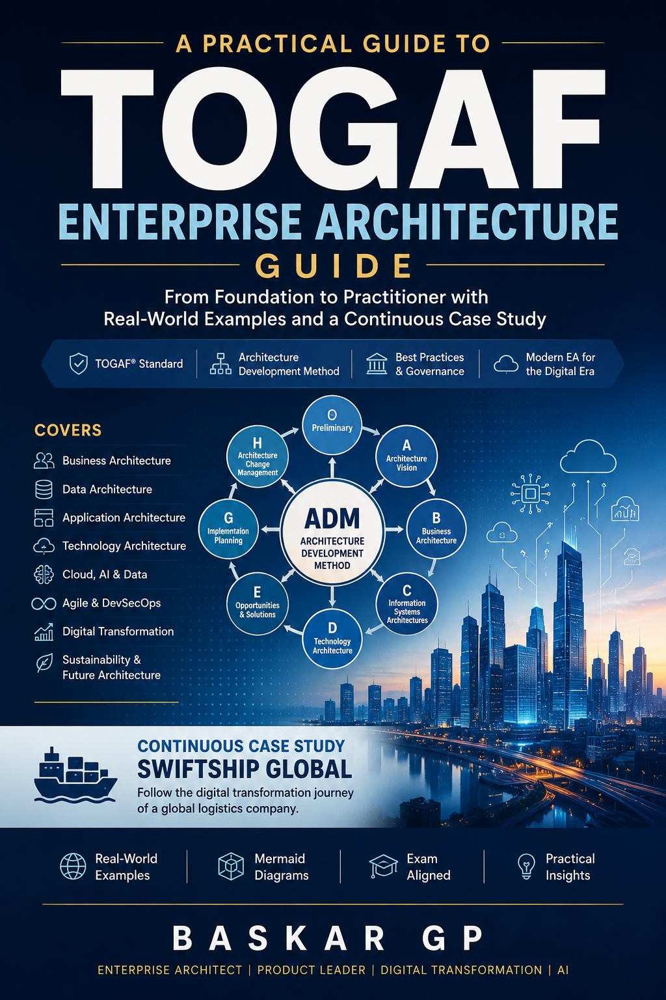

# TOGAF-Enterprise-Architecture-Guide
A practical guide to TOGAF Enterprise Architecture from Foundation to Practitioner using real-world case studies.

## 📖 About This Book

This book is designed to help readers understand Enterprise Architecture using the TOGAF Standard.

Unlike traditional certification guides, this book explains concepts through a continuous case study (SwiftShip Global), practical examples, Mermaid diagrams, and real-world architecture scenarios.

It is suitable for beginners as well as experienced architects preparing for the TOGAF Foundation and Practitioner certifications.

## 👥 Who Should Read This Book?

This guide is suitable for:

- Enterprise Architects
- Solution Architects
- Cloud Architects
- IT Managers
- Digital Transformation Leaders
- Product Managers
- Technology Consultants
- Students preparing for TOGAF Foundation
- Students preparing for TOGAF Practitioner

## 🚀 What You'll Learn

- Enterprise Architecture Fundamentals
- TOGAF Standard
- Architecture Development Method (ADM)
- Business Architecture
- Data Architecture
- Application Architecture
- Technology Architecture
- Architecture Governance
- Cloud Architecture
- Artificial Intelligence
- Agile Architecture
- DevSecOps
- Platform Engineering
- Digital Transformation
- Sustainability
- Future Enterprise Architecture

# 📚 Table of Contents

---

# Part I – Understanding the Enterprise

- [Chapter 1 – Introduction to Enterprise Architecture](book/Part-1-Understanding-the-Enterprise/01-Introduction-to-Enterprise-Architecture.md)
- [Chapter 2 – Why Enterprise Architecture Matters](book/Part-1-Understanding-the-Enterprise/02-Why-Enterprise-Architecture-Matters.md)
- [Chapter 3 – The TOGAF Playbook](book/Part-1-Understanding-the-Enterprise/03-The-TOGAF-Playbook.md)
- [Chapter 4 – Understanding the TOGAF Standard](book/Part-1-Understanding-the-Enterprise/04-Understanding-the-TOGAF-Standard.md)
- [Chapter 5 – Meet the Architecture Development Method (ADM)](book/Part-1-Understanding-the-Enterprise/05-Meet-the-Architecture-Development-Method-ADM.md)
- [Chapter 6 – Thinking Like an Enterprise Architect](book/Part-1-Understanding-the-Enterprise/06-Thinking-Like-an-Enterprise-Architect.md)

---
🏠 **Home:** [Table of Contents](../../README.md)

➡️ **Next:** [Chapter 2 – Why Enterprise Architecture Matters](02-Why-Enterprise-Architecture-Matters.md)
---

# Part II – The TOGAF Standard

- [Chapter 7 – Architecture Principles](book/Part-2-TOGAF-Standard/07-Architecture-Principles.md)
- [Chapter 8 – Stakeholder Management](book/Part-2-TOGAF-Standard/08-Stakeholder-Management.md)
- [Chapter 9 – Architecture Vision](book/Part-2-TOGAF-Standard/09-Architecture-Vision.md)
- [Chapter 10 – Enterprise Continuum](book/Part-2-TOGAF-Standard/10-Enterprise-Continuum.md)
- [Chapter 11 – Architecture Repository](book/Part-2-TOGAF-Standard/11-Architecture-Repository.md)
- [Chapter 12 – Architecture Building Blocks](book/Part-2-TOGAF-Standard/12-Architecture-Building-Blocks.md)
- [Chapter 13 – Architecture Content Framework](book/Part-2-TOGAF-Standard/13-Architecture-Content-Framework.md)
- [Chapter 14 – Architecture Governance](book/Part-2-TOGAF-Standard/14-Architecture-Governance.md)

---

⬅️ **Previous:** [Chapter 1 – Introduction to Enterprise Architecture](01-Introduction-to-Enterprise-Architecture.md)

🏠 **Home:** [Table of Contents](../../README.md)

➡️ **Next:** [Chapter 3 – The TOGAF Playbook](03-The-TOGAF-Playbook.md)
---

# Part III – Architecture Development Method (ADM)

- [Chapter 15 – Preliminary Phase](book/Part-3-ADM/15-Preliminary-Phase.md)
- [Chapter 16 – Phase A: Architecture Vision](book/Part-3-ADM/16-Phase-A-Architecture-Vision.md)
- [Chapter 17 – Phase B: Business Architecture](book/Part-3-ADM/17-Phase-B-Business-Architecture.md)
- [Chapter 18 – Phase C: Data Architecture](book/Part-3-ADM/18-Phase-C-Data-Architecture.md)
- [Chapter 19 – Phase C: Application Architecture](book/Part-3-ADM/19-Phase-C-Application-Architecture.md)
- [Chapter 20 – Phase D: Technology Architecture](book/Part-3-ADM/20-Phase-D-Technology-Architecture.md)
- [Chapter 21 – Phase E: Opportunities and Solutions](book/Part-3-ADM/21-Phase-E-Opportunities-and-Solutions.md)
- [Chapter 22 – Phase F: Migration Planning](book/Part-3-ADM/22-Phase-F-Migration-Planning.md)
- [Chapter 23 – Phase G: Implementation Governance](book/Part-3-ADM/23-Phase-G-Implementation-Governance.md)
- [Chapter 24 – Phase H: Architecture Change Management](book/Part-3-ADM/24-Phase-H-Architecture-Change-Management.md)
- [Chapter 25 – Requirements Management Across the ADM](book/Part-3-ADM/25-Requirements-Management-Across-the-ADM.md)

---

⬅️ **Previous:** [Chapter 2 – Why Enterprise Architecture Matters](02-Why-Enterprise-Architecture-Matters.md)

🏠 **Home:** [Table of Contents](../../README.md)

➡️ **Next:** [Chapter 4 – Understanding the TOGAF Standard](04-Understanding-the-TOGAF-Standard.md)
---

# Part IV – Governing Enterprise Change

- [Chapter 26 – Architecture Capability Framework](book/Part-4-Governing-Enterprise-Change/26-Architecture-Capability-Framework.md)
- [Chapter 27 – Establishing the Enterprise Architecture Office](book/Part-4-Governing-Enterprise-Change/27-Establishing-the-Enterprise-Architecture-Office.md)
- [Chapter 28 – Architecture Governance in Practice](book/Part-4-Governing-Enterprise-Change/28-Architecture-Governance-in-Practice.md)
- [Chapter 29 – Enterprise Portfolio Management](book/Part-4-Governing-Enterprise-Change/29-Enterprise-Portfolio-Management.md)
- [Chapter 30 – Managing Stakeholders and Organizational Change](book/Part-4-Governing-Enterprise-Change/30-Managing-Stakeholders-and-Organizational-Change.md)
- [Chapter 31 – Architecture Skills, Competencies and Career Paths](book/Part-4-Governing-Enterprise-Change/31-Architecture-Skills-Competencies-and-Career-Paths.md)
- [Chapter 32 – Measuring Architecture Success](book/Part-4-Governing-Enterprise-Change/32-Measuring-Architecture-Success.md)

---

⬅️ **Previous:** [Chapter 3 – The TOGAF Playbook](03-The-TOGAF-Playbook.md)

🏠 **Home:** [Table of Contents](../../README.md)

➡️ **Next:** [Chapter 5 – Meet the Architecture Development Method (ADM)](05-Meet-the-Architecture-Development-Method-ADM.md)
---

# Part V – Enterprise Architecture in the Modern Digital Enterprise

- [Chapter 33 – Enterprise Architecture in the Cloud Era](book/Part-5-Modern-Enterprise-Architecture/33-Enterprise-Architecture-in-the-Cloud-Era.md)
- [Chapter 34 – Enterprise Architecture for AI and Intelligent Enterprises](book/Part-5-Modern-Enterprise-Architecture/34-Enterprise-Architecture-for-AI-and-Intelligent-Enterprises.md)
- [Chapter 35 – Data-Driven Enterprise Architecture](book/Part-5-Modern-Enterprise-Architecture/35-Data-Driven-Enterprise-Architecture.md)
- [Chapter 36 – Enterprise Architecture and Agile Delivery](book/Part-5-Modern-Enterprise-Architecture/36-Enterprise-Architecture-and-Agile-Delivery.md)
- [Chapter 37 – DevSecOps and Platform Engineering](book/Part-5-Modern-Enterprise-Architecture/37-DevSecOps-and-Platform-Engineering.md)
- [Chapter 38 – Digital Transformation Patterns](book/Part-5-Modern-Enterprise-Architecture/38-Digital-Transformation-Patterns.md)
- [Chapter 39 – Sustainability and Green Enterprise Architecture](book/Part-5-Modern-Enterprise-Architecture/39-Sustainability-and-Green-Enterprise-Architecture.md)
- [Chapter 40 – The Future Enterprise Architect](book/Part-5-Modern-Enterprise-Architecture/40-The-Future-Enterprise-Architect.md)

---

⬅️ **Previous:** [Chapter 4 – Understanding the TOGAF Standard](04-Understanding-the-TOGAF-Standard.md)

🏠 **Home:** [Table of Contents](../../README.md)

➡️ **Next:** [Chapter 6 – Thinking Like an Enterprise Architect](06-Thinking-Like-an-Enterprise-Architect.md)
---

## ✨ Features

- 40 comprehensive chapters
- Real-world SwiftShip Global case study
- TOGAF Foundation & Practitioner aligned
- Mermaid architecture diagrams
- Practical examples
- Architecture governance guidance
- Cloud, AI, DevSecOps, and Agile coverage
- Modern Enterprise Architecture practices

## 📂 Repository Structure

book/
├── Part-1-Understanding-the-Enterprise
├── Part-2-TOGAF-Standard
├── Part-3-Architecture-Development-Method
├── Part-4-Governing-Enterprise-Change
└── Part-5-Modern-Enterprise-Architecture

## 🏢 Continuous Case Study

Throughout this book, you will follow the digital transformation journey of **SwiftShip Global**, a fictional logistics company.

Each chapter builds on the previous one, demonstrating how Enterprise Architecture evolves from strategy through implementation and continuous improvement.

## 📚 Additional Resources

- TOGAF Foundation revision
- TOGAF Practitioner guidance
- Architecture diagrams
- Enterprise Architecture reference models
- Best practices

## 📄 License

This repository is licensed under the MIT License.

See the LICENSE file for details.

## 👤 Author

Baskar Periasamy & Hemadri T J

[LinkedIn: https://www.linkedin.com/in/baskar-periasamy/]
[LinkedIn: https://www.linkedin.com/in/hemadritj/]

License

Author
