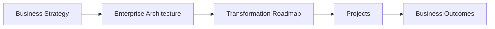

# Chapter 3

# The TOGAF Playbook
## Why Organizations Choose TOGAF

---

## Learning Objectives

By the end of this chapter, you will be able to:

- Understand why Enterprise Architecture needs a framework.
- Explain what TOGAF is.
- Describe the purpose of the TOGAF Standard.
- Recognize the benefits of using TOGAF in large enterprises.
- Understand how TOGAF will guide SwiftShip's transformation.

---

# Wednesday Morning – A New Question

Following yesterday's discussion, the executive team agrees that SwiftShip needs Enterprise Architecture.

Emma Chen, the CEO, asks the next logical question.

> "If Enterprise Architecture is the answer, how do we actually build one?"

David Kumar, the CIO, adds:

> "There are countless consulting firms, methodologies, and frameworks. Which one should we trust?"

Everyone turns to you.

You walk to the screen and display a single word.

# TOGAF

---

# A Transformation Needs a Playbook

You explain:

"Imagine trying to build a new international airport without a blueprint."

"Every contractor would work differently."

"The result would be delays, confusion, cost overruns, and incompatible systems."

Enterprise transformation is no different.

Without a common approach:

- Every project creates its own architecture.
- Teams use different terminology.
- Decisions become inconsistent.
- Business and IT lose alignment.

A successful transformation requires a common playbook.

---

# What Is TOGAF?

TOGAF stands for **The Open Group Architecture Framework**.

It is one of the world's most widely adopted Enterprise Architecture frameworks.

Rather than prescribing a specific technology, TOGAF provides:

- A common language.
- A structured development method.
- Best practices.
- Governance guidance.
- Deliverables and architectural artifacts.
- A repeatable approach for enterprise transformation.

---

# Why SwiftShip Chose TOGAF

You explain why TOGAF fits SwiftShip's needs.

## Business Alignment

Every architecture decision starts with business strategy.

## Repeatable Method

Every region follows the same architecture process.

## Better Governance

Projects are reviewed against common architectural principles.

## Consistency

Business, data, applications, and technology are designed together.

## Continuous Improvement

Architecture evolves as the enterprise changes.

---

# TOGAF Is Not a Technology

Olivia Park asks:

> "Does TOGAF tell us to use AWS or Azure?"

You reply:

"No."

"TOGAF doesn't tell you which technology to buy."

"It helps you decide **how** to make architecture decisions that align with business objectives."

That distinction is critical.

---

# The Heart of TOGAF

You draw a simple diagram.

You explain:

"TOGAF connects strategy to execution."

It ensures that every project contributes to enterprise goals.

---

# How TOGAF Will Help SwiftShip

Over the coming months, SwiftShip will use TOGAF to:

- Understand the current enterprise.
- Define the future architecture.
- Identify gaps.
- Prioritize transformation initiatives.
- Govern implementation.
- Continuously improve the architecture.

This journey is guided by the **Architecture Development Method (ADM)**, which you will learn in the upcoming chapters.

---

# Foundation Exam Focus

Remember:

- TOGAF is an Enterprise Architecture framework.
- TOGAF provides a common vocabulary and method.
- TOGAF is business-driven.
- TOGAF supports governance and transformation.
- TOGAF does not prescribe specific technologies.

---

# Practitioner Scenario

**Scenario**

Regional architecture teams use different documentation standards and decision-making approaches.

The CIO wants every transformation initiative to follow one consistent architecture process.

**Question**

Which framework should the organization adopt?

**Answer**

TOGAF provides a standardized, repeatable approach for developing, governing, and evolving Enterprise Architecture across the enterprise.

---

# Common Mistakes

- Thinking TOGAF is a software product.
- Believing TOGAF replaces project management.
- Assuming TOGAF recommends specific vendors or cloud platforms.
- Treating TOGAF as an IT-only framework.

---

# Key Takeaways

- Enterprise transformation requires a common playbook.
- TOGAF provides that playbook.
- TOGAF aligns business strategy with execution.
- TOGAF supports governance, consistency, and long-term change.
- The ADM is the core method within TOGAF.

---

# What's Next?

The CEO smiles.

> "Now that we have a framework, show us **how it works**."

In Chapter 4, we explore the building blocks of the TOGAF Standard and the concepts that every Enterprise Architect should understand before beginning the Architecture Development Method.
