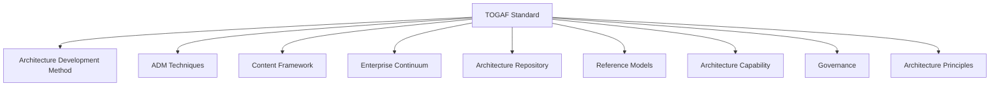
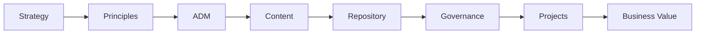

# Chapter 4

# Understanding the TOGAF Standard
## Inside the Enterprise Architect's Toolbox

---

## Learning Objectives

By the end of this chapter, you will be able to:

- Explain what the TOGAF Standard contains.
- Understand the major components of TOGAF.
- Recognize how the components work together.
- Distinguish between the framework and the Architecture Development Method (ADM).
- Understand why TOGAF is modular and adaptable.

---

# Tuesday Morning – A New Challenge

The executive team gathers again in the strategy room at SwiftShip Global.

On the whiteboard is a single word:

**TOGAF**

Emma Chen, the CEO, looks around the room.

> "Yesterday, we agreed that TOGAF is the framework we will use."

She pauses.

> "But what exactly did we buy into?"

David Kumar, the CIO, smiles.

> "Is TOGAF just another project methodology?"

Olivia Park, the COO, adds:

> "Or is it something much larger?"

You walk to the front of the room carrying a large blueprint tube.

Everyone expects one document.

Instead, you begin unrolling several large architectural drawings across the conference table.

---

# TOGAF Is More Than a Single Document

You explain:

> "Many people believe TOGAF is a single methodology."

"It isn't."

"It is an entire collection of guidance, methods, governance practices, techniques, reference materials, and best practices that help organizations design, implement, and sustain Enterprise Architecture."

Instead of being a rigid methodology, TOGAF is more like an architect's toolbox.

Different tools are used for different situations.

---

# The TOGAF Standard at a Glance

---

# 1. Architecture Development Method (ADM)

The ADM is the heart of TOGAF. It provides a repeatable process for developing Enterprise Architecture and guides organizations from the current state to the desired future state.

# 2. ADM Guidelines and Techniques

TOGAF provides guidance for adapting the ADM using techniques such as:

- Iteration
- Risk Management
- Stakeholder Management
- Business Scenarios
- Gap Analysis
- Migration Planning

---

# 3. Content Framework

The Content Framework provides a consistent structure for organizing architecture deliverables, artifacts, and building blocks across the enterprise.

---

# 4. Enterprise Continuum

The Enterprise Continuum encourages organizations to reuse architecture assets, reducing duplication and increasing consistency.

---

# 5. Architecture Repository

The Architecture Repository stores:

- Architecture Principles
- Standards
- Reference Architectures
- Building Blocks
- Roadmaps
- Governance Decisions

It serves as the organization's architectural knowledge base.

---

# 6. Reference Models

Reference Models provide proven architectural patterns that organizations can adapt to their own environments.

---

# 7. Architecture Capability

Successful Enterprise Architecture requires:

- Skilled architects
- Governance
- Roles and responsibilities
- Funding
- Executive sponsorship
- Architecture processes

---

# 8. Governance

Architecture Governance ensures that projects comply with agreed architecture standards and principles while supporting business objectives.

---

# 9. Architecture Principles

Examples include:

- Business First
- Data is an Enterprise Asset
- Reuse Before Buy
- Security by Design
- Cloud When Appropriate

---

# How Everything Fits Together

---

# Foundation Exam Focus

Remember:

- ADM is the core method.
- Content Framework organizes deliverables.
- Enterprise Continuum promotes reuse.
- Repository stores architecture assets.
- Governance ensures compliance.
- Capability enables sustainable architecture.

---

# Practitioner Scenario

**Scenario**

Multiple architecture teams repeatedly recreate standards because previous work cannot be found.

**Answer**

Use the **Architecture Repository**, supported by the **Enterprise Continuum**, to organize and reuse architectural assets.

---

# Common Mistakes

- Thinking ADM is the entire TOGAF Standard.
- Ignoring Governance.
- Treating Principles as optional.
- Not maintaining an Architecture Repository.

---

# Key Takeaways

- TOGAF is a comprehensive Enterprise Architecture framework.
- ADM is only one component.
- Governance, Capability, Principles, and the Repository are equally important.
- All components work together to support enterprise transformation.

---

# Next Chapter

**Chapter 5 – Meet the Architecture Development Method (ADM): The Roadmap for Enterprise Transformation**

---

## 📖 Continue Reading

⬅️ **Previous:** [Chapter 3 – The TOGAF Playbook](03-The-TOGAF-Playbook.md)

🏠 **Home:** [📚 Table of Contents](../../../README.md)

➡️ **Next:** [Chapter 5 – Meet the Architecture Development Method ADM](05-Meet-the-Architecture-Development-Method-ADM.md)

---

© 2026 **Baskar Periasamy** • Licensed under the MIT License.
