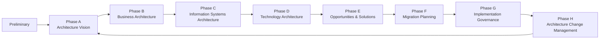
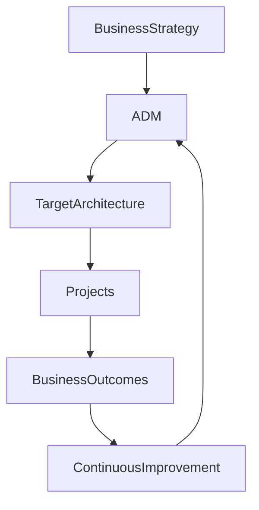

# Chapter 5

# Meet the Architecture Development Method (ADM)
## The Roadmap for Enterprise Transformation

---

## Learning Objectives

By the end of this chapter, you will be able to:

- Explain the purpose of the Architecture Development Method (ADM).
- Identify each phase of the ADM.
- Understand how the ADM supports business transformation.
- Recognize that the ADM is iterative rather than strictly linear.
- Appreciate why the ADM is the core of the TOGAF Standard.

---

# Wednesday Morning – The Road Ahead

The executive team gathers once again.

Emma Chen, CEO, looks at the transformation roadmap displayed on the screen.

> "We understand what TOGAF contains."

She pauses.

> "Now show us how we actually use it."

You smile and draw a large circle on the whiteboard.

> "This," you explain, "is the Architecture Development Method, or ADM. It is the journey every successful enterprise transformation follows."

---

# What Is the ADM?

The Architecture Development Method (ADM) is the core method of the TOGAF Standard.

It provides a structured, repeatable approach for developing, implementing, governing, and maintaining Enterprise Architecture.

Rather than being a one-time project plan, the ADM supports continuous improvement as business needs evolve.

---

# The ADM Cycle

The ADM is shown as a continuous cycle because enterprise architecture is never truly finished.

---

# Overview of the ADM Phases

## Preliminary Phase

Prepare the organization for Enterprise Architecture by defining principles, governance, scope, and architecture capability.

## Phase A – Architecture Vision

Define the business problem, scope, stakeholders, and desired outcomes for the transformation.

## Phase B – Business Architecture

Understand how the business should operate to achieve its strategic objectives.

## Phase C – Information Systems Architecture

Design the Data Architecture and Application Architecture needed to support the business.

## Phase D – Technology Architecture

Define the technology infrastructure that will support applications and data.

## Phase E – Opportunities & Solutions

Identify solution options and organize them into practical work packages.

## Phase F – Migration Planning

Create a realistic roadmap showing how the enterprise will transition from the current state to the target architecture.

## Phase G – Implementation Governance

Ensure implementation projects comply with the approved architecture.

## Phase H – Architecture Change Management

Monitor business and technology changes, updating the architecture whenever necessary.

---

# Why the ADM Is Circular

David Kumar asks,

> "Why doesn't the process simply end after implementation?"

You reply:

"Because businesses continue to change."

New technologies emerge.

Customer expectations evolve.

Regulations change.

Enterprise Architecture must continuously adapt.

---

# ADM Supports Business Strategy

The ADM ensures that every transformation initiative remains aligned with business strategy.

---

# Foundation Exam Focus

Remember:

- The ADM is the core method within the TOGAF Standard.
- It consists of the Preliminary Phase followed by Phases A through H.
- The ADM is iterative and supports continuous improvement.
- Every phase produces outputs that become inputs for later phases.

---

# Practitioner Scenario

**Scenario**

SwiftShip is preparing a global digital transformation programme. Before designing any new systems, the architecture team must define stakeholders, business objectives, and the overall vision.

**Question**

Which ADM phase should they begin with?

**Answer**

**Phase A – Architecture Vision**, after completing the Preliminary Phase.

---

# Common Mistakes

- Treating the ADM as a strictly linear waterfall process.
- Skipping the Preliminary Phase.
- Beginning with technology instead of business objectives.
- Assuming the architecture is complete after implementation.

---

# Key Takeaways

- The ADM is the heart of the TOGAF Standard.
- It provides a repeatable approach to Enterprise Architecture.
- The ADM aligns business strategy with implementation.
- Enterprise Architecture is an ongoing journey rather than a one-time project.

---

# Chapter Summary

Emma looks at the circular diagram.

> "So the architecture never really ends."

You nod.

> "Exactly. As long as the business evolves, the architecture must evolve with it."

The executive team is now ready to begin the first phase of SwiftShip's Enterprise Architecture journey.

---

# Next Chapter

**Chapter 6 – Thinking Like an Enterprise Architect**

---

## 📖 Continue Reading

⬅️ **Previous:** [Chapter 4 – Understanding the TOGAF Standard](04-Understanding-the-TOGAF-Standard.md)

🏠 **Home:** [📚 Table of Contents](../../../README.md)

➡️ **Next:** [Chapter 6 – Thinking Like an Enterprise Architect](06-Thinking-Like-an-Enterprise-Architect.md)

---

© 2026 **Baskar Periasamy** • Licensed under the MIT License.
