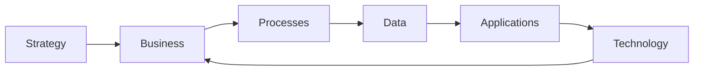
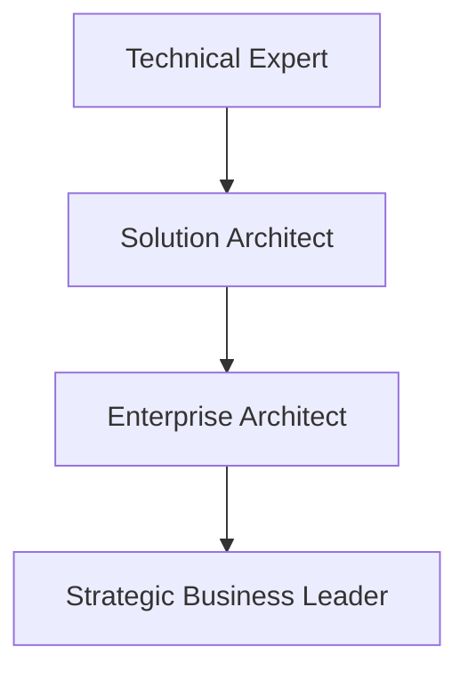

# Chapter 6

# Thinking Like an Enterprise Architect
## Developing the Enterprise Architecture Mindset

---

## Learning Objectives

By the end of this chapter, you will be able to:

- Think beyond individual technologies and projects.
- Apply systems thinking to business problems.
- Balance stakeholder needs and competing priorities.
- Understand the importance of architecture principles and governance.
- Recognize the mindset required of an Enterprise Architect.

---

# Thursday Morning – Beyond Technology

The SwiftShip executive team has learned what Enterprise Architecture is, why TOGAF is used, and how the Architecture Development Method (ADM) guides transformation.

Emma Chen, the CEO, asks one final question before the team begins the ADM.

> "What makes a great Enterprise Architect?"

You pause for a moment.

> "It isn't someone who knows the most technology."

The room becomes quiet.

> "A great Enterprise Architect sees the entire enterprise—not just the systems."

---

# The Enterprise Architect's Perspective

An Enterprise Architect must understand how business strategy, people, processes, information, applications, and technology interact.

Instead of asking:

> "Which technology should we implement?"

An Enterprise Architect asks:

> "How will this decision improve the business?"

---

# Systems Thinking

Enterprise Architects view the organization as an interconnected system.

A change in one area often affects every other area.

---

# Business Before Technology

Technology should never drive strategy.

Instead:

1. Understand the business objective.
2. Identify business capabilities.
3. Design the target architecture.
4. Select technologies that best support the architecture.

Business value always comes first.

---

# Balancing Stakeholder Needs

Different stakeholders have different priorities.

| Stakeholder | Typical Priority |
|-------------|------------------|
| CEO | Business Growth |
| CFO | Cost Control |
| COO | Operational Efficiency |
| CIO | Technology Strategy |
| Customers | Better Experience |

An Enterprise Architect balances these competing needs rather than optimizing for only one.

---

# Managing Trade-offs

Architectural decisions involve trade-offs.

Examples include:

- Speed vs. Cost
- Innovation vs. Risk
- Standardization vs. Flexibility
- Performance vs. Simplicity
- Short-term Gains vs. Long-term Sustainability

The best solution is rarely perfect—it is the one that best supports business objectives.

---

# Architecture Principles

Architecture Principles provide consistent guidance.

Examples:

- Business First
- Reuse Before Build
- Security by Design
- Data is an Enterprise Asset
- Cloud When Appropriate

Principles help architects make consistent decisions across multiple projects.

---

# Governance Matters

Architecture only succeeds when decisions are consistently applied.

Governance ensures:

- Compliance with architecture standards
- Controlled exceptions
- Transparent decision-making
- Continuous alignment with business strategy

---

# The Enterprise Architect's Toolkit

Successful Enterprise Architects combine:

- Strategic thinking
- Communication
- Leadership
- Business knowledge
- Technical understanding
- Negotiation
- Analytical skills

Architecture is as much about people as it is about technology.

---

# From IT Expert to Enterprise Architect

As architects mature, their focus shifts from individual systems to enterprise-wide outcomes.

---

# Foundation Exam Focus

Remember:

- Enterprise Architects are business-focused.
- Technology decisions should support business objectives.
- Systems thinking is essential.
- Governance and principles enable consistent decision-making.
- Enterprise Architecture is a continuous discipline.

---

# Practitioner Scenario

**Scenario**

SwiftShip plans to replace its warehouse management system. One team recommends choosing the newest technology immediately.

Before approving the proposal, the Enterprise Architect asks how the new system supports business capabilities, integrates with existing applications, affects operational processes, and aligns with architecture principles.

**Answer**

The Enterprise Architect is applying systems thinking and ensuring technology decisions align with enterprise strategy before implementation.

---

# Common Mistakes

- Focusing only on technology.
- Ignoring stakeholder concerns.
- Optimizing individual projects instead of the enterprise.
- Treating governance as unnecessary.
- Making decisions without architecture principles.

---

# Key Takeaways

- Enterprise Architects think strategically.
- Business objectives guide architectural decisions.
- Systems thinking connects all enterprise domains.
- Trade-offs are a normal part of architecture.
- Governance and principles create consistency across transformation initiatives.

---

# Chapter Summary

Emma smiles.

> "Now I understand."

> "Enterprise Architecture isn't about drawing diagrams."

> "It's about helping the business make better decisions."

You nod.

> "Exactly. The diagrams are only the language. The real value is the thinking behind them."

With that understanding, SwiftShip is ready to begin its Enterprise Architecture journey using the TOGAF Standard.

---

# End of Part I

You have completed **Part I – Understanding the Enterprise**.

In **Part II**, we begin a deeper exploration of the TOGAF Standard and the architectural concepts that support successful enterprise transformation.
