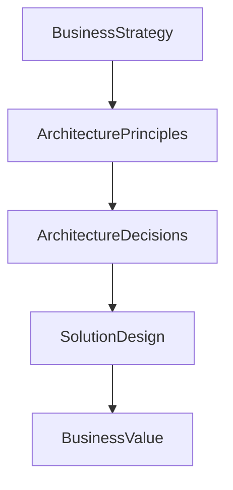

# Chapter 7

# Architecture Principles
## The Rules That Guide Every Decision

---

## Learning Objectives

By the end of this chapter, you will be able to:

- Define Architecture Principles.
- Explain why principles are essential to Enterprise Architecture.
- Describe the structure of a well-written architecture principle.
- Differentiate between Business, Data, Application, and Technology principles.
- Apply principles to architecture decisions.

---

# Monday Morning – Decisions Without Direction

The Enterprise Architecture Office at SwiftShip Global is officially established.

Emma Chen, the CEO, opens the first Architecture Board meeting.

> "We've agreed on TOGAF."

> "We've agreed on the roadmap."

She looks around the room.

> "But how do we ensure every architect makes consistent decisions?"

You write two words on the whiteboard.

**Architecture Principles**

---

# Why Architecture Principles Matter

Imagine that every project manager, solution architect, and vendor makes decisions independently.

Some choose cloud-first solutions.

Others build custom software.

Some duplicate existing systems.

Although each decision may seem reasonable on its own, together they create an inconsistent enterprise.

Architecture Principles prevent this.

They provide enduring guidance for architectural decisions across the organization.

---

# What Are Architecture Principles?

Architecture Principles are high-level rules that guide the planning, design, implementation, and governance of Enterprise Architecture.

They help ensure that every decision supports:

- Business strategy
- Enterprise consistency
- Long-term sustainability
- Effective governance

Principles are stable and should rarely change.

---

# Characteristics of Good Principles

Effective Architecture Principles are:

- Understandable
- Relevant
- Stable
- Actionable
- Consistent
- Widely accepted across the enterprise

A good principle influences real decisions rather than existing only as documentation.

---

# Structure of an Architecture Principle

Each principle should contain four parts.

| Component | Purpose |
|-----------|---------|
| Name | A concise title |
| Statement | The principle itself |
| Rationale | Why the principle exists |
| Implications | What the organization must do to comply |

---

# Example Principle

## Name

Business First

## Statement

Business objectives take priority over technology preferences.

## Rationale

Technology exists to enable business outcomes, not drive them.

## Implications

- Projects must demonstrate business value.
- Technology choices require business justification.
- Business stakeholders participate in major architecture decisions.

---

# Categories of Architecture Principles

## Business Principles

Guide business decisions.

Examples:

- Business First
- Customer-Centric Design
- Regulatory Compliance

## Data Principles

Guide the management of enterprise information.

Examples:

- Data is an Enterprise Asset
- Single Source of Truth
- Data Quality by Design

## Application Principles

Guide application design.

Examples:

- Reuse Before Build
- Standard Interfaces
- API-First Integration

## Technology Principles

Guide infrastructure decisions.

Examples:

- Cloud When Appropriate
- Security by Design
- Standard Technology Platforms

---

# Principles Guide Every Decision

Every architectural decision should be traceable back to one or more approved principles.

---

# Principles at SwiftShip

The Architecture Board approves the following initial principles:

1. Business First
2. Customer Experience Matters
3. Data is an Enterprise Asset
4. Reuse Before Build
5. Security by Design
6. Cloud When Appropriate

Every transformation initiative must demonstrate alignment with these principles before receiving approval.

---

# Foundation Exam Focus

Remember:

- Architecture Principles provide enduring guidance.
- Principles support governance and decision-making.
- Each principle includes a Name, Statement, Rationale, and Implications.
- Principles should be stable, understandable, and actionable.
- Principles influence Business, Data, Application, and Technology Architecture.

---

# Practitioner Scenario

**Scenario**

A project team proposes building a new customer database even though an enterprise customer platform already exists.

The Architecture Board reviews the proposal.

**Question**

Which Architecture Principle should influence the decision?

**Answer**

The principle **Reuse Before Build** encourages leveraging existing enterprise capabilities before creating new solutions, reducing cost, complexity, and duplication.

---

# Common Mistakes

- Writing principles that are too vague.
- Confusing standards with principles.
- Creating principles without business support.
- Ignoring the implications of a principle.
- Allowing projects to bypass agreed principles.

---

# Key Takeaways

- Architecture Principles guide consistent enterprise decisions.
- Principles support governance and strategic alignment.
- Every principle includes a Name, Statement, Rationale, and Implications.
- Principles influence every architecture domain.
- Strong principles reduce inconsistency and improve long-term enterprise outcomes.

---

# Chapter Summary

Emma reviews the approved principles.

> "Now every architect will begin from the same foundation."

You nod.

> "Exactly. Principles don't eliminate decisions—they ensure that every decision moves SwiftShip in the same strategic direction."

---

# Next Chapter

**Chapter 8 – Stakeholder Management: Building Consensus Across the Enterprise**

---

## 📖 Continue Reading

⬅️ **Previous:** [Chapter 6 – Thinking Like an Enterprise Architect](../Part-1-Understanding-the-Enterprise/06-Thinking-Like-an-Enterprise-Architect.md)

🏠 **Home:** [📚 Table of Contents](../../../README.md)

➡️ **Next:** [Chapter 8 – Stakeholder Management](08-Stakeholder-Management.md)

---

© 2026 **Baskar Periasamy** • Licensed under the MIT License.
