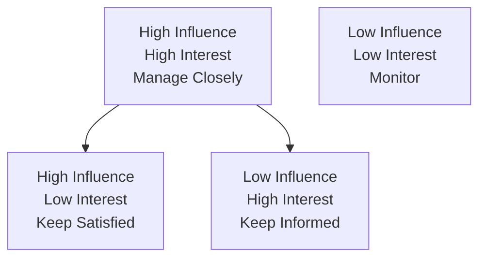
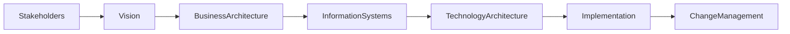

# Chapter 8

# Stakeholder Management
## Building Consensus Across the Enterprise

---

## Learning Objectives

By the end of this chapter, you will be able to:

- Define stakeholders in the context of Enterprise Architecture.
- Identify stakeholder concerns and expectations.
- Explain why stakeholder management is critical to architectural success.
- Apply stakeholder analysis techniques.
- Understand how TOGAF incorporates stakeholder management throughout the ADM.

---

# Tuesday Morning – Too Many Voices

The Enterprise Architecture Office at SwiftShip Global has begun defining the company's transformation strategy.

During the weekly executive meeting, Emma Chen, the CEO, notices something unusual.

Every executive supports digital transformation—but for completely different reasons.

- The CFO wants to reduce operational costs.
- The COO wants faster warehouse operations.
- The CIO wants to modernize legacy applications.
- The Chief Information Security Officer wants stronger cybersecurity.
- Regional managers want greater local flexibility.

Emma turns to you.

> "Everyone agrees we need change."

She pauses.

> "So why can't everyone agree on the solution?"

You smile.

> "Because architecture is ultimately about people."

---

# Who Is a Stakeholder?

A stakeholder is any individual, group, or organization that:

- Influences the architecture,
- Is affected by the architecture, or
- Has an interest in the outcomes of the architecture.

Stakeholders exist at every level of the enterprise—from executive leadership to customers and technology vendors.

Successful Enterprise Architecture depends on understanding their perspectives.

---

# Why Stakeholder Management Matters

Architecture decisions often involve competing priorities.

Without stakeholder engagement:

- Projects lose executive support.
- Business needs are misunderstood.
- Requirements become incomplete.
- Resistance to change increases.
- Governance becomes difficult.

Stakeholder management helps architects build trust, alignment, and commitment.

---

# Identifying Stakeholders

At SwiftShip, the architecture team identifies the following key stakeholders.

| Stakeholder | Primary Concern |
|-------------|-----------------|
| CEO | Business growth and competitive advantage |
| CFO | Cost optimization and return on investment |
| COO | Operational efficiency |
| CIO | Technology strategy and integration |
| CISO | Security and compliance |
| Regional Managers | Local operational flexibility |
| Customers | Reliable and seamless services |
| Employees | Simpler business processes |

Every stakeholder brings a unique perspective to enterprise transformation.

---

# Understanding Stakeholder Concerns

Not all stakeholders measure success in the same way.

For example:

- Executives focus on strategic outcomes.
- Project managers focus on delivery.
- Architects focus on long-term sustainability.
- End users focus on usability.
- Regulators focus on compliance.

An Enterprise Architect must understand these concerns before proposing solutions.

---

# Stakeholder Analysis

A simple stakeholder analysis evaluates two dimensions:

- Influence
- Interest

Stakeholders with high influence and high interest require the greatest attention throughout the architecture lifecycle.

---

# Communication Is Part of Architecture

Enterprise Architects spend significant time communicating.

Effective communication includes:

- Executive presentations
- Workshops
- Interviews
- Architecture reviews
- Visual models
- Decision records

The goal is not simply to present architecture—but to create shared understanding.

---

# Resolving Conflicting Priorities

During planning, the CFO recommends minimizing investment by extending the life of existing warehouse systems.

The CIO recommends replacing them with a modern cloud platform.

Both arguments are reasonable.

Instead of choosing a side immediately, the architecture team:

1. Reviews business objectives.
2. Evaluates risks.
3. Considers architecture principles.
4. Assesses long-term value.
5. Presents evidence-based recommendations.

Architecture decisions should balance competing interests rather than favoring one stakeholder.

---

# Stakeholder Management Throughout the ADM

Stakeholder engagement is continuous throughout the Architecture Development Method.

It is not a one-time activity.

---

# Foundation Exam Focus

Remember:

- Stakeholders influence or are affected by Enterprise Architecture.
- Different stakeholders have different concerns.
- Stakeholder management continues throughout the ADM.
- Communication is essential for successful architecture.
- Enterprise Architects balance competing stakeholder priorities.

---

# Practitioner Scenario

**Scenario**

SwiftShip plans to introduce an enterprise-wide customer platform.

The Sales Division supports the proposal because it improves customer visibility.

Regional offices oppose the proposal because they fear losing operational flexibility.

**Question**

What should the Enterprise Architect do?

**Answer**

Identify stakeholder concerns, communicate the business rationale, evaluate impacts objectively, and facilitate discussions to reach an enterprise-wide solution aligned with business strategy and architecture principles.

---

# Common Mistakes

- Assuming all stakeholders share the same objectives.
- Engaging stakeholders only at the beginning of a project.
- Ignoring stakeholder concerns.
- Communicating technical details instead of business outcomes.
- Allowing individual stakeholder interests to override enterprise goals.

---

# Key Takeaways

- Enterprise Architecture is fundamentally about people and business outcomes.
- Every stakeholder has unique priorities and concerns.
- Effective stakeholder management builds alignment and reduces resistance.
- Communication is one of an Enterprise Architect's most valuable skills.
- Stakeholder engagement is continuous throughout the architecture lifecycle.

---

# Chapter Summary

Emma reflects on the discussion.

> "Architecture isn't just about designing systems."

You nod.

> "Exactly."

> "The best architecture in the world will fail if the people affected by it don't understand or support it."

The executives now recognize that successful transformation depends as much on stakeholder engagement as it does on technology.

---

# Next Chapter

**Chapter 9 – Architecture Vision: Creating a Shared Destination**
