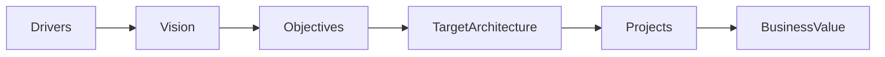
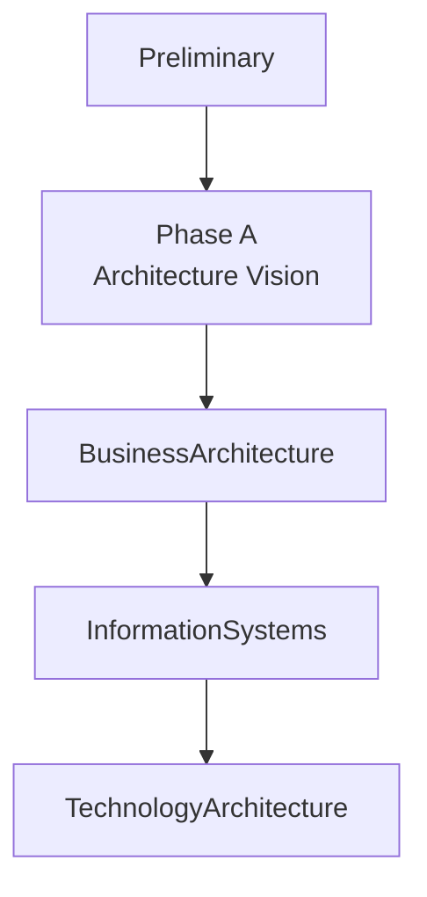

# Chapter 9

# Architecture Vision
## Creating a Shared Destination

---

## Learning Objectives

By the end of this chapter, you will be able to:

- Define Architecture Vision.
- Explain the purpose of Phase A – Architecture Vision.
- Identify the key inputs and outputs of the Architecture Vision.
- Understand how stakeholder concerns influence the vision.
- Describe the role of business value and scope in Enterprise Architecture.

---

# Wednesday Morning – A Shared Destination

The executive leadership team gathers to launch SwiftShip's transformation programme.

Emma Chen, the CEO, begins the meeting.

> "We've established our principles and aligned our stakeholders."

She pauses.

> "Before we redesign anything, everyone must agree on where we are going."

You nod.

> "That's exactly why every TOGAF journey begins with an Architecture Vision."

---

# What Is an Architecture Vision?

The Architecture Vision is a high-level description of the future state of the enterprise.

It explains:

- Why the transformation is needed.
- What business outcomes are expected.
- Which stakeholders are involved.
- What is included in scope.
- How success will be measured.

The Architecture Vision creates a shared understanding before detailed architecture work begins.

---

# Why the Architecture Vision Matters

Without a clear vision:

- Projects pursue conflicting objectives.
- Stakeholders interpret goals differently.
- Scope expands uncontrollably.
- Investments lose strategic alignment.

A well-defined vision provides a common direction for every architecture activity.

---

# Elements of an Architecture Vision

An effective Architecture Vision typically includes:

- Business drivers
- Strategic objectives
- Scope
- Constraints
- Stakeholders
- Business value
- High-level target architecture
- Success measures

---

# Business Drivers

SwiftShip identifies several business drivers:

- Rapid growth in global e-commerce
- Rising customer expectations
- Legacy logistics systems
- Increasing cybersecurity risks
- Demand for real-time shipment visibility

These drivers justify the transformation programme.

---

# From Drivers to Value

The Architecture Vision connects business needs with transformation initiatives.

---

# Defining Scope

The Architecture Board decides that Phase 1 will focus on:

- Global shipment tracking
- Warehouse operations
- Customer portals
- Enterprise data integration

Items outside the initial scope, such as HR systems, will be addressed in future iterations.

Clear scope helps prevent unnecessary complexity.

---

# Understanding Constraints

Every architecture initiative has constraints.

Examples include:

- Budget limitations
- Regulatory requirements
- Existing technology investments
- Project timelines
- Resource availability

Architects must design solutions that respect these realities.

---

# Business Value

Emma asks,

> "How will we know this transformation is successful?"

You explain that the Architecture Vision defines measurable business value.

Examples include:

- 30% faster shipment processing
- Improved customer satisfaction
- Lower operating costs
- Reduced application duplication
- Better regulatory compliance

Business value provides the foundation for future investment decisions.

---

# Stakeholder Agreement

Before moving into detailed architecture, the Architecture Vision is reviewed with:

- Executive sponsors
- Business leaders
- Technology leaders
- Security representatives
- Regional managers

Their agreement establishes a common understanding of the transformation.

---

# Architecture Vision in the ADM

Phase A establishes the direction for every subsequent ADM phase.

---

# Foundation Exam Focus

Remember:

- Architecture Vision is developed during Phase A.
- It defines scope, stakeholders, business drivers, and value.
- It aligns business strategy with Enterprise Architecture.
- Stakeholder agreement is essential before detailed design begins.

---

# Practitioner Scenario

**Scenario**

SwiftShip wants to modernize its logistics platform.

Different business units propose unrelated initiatives with no common objectives.

**Question**

How should the Enterprise Architect respond?

**Answer**

Develop an Architecture Vision that clearly defines the business drivers, scope, objectives, stakeholder concerns, and expected business value before beginning detailed architecture work.

---

# Common Mistakes

- Beginning solution design without a shared vision.
- Defining technology before business objectives.
- Allowing scope to grow without governance.
- Ignoring stakeholder expectations.
- Failing to define measurable business outcomes.

---

# Key Takeaways

- The Architecture Vision provides strategic direction.
- Business drivers justify transformation.
- Scope and constraints guide architectural decisions.
- Stakeholder agreement is essential.
- Phase A lays the foundation for the remaining ADM phases.

---

# Chapter Summary

Emma reviews the Architecture Vision.

> "Now every project team understands not only what we're building, but why we're building it."

You smile.

> "Exactly. A shared destination is the first step toward a successful transformation."

The organization is now ready to move from vision to detailed enterprise architecture.

---

# Next Chapter

**Chapter 10 – Enterprise Continuum: Reusing Knowledge Across the Enterprise**
