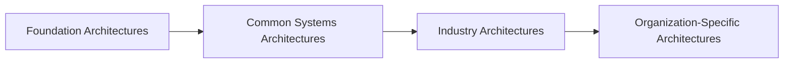
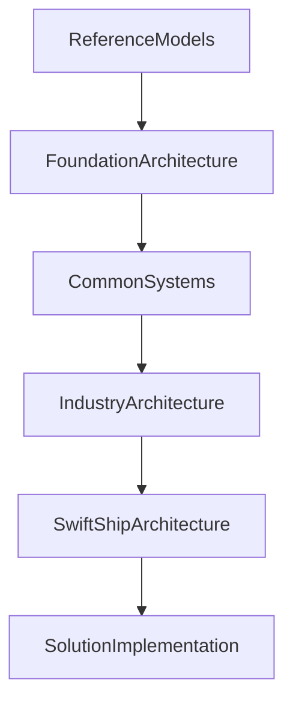

# Chapter 10

# Enterprise Continuum
## Reusing Knowledge Across the Enterprise

---

## Learning Objectives

By the end of this chapter, you will be able to:

- Define the Enterprise Continuum.
- Explain the purpose of the Enterprise Continuum in TOGAF.
- Differentiate between generic and organization-specific architectures.
- Understand how architectural assets evolve across the continuum.
- Recognize how the Enterprise Continuum promotes reuse and consistency.

---

# Thursday Morning – Stop Reinventing the Wheel

The SwiftShip Enterprise Architecture Office is making good progress.

As teams begin designing solutions, Emma Chen notices a recurring problem.

Every regional office seems to be creating similar architectures for customer portals, warehouse systems, and shipment tracking.

Emma asks,

> "Why are we solving the same problems over and over again?"

You reply,

> "Because we haven't learned to reuse our knowledge."

You write a new term on the whiteboard.

**Enterprise Continuum**

---

# What Is the Enterprise Continuum?

The Enterprise Continuum is a way of classifying and organizing architecture assets so they can be reused across the enterprise.

Instead of creating every architecture from scratch, organizations can build upon existing knowledge, standards, patterns, and reference architectures.

The Enterprise Continuum is not a physical repository.

Rather, it is a way of thinking about how architecture evolves from generic concepts to enterprise-specific solutions.

---

# Why the Enterprise Continuum Matters

Without reuse:

- Projects duplicate work.
- Costs increase.
- Standards become inconsistent.
- Delivery takes longer.
- Knowledge remains isolated.

By encouraging reuse, the Enterprise Continuum enables faster, more consistent enterprise transformation.

---

# The Continuum of Reuse

As architects move from left to right, solutions become increasingly tailored to the organization's needs.

---

# Foundation Architectures

Foundation Architectures contain generic capabilities that are applicable to many organizations.

Examples include:

- Networking concepts
- Security principles
- Cloud computing fundamentals
- Integration patterns

These provide a starting point for enterprise architecture.

---

# Common Systems Architectures

Common Systems Architectures address capabilities shared across many organizations.

Examples include:

- Identity and Access Management
- Email platforms
- Collaboration tools
- Enterprise integration services

Organizations can often adopt these architectures with minimal customization.

---

# Industry Architectures

Industry Architectures incorporate best practices specific to a business sector.

For SwiftShip, examples include:

- Logistics tracking standards
- Supply chain integration
- Warehouse automation
- Transportation management

Industry-specific architectures accelerate solution design while supporting regulatory and operational requirements.

---

# Organization-Specific Architectures

At the end of the continuum are architectures unique to the enterprise.

SwiftShip develops specialized solutions for:

- Global shipment optimization
- Regional customs integration
- Customer loyalty programmes
- Predictive delivery analytics

These architectures reflect the organization's competitive advantages.

---

# Enterprise Continuum vs. Architecture Repository

Emma asks,

> "If we already have an Architecture Repository, why do we need the Enterprise Continuum?"

You explain:

The **Architecture Repository** stores architectural assets.

The **Enterprise Continuum** classifies those assets according to their level of reuse and specialization.

Think of the repository as the library.

Think of the Enterprise Continuum as the library's classification system.

---

# Reuse in Action

Every new architecture should reuse as much existing knowledge as possible before creating something new.

---

# Benefits of the Enterprise Continuum

SwiftShip realizes several benefits:

- Faster architecture development
- Reduced duplication
- Greater consistency
- Improved governance
- Lower implementation costs
- Better knowledge sharing

Reuse becomes a strategic capability rather than an afterthought.

---

# Foundation Exam Focus

Remember:

- The Enterprise Continuum promotes reuse of architecture assets.
- It is a classification concept, not a physical repository.
- Architectures progress from generic to organization-specific.
- The Architecture Repository stores assets; the Enterprise Continuum classifies them.

---

# Practitioner Scenario

**Scenario**

Three regional teams independently design nearly identical warehouse integration solutions.

The Architecture Board wants future projects to leverage existing work instead of creating new designs each time.

**Question**

Which TOGAF concept best supports this objective?

**Answer**

The **Enterprise Continuum**, together with the **Architecture Repository**, enables architects to classify, discover, and reuse architectural assets across the organization.

---

# Common Mistakes

- Assuming the Enterprise Continuum is a software tool.
- Confusing the Enterprise Continuum with the Architecture Repository.
- Building solutions without considering reusable assets.
- Ignoring industry reference architectures.
- Reinventing architectures that already exist.

---

# Key Takeaways

- The Enterprise Continuum encourages architectural reuse.
- It organizes architecture from generic foundations to enterprise-specific solutions.
- Reuse reduces cost, time, and complexity.
- The Architecture Repository stores assets; the Enterprise Continuum classifies them.
- Successful Enterprise Architecture builds on existing knowledge before creating new solutions.

---

# Chapter Summary

Emma reviews the architecture roadmap.

> "We've spent years creating valuable knowledge."

You smile.

> "Now we'll start using it."

By embracing the Enterprise Continuum, SwiftShip transforms isolated architectural efforts into a growing body of reusable enterprise knowledge.

---

# Next Chapter

**Chapter 11 – Architecture Repository: Preserving the Enterprise's Architectural Memory**

---

## 📖 Continue Reading

⬅️ **Previous:** [Chapter 9 – Architecture Vision](09-Architecture-Vision.md)

🏠 **Home:** [📚 Table of Contents](../../../README.md)

➡️ **Next:** [Chapter 11 – Architecture Repository](11-Architecture-Repository.md)

---

© 2026 **Baskar Periasamy** • Licensed under the MIT License.
