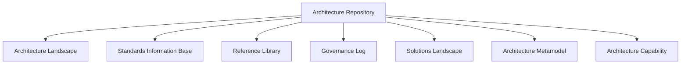
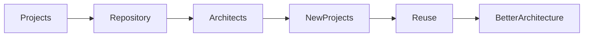

# Chapter 11

# Architecture Repository
## Preserving the Enterprise's Architectural Memory

---

## Learning Objectives

By the end of this chapter, you will be able to:

- Define the Architecture Repository.
- Explain the purpose of the Architecture Repository in TOGAF.
- Describe the major components of the repository.
- Distinguish the Architecture Repository from the Enterprise Continuum.
- Understand how the repository supports governance, reuse, and decision-making.

---

# Friday Morning – Where Does Our Knowledge Go?

SwiftShip's architecture team has completed several transformation initiatives.

Emma Chen reviews a recent presentation.

> "We've created principles, standards, reference architectures, and roadmaps."

She looks at the team.

> "Where do we keep all of this so future projects can benefit?"

You answer with a single phrase.

**Architecture Repository**

---

# What Is the Architecture Repository?

The Architecture Repository is the central store for architecture assets used across the enterprise.

It enables architects to capture, organize, maintain, and reuse architectural knowledge throughout the architecture lifecycle.

Unlike the Enterprise Continuum, which classifies assets, the Architecture Repository stores the assets themselves.

---

# Why the Repository Matters

Without a central repository:

- Teams recreate architecture artifacts.
- Standards become inconsistent.
- Knowledge is lost when projects finish.
- Governance decisions are difficult to trace.
- New architects struggle to find reliable information.

The repository becomes the organization's architectural memory.

---

# Major Components of the Architecture Repository

Each component serves a different purpose but contributes to a common body of architectural knowledge.

---

# Architecture Landscape

The Architecture Landscape records current, transition, and target architectures.

It provides visibility into:

- Business Architecture
- Data Architecture
- Application Architecture
- Technology Architecture

Architects use the landscape to understand where the enterprise is today and where it is heading.

---

# Standards Information Base

The Standards Information Base (SIB) stores approved standards, policies, technologies, and guidelines.

Examples include:

- Security standards
- API standards
- Cloud standards
- Data governance policies
- Infrastructure standards

Projects refer to these standards to ensure consistency.

---

# Reference Library

The Reference Library contains reusable guidance such as:

- Reference architectures
- Industry frameworks
- Design patterns
- Templates
- Best practices
- White papers

These resources accelerate future architecture work.

---

# Governance Log

The Governance Log captures:

- Architecture review decisions
- Approved exceptions
- Compliance assessments
- Architecture Board outcomes
- Decision records

This creates an auditable history of architectural governance.

---

# Solutions Landscape

The Solutions Landscape tracks implemented solutions and their relationship to the target architecture.

It helps answer questions such as:

- Which capabilities have been implemented?
- Which systems are scheduled for retirement?
- What transformation initiatives remain?

---

# Architecture Capability

The repository also documents how Enterprise Architecture operates, including:

- Architecture roles
- Governance structures
- Processes
- Skills
- Responsibilities

This supports continuous improvement of the architecture function.

---

# Repository vs. Enterprise Continuum

Emma asks,

> "How is this different from the Enterprise Continuum?"

You explain:

| Enterprise Continuum | Architecture Repository |
|----------------------|-------------------------|
| Classifies assets | Stores assets |
| Encourages reuse | Preserves knowledge |
| Conceptual model | Physical or logical repository |
| Organizes architecture by level of specialization | Organizes architecture by content and purpose |

The two concepts complement each other.

---

# Repository in Action

Every completed project enriches the repository, making future architecture initiatives more effective.

---

# Foundation Exam Focus

Remember:

- The Architecture Repository stores architecture assets.
- It includes the Architecture Landscape, Standards Information Base, Reference Library, Governance Log, Solutions Landscape, Metamodel, and Architecture Capability.
- The Enterprise Continuum classifies assets; the Repository stores them.
- The repository supports governance, reuse, and organizational learning.

---

# Practitioner Scenario

**Scenario**

SwiftShip launches a new logistics initiative. The architecture team needs approved technology standards, previous solution designs, governance decisions, and reference architectures before beginning the project.

**Question**

Where should they obtain this information?

**Answer**

From the **Architecture Repository**, which stores reusable architecture assets, standards, governance records, and reference materials.

---

# Common Mistakes

- Confusing the Repository with the Enterprise Continuum.
- Failing to update repository content after projects.
- Storing documents without governance.
- Treating the repository as a simple file share.
- Ignoring version control and ownership.

---

# Key Takeaways

- The Architecture Repository is the enterprise's architectural memory.
- It stores reusable assets that support governance and consistency.
- Multiple repository components serve different architecture needs.
- Well-maintained repositories reduce duplication and improve decision-making.
- Repositories and the Enterprise Continuum work together to enable effective Enterprise Architecture.

---

# Chapter Summary

Emma reviews the repository dashboard.

> "We're no longer just completing projects."

You smile.

> "We're building knowledge that every future architect can use."

SwiftShip now has a single source of architectural truth that will guide every transformation initiative.

---

# Next Chapter

**Chapter 12 – Building Blocks: Designing with Reusable Components**
