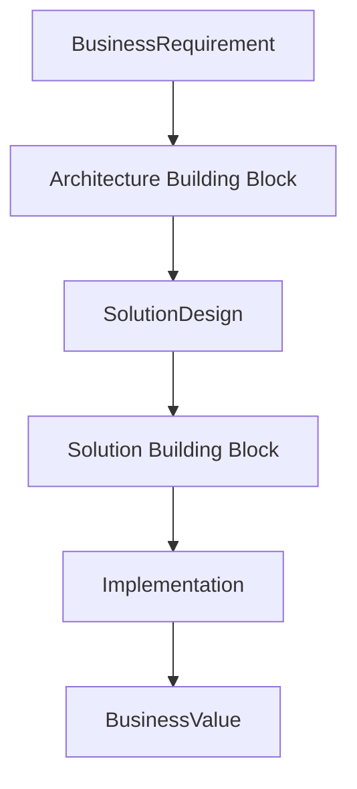
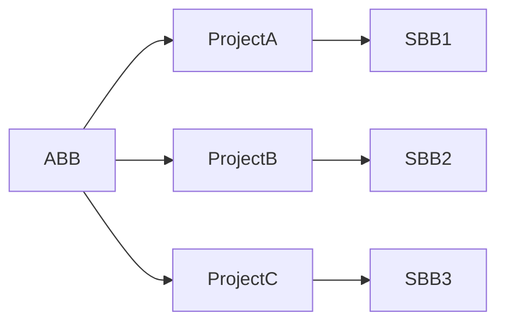

# Chapter 12

# Building Blocks
## Designing Enterprise Solutions with Reusable Components

---

## Learning Objectives

By the end of this chapter, you will be able to:

- Define Architecture Building Blocks (ABBs) and Solution Building Blocks (SBBs).
- Explain the relationship between ABBs and SBBs.
- Understand how Building Blocks promote reuse and standardization.
- Distinguish between logical architecture and physical implementation.
- Apply Building Blocks to Enterprise Architecture initiatives.

---

# Monday Morning – Building Smarter, Not Harder

The Enterprise Architecture Office at SwiftShip Global has defined its principles, repository, and governance model.

As the first transformation projects begin, one project team proposes building a new customer notification service from scratch.

Another team suggests using an existing enterprise messaging platform.

Emma Chen, the CEO, asks:

> "Why are different teams solving the same problem in different ways?"

You walk to the whiteboard and draw a simple picture of building blocks.

> "Because successful enterprises build solutions from reusable components—not from scratch every time."

---

# What Are Building Blocks?

Building Blocks are reusable components that can be combined to create Enterprise Architecture solutions.

TOGAF distinguishes between two major types:

- **Architecture Building Blocks (ABBs)**
- **Solution Building Blocks (SBBs)**

Together, they bridge the gap between architectural design and implementation.

---

# Architecture Building Blocks (ABBs)

An Architecture Building Block defines **what** capability is required.

It describes the logical architecture without specifying a particular technology or product.

Examples include:

- Customer Identity Management
- Shipment Tracking
- Payment Processing
- Notification Service
- API Gateway

ABBs focus on business and architectural capabilities.

---

# Solution Building Blocks (SBBs)

A Solution Building Block defines **how** the capability will be implemented.

It includes the actual products, technologies, services, and configurations used to realize an ABB.

Examples include:

- Microsoft Entra ID
- Amazon Simple Notification Service (SNS)
- Apache Kafka
- Kong API Gateway
- PostgreSQL Database

SBBs turn architecture into deployable solutions.

---

# ABBs vs. SBBs

| Architecture Building Block (ABB) | Solution Building Block (SBB) |
|-----------------------------------|-------------------------------|
| Defines **what** is needed | Defines **how** it is implemented |
| Logical | Physical |
| Technology-independent | Technology-specific |
| Supports architecture design | Supports implementation |
| Stable over time | May change as technology evolves |

---

# From Business Need to Solution

SwiftShip wants to notify customers whenever a shipment status changes.

The architecture team first identifies the required capability.

**ABB**

Customer Notification Service

The implementation team then selects the technology.

**SBB**

Amazon SNS integrated with the enterprise event platform.

The business capability remains the same even if the underlying technology changes in the future.

---

# Relationship Between ABBs and SBBs

Architecture defines the destination.

Solutions define the journey.

---

# Why Building Blocks Matter

Reusable Building Blocks help organizations:

- Reduce development effort
- Improve consistency
- Increase interoperability
- Simplify governance
- Accelerate project delivery
- Lower implementation costs

Instead of reinventing solutions, architects reuse proven capabilities.

---

# Reuse Across the Enterprise

The same Architecture Building Block can be realized by different Solution Building Blocks depending on business needs, technology strategy, or regional requirements.

---

# Building Blocks at SwiftShip

The Architecture Board establishes a catalog of reusable ABBs.

Examples include:

- Customer Management
- Shipment Tracking
- Identity Management
- Document Storage
- Analytics Platform
- API Management
- Enterprise Messaging

Project teams must evaluate existing Building Blocks before proposing new ones.

---

# Foundation Exam Focus

Remember:

- ABBs describe **what** is required.
- SBBs describe **how** it will be implemented.
- ABBs are logical and technology-independent.
- SBBs are physical and technology-specific.
- Building Blocks promote reuse and standardization.

---

# Practitioner Scenario

**Scenario**

SwiftShip plans to introduce a real-time notification capability.

The architecture team first defines the required business capability without selecting a vendor.

Later, the implementation team chooses Amazon SNS as the messaging platform.

**Question**

Which TOGAF concepts are represented?

**Answer**

The required notification capability is an **Architecture Building Block (ABB)**.

Amazon SNS is the **Solution Building Block (SBB)** used to implement that capability.

---

# Common Mistakes

- Treating ABBs and SBBs as the same concept.
- Selecting technologies before defining architecture.
- Creating duplicate Building Blocks.
- Ignoring reusable enterprise capabilities.
- Allowing projects to bypass approved Building Blocks.

---

# Key Takeaways

- Building Blocks are reusable architecture components.
- ABBs describe capabilities; SBBs describe implementations.
- Reuse improves consistency, governance, and efficiency.
- Architecture should define capabilities before technologies.
- Building Blocks help transform enterprise designs into practical solutions.

---

# Chapter Summary

Emma reviews the proposed customer notification solution.

> "So our architecture remains stable, even if the technology changes."

You nod.

> "Exactly. Technology evolves. Business capabilities endure."

SwiftShip now understands how reusable Building Blocks create a flexible, sustainable Enterprise Architecture.

---

# Next Chapter

**Chapter 13 – Architecture Content Framework: Organizing Enterprise Knowledge**
