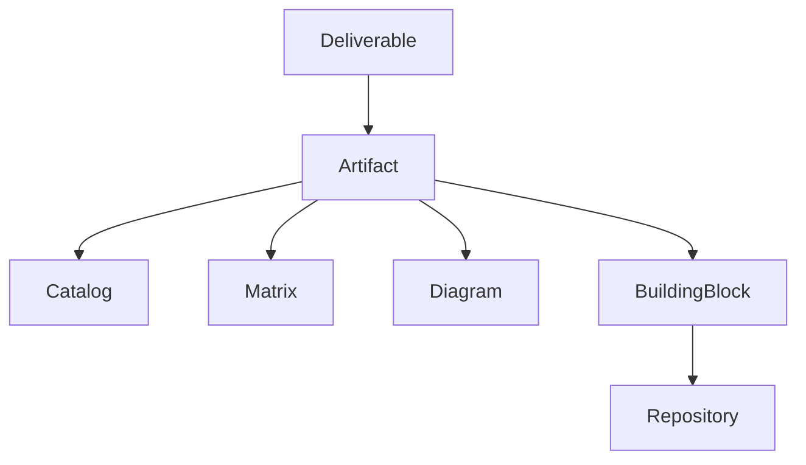
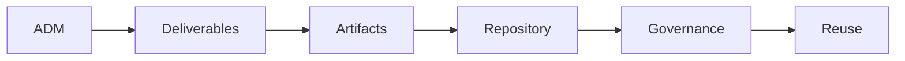

# Chapter 13

# Architecture Content Framework
## Organizing Enterprise Architecture Knowledge

---

## Learning Objectives

By the end of this chapter, you will be able to:

- Explain the purpose of the TOGAF Architecture Content Framework.
- Differentiate between Deliverables, Artifacts, and Building Blocks.
- Understand the Content Metamodel.
- Recognize the role of catalogs, matrices, and diagrams.
- Organize architecture outputs in a structured and reusable way.

---

# Tuesday Morning – Too Many Documents

SwiftShip's Enterprise Architecture Office has completed several architecture initiatives.

The Architecture Repository is growing rapidly.

Emma Chen, the CEO, looks at dozens of documents spread across the conference table.

> "We have capability maps, application inventories, process diagrams, standards, roadmaps, and governance reports."

She smiles.

> "But how does anyone know what belongs where?"

You reply,

> "That's exactly why TOGAF provides the Architecture Content Framework."

---

# What Is the Architecture Content Framework?

The Architecture Content Framework provides a structured approach for organizing architecture outputs.

It ensures that architects produce information consistently, making it easier to understand, govern, and reuse architecture across the enterprise.

Rather than defining *what* architecture should be created, it defines *how architecture information should be organized*.

---

# Why the Content Framework Matters

Without a common structure:

- Documentation becomes inconsistent.
- Different projects use different terminology.
- Information is difficult to locate.
- Reuse becomes challenging.
- Governance reviews take longer.

The Content Framework provides a common language for architecture documentation.

---

# The Three Core Concepts

TOGAF distinguishes three important concepts.

| Concept | Purpose |
|---------|---------|
| Deliverable | A formal work product provided to stakeholders |
| Artifact | A specific piece of architectural information |
| Building Block | A reusable component of the architecture |

Understanding the relationship between these concepts is essential.

---

# Deliverables

A Deliverable is a formally reviewed and approved output produced during the ADM.

Examples include:

- Architecture Vision Document
- Architecture Definition Document
- Architecture Requirements Specification
- Implementation and Migration Plan
- Architecture Contract

Deliverables are usually shared with stakeholders and governance bodies.

---

# Artifacts

Artifacts are individual pieces of architecture information contained within deliverables.

TOGAF groups artifacts into three categories.

## Catalogs

Catalogs are lists of architecture elements.

Examples:

- Application Portfolio Catalog
- Technology Standards Catalog
- Business Capability Catalog

---

## Matrices

Matrices show relationships between architecture elements.

Examples:

- Application-to-Organization Matrix
- Role-to-Process Matrix
- Data Entity-to-Application Matrix

---

## Diagrams

Diagrams provide visual representations of the architecture.

Examples:

- Business Process Diagram
- Application Communication Diagram
- Technology Architecture Diagram
- Capability Map

---

# Relationship Between Deliverables, Artifacts, and Building Blocks

A single deliverable often contains many artifacts.

Artifacts describe Building Blocks and are ultimately stored within the Architecture Repository.

---

# The Content Metamodel

The Content Metamodel describes how architecture elements relate to one another.

Examples include relationships between:

- Business Capabilities
- Business Processes
- Data Entities
- Applications
- Technology Components

The metamodel provides consistency across architecture work.

---

# Example – SwiftShip Transformation

SwiftShip creates an **Architecture Definition Document**.

Inside the document are:

- Business Capability Catalog
- Application Portfolio Catalog
- Business Process Diagram
- Technology Standards Matrix
- Target Architecture Diagram

Together, these artifacts describe the target architecture while following a consistent structure.

---

# Content Framework Across the ADM

The Content Framework ensures that every ADM phase produces well-organized outputs that can be governed and reused.

---

# Benefits of the Content Framework

SwiftShip gains several advantages:

- Consistent documentation
- Easier governance reviews
- Improved collaboration
- Faster knowledge sharing
- Better architecture reuse
- Simplified onboarding of new architects

The framework turns architecture documentation into an enterprise asset.

---

# Foundation Exam Focus

Remember:

- Deliverables are formal work products.
- Artifacts are architecture descriptions.
- Building Blocks are reusable architecture components.
- Artifacts include Catalogs, Matrices, and Diagrams.
- The Content Metamodel defines relationships between architecture elements.

---

# Practitioner Scenario

**Scenario**

The Architecture Board asks every project to submit documentation in a consistent format containing capability catalogs, application matrices, and technology diagrams.

**Question**

Which TOGAF concept supports this requirement?

**Answer**

The **Architecture Content Framework**, which standardizes the organization of architecture deliverables, artifacts, and building blocks.

---

# Common Mistakes

- Confusing Deliverables with Artifacts.
- Treating diagrams as the only architecture output.
- Ignoring catalogs and matrices.
- Producing inconsistent documentation across projects.
- Failing to relate architecture elements through the Content Metamodel.

---

# Key Takeaways

- The Architecture Content Framework organizes architecture knowledge.
- Deliverables contain Artifacts.
- Artifacts include Catalogs, Matrices, and Diagrams.
- Building Blocks represent reusable architecture capabilities.
- The Content Metamodel ensures consistent relationships between architecture elements.
- Consistent documentation improves governance and reuse.

---

# Chapter Summary

Emma closes the final architecture document.

> "Now I see the difference."

> "We're not just producing documents."

You smile.

> "We're creating structured knowledge that every future project can understand and reuse."

SwiftShip's architecture documentation has evolved into a consistent, enterprise-wide language.

---

# Next Chapter

**Chapter 14 – Architecture Governance: Keeping Enterprise Transformation on Course**
