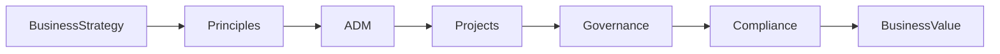
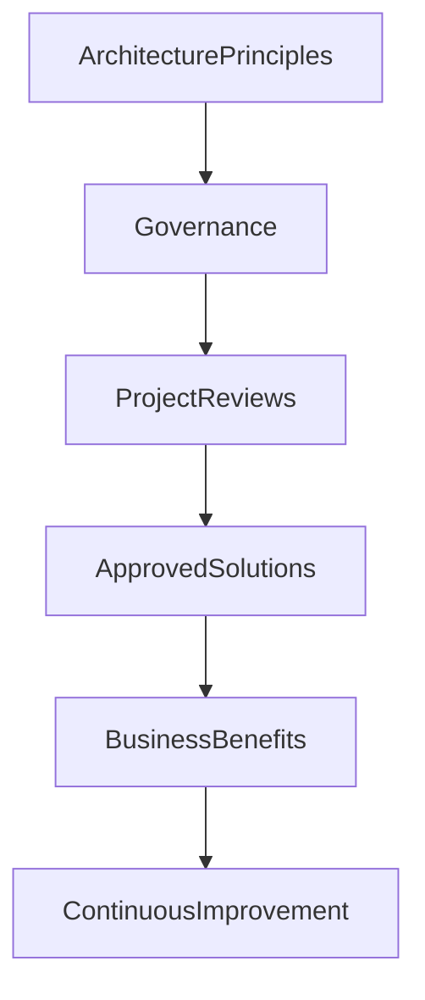

# Chapter 14

# Architecture Governance
## Keeping Enterprise Transformation on Course

---

## Learning Objectives

By the end of this chapter, you will be able to:

- Define Architecture Governance and explain its purpose.
- Understand the role of governance throughout the ADM.
- Describe the responsibilities of the Architecture Board.
- Explain Architecture Compliance Reviews and Architecture Contracts.
- Understand how governance enables business value while managing risk.

---

# Wednesday Morning – Turning Plans into Reality

SwiftShip's architecture team has completed its principles, repository, building blocks, and architecture documentation.

Emma Chen, the CEO, asks one final question before implementation begins.

> "We've designed an excellent target architecture."

She pauses.

> "How do we ensure every project actually follows it?"

You reply with a single phrase.

**Architecture Governance**

---

# What Is Architecture Governance?

Architecture Governance is the system of leadership, decision-making, oversight, and accountability that ensures architecture is developed and implemented in accordance with agreed principles, standards, and business objectives.

Governance ensures Enterprise Architecture remains relevant throughout planning, implementation, and ongoing change.

---

# Why Governance Matters

Without governance:

- Projects choose different standards.
- Solution designs drift from the target architecture.
- Technical debt increases.
- Business risks grow.
- Investments fail to deliver expected value.

Governance keeps transformation aligned with enterprise strategy.

---

# Governance in the TOGAF Lifecycle

Governance is not a single ADM phase—it supports every phase of the architecture lifecycle.

---

# The Architecture Board

SwiftShip establishes an **Architecture Board** to oversee Enterprise Architecture.

Typical responsibilities include:

- Approving architecture principles
- Reviewing architecture deliverables
- Resolving architectural issues
- Granting or rejecting exceptions
- Monitoring compliance
- Guiding strategic decisions

The Architecture Board provides enterprise-wide architectural leadership.

---

# Architecture Compliance Reviews

As projects progress, the Architecture Board performs Architecture Compliance Reviews.

These reviews verify that projects:

- Align with business objectives
- Follow approved architecture principles
- Use enterprise standards
- Reuse approved Building Blocks
- Manage identified risks

Compliance reviews identify issues early, reducing costly redesign later.

---

# Architecture Contracts

An Architecture Contract records the commitments between the Architecture function and implementation teams.

Typical contents include:

- Scope
- Responsibilities
- Deliverables
- Architecture requirements
- Compliance expectations
- Escalation process

The contract establishes clear accountability.

---

# Managing Exceptions

Sometimes projects cannot fully comply with enterprise standards.

Examples include:

- Regulatory requirements
- Time-critical business needs
- Legacy system constraints

Rather than bypassing governance, project teams submit an exception request.

The Architecture Board evaluates:

- Business justification
- Risk
- Alternatives
- Long-term impact

Approved exceptions are documented in the Governance Log.

---

# Governance Supports Business Outcomes

Governance is not about slowing projects.

It is about enabling consistent, well-informed decisions that maximize long-term business value.

---

# Governance at SwiftShip

Before any transformation initiative begins, every project must:

1. Align with Architecture Principles.
2. Reference approved Building Blocks.
3. Review architecture standards.
4. Complete an Architecture Compliance Review.
5. Obtain Architecture Board approval where required.

This process ensures that regional initiatives contribute to a coherent enterprise architecture.

---

# Foundation Exam Focus

Remember:

- Architecture Governance provides oversight and accountability.
- The Architecture Board directs governance activities.
- Architecture Compliance Reviews assess adherence to the target architecture.
- Architecture Contracts define responsibilities and expectations.
- Governance applies throughout the ADM lifecycle.

---

# Practitioner Scenario

**Scenario**

A regional office wants to deploy a warehouse solution that does not comply with SwiftShip's approved integration standards because of an aggressive delivery deadline.

**Question**

How should the Architecture Board respond?

**Answer**

Conduct an Architecture Compliance Review, evaluate the business justification and associated risks, consider alternatives, and either approve a documented exception or require alignment with the enterprise architecture before implementation.

---

# Common Mistakes

- Treating governance as a one-time approval.
- Confusing governance with project management.
- Ignoring Architecture Compliance Reviews.
- Allowing undocumented exceptions.
- Viewing governance as bureaucracy instead of business enablement.

---

# Key Takeaways

- Governance ensures architecture is implemented consistently.
- The Architecture Board provides enterprise oversight.
- Compliance Reviews verify alignment with principles and standards.
- Architecture Contracts clarify responsibilities.
- Effective governance balances agility with control.

---

# Chapter Summary

Emma reviews the governance framework.

> "Architecture isn't complete when the design is finished."

You nod.

> "The real measure of success is whether the enterprise follows the architecture while continuing to deliver business value."

SwiftShip is now ready to move from architectural foundations into detailed execution using the Architecture Development Method.

---

# End of Part II

You have completed **Part II – The TOGAF Standard**.

The executive team now understands the principles, governance, repositories, content, and reusable assets that support Enterprise Architecture.

The next stage of the journey begins with **Part III – Architecture Development Method (ADM)**, where SwiftShip starts the Preliminary Phase and progresses through Phases A to H in detail.
