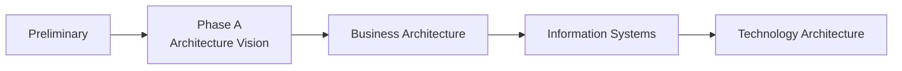

# Chapter 15

# Preliminary Phase
## Preparing the Enterprise for Architecture

---

## Learning Objectives

By the end of this chapter, you will be able to:

- Explain the purpose of the Preliminary Phase.
- Identify the objectives and key activities of the Preliminary Phase.
- Understand Architecture Capability and governance preparation.
- Recognize the major inputs and outputs of the Preliminary Phase.
- Explain why preparation is essential before beginning Phase A.

---

# Monday Morning – Before the Journey Begins

With the architectural foundation established, SwiftShip Global is ready to begin the Architecture Development Method (ADM).

Emma Chen, the CEO, addresses the Architecture Board.

> "We've agreed on our principles, governance, and standards."

She pauses.

> "Can we start designing our future architecture today?"

You shake your head.

> "Not yet."

> "Before we begin designing, we must prepare the organization itself."

That preparation is called the **Preliminary Phase**.

---

# What Is the Preliminary Phase?

The Preliminary Phase prepares the enterprise to perform Enterprise Architecture.

Rather than producing a target architecture, it establishes the capability, governance, processes, roles, and principles needed for successful architecture work.

Think of it as preparing the construction site before building begins.

---

# Objectives of the Preliminary Phase

The Preliminary Phase aims to:

- Establish the Enterprise Architecture capability.
- Define architecture governance.
- Confirm organizational scope.
- Identify stakeholders.
- Define architecture principles.
- Tailor the TOGAF ADM to organizational needs.
- Secure executive sponsorship.

These activities create a strong foundation for all later ADM phases.

---

# Key Activities

The architecture team performs several important activities.

## Establish the Architecture Capability

SwiftShip creates an Enterprise Architecture Office with defined roles, responsibilities, and reporting structures.

## Define Governance

The Architecture Board, review process, and decision-making procedures are formally established.

## Tailor the TOGAF Standard

The team decides how TOGAF will be applied within SwiftShip, including documentation standards and governance checkpoints.

## Define Principles

Previously approved architecture principles become mandatory guidance for all projects.

## Confirm Scope

The Architecture Board confirms that the first transformation programme will focus on logistics, warehouse operations, and customer-facing digital services.

---

# Inputs and Outputs

| Inputs | Outputs |
|---------|----------|
| Business Strategy | Tailored Architecture Framework |
| Enterprise Goals | Architecture Principles |
| Existing Governance | Architecture Capability |
| Stakeholder Expectations | Governance Model |
| Organizational Context | Request for Architecture Work |

The outputs of the Preliminary Phase enable the Architecture Vision in Phase A.

---

# Preliminary Phase in the ADM

The Preliminary Phase is the foundation upon which the entire ADM is built.

---

# Architecture Capability

Architecture Capability includes:

- Enterprise Architecture Office
- Architecture Board
- Governance processes
- Skills and competencies
- Architecture Repository
- Standards and methods

Without these elements, architecture becomes inconsistent and difficult to sustain.

---

# Tailoring TOGAF

No two organizations are identical.

SwiftShip tailors TOGAF by:

- Defining governance checkpoints.
- Standardizing architecture templates.
- Selecting required deliverables.
- Establishing review cycles.
- Integrating architecture with project management.

Tailoring makes TOGAF practical without changing its core principles.

---

# SwiftShip Example

Before launching its warehouse modernization programme, SwiftShip:

1. Appoints a Chief Enterprise Architect.
2. Forms an Architecture Board.
3. Publishes Architecture Principles.
4. Creates an Architecture Repository.
5. Defines governance processes.
6. Approves the first Request for Architecture Work.

Only then does the organization proceed to Phase A.

---

# Foundation Exam Focus

Remember:

- The Preliminary Phase prepares the organization for Enterprise Architecture.
- It establishes Architecture Capability and Governance.
- TOGAF should be tailored to organizational needs.
- Architecture Principles are confirmed before detailed architecture work.
- The Preliminary Phase precedes Phase A.

---

# Practitioner Scenario

**Scenario**

A global retailer wants to begin Enterprise Architecture but has no Architecture Board, governance process, or architecture principles.

**Question**

Which ADM phase should address these gaps?

**Answer**

The **Preliminary Phase**, where the architecture capability, governance framework, principles, and organizational preparation are established before architecture development begins.

---

# Common Mistakes

- Skipping the Preliminary Phase.
- Beginning solution design before governance exists.
- Applying TOGAF without tailoring.
- Starting projects without executive sponsorship.
- Treating architecture as only a technical activity.

---

# Key Takeaways

- The Preliminary Phase prepares the enterprise—not the solution.
- Governance, capability, principles, and scope are established first.
- TOGAF is tailored to fit the organization.
- Strong preparation improves the success of every later ADM phase.

---

# Chapter Summary

Emma reviews the readiness checklist.

> "Now I understand why we didn't rush into architecture."

You smile.

> "Preparation is part of architecture. A strong foundation makes every future decision easier."

SwiftShip is now fully prepared to begin **Phase A – Architecture Vision**, where the enterprise transformation officially starts.

---

# Next Chapter

**Chapter 16 – Phase A: Architecture Vision**
