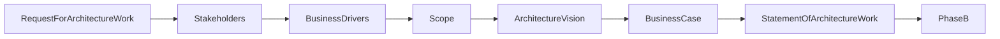
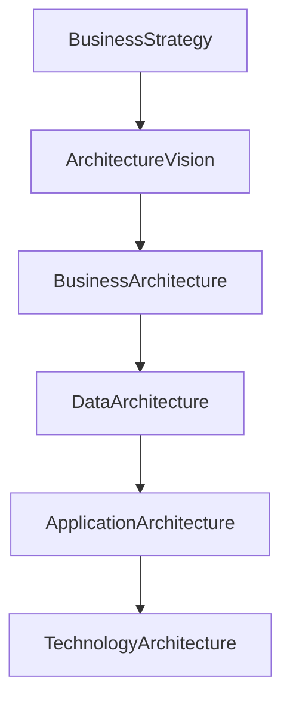

# Chapter 16

# Phase A – Architecture Vision
## Creating the Future State

---

## Learning Objectives

By the end of this chapter, you will be able to:

- Explain the purpose of Phase A – Architecture Vision.
- Identify the key inputs, activities, and outputs of Phase A.
- Understand the importance of stakeholder engagement.
- Define the Statement of Architecture Work.
- Explain how the Architecture Vision aligns business strategy with enterprise transformation.

---

# Tuesday Morning – The Transformation Begins

SwiftShip Global has completed the Preliminary Phase.

The Enterprise Architecture Office is operational.

Architecture principles have been approved.

Governance has been established.

Emma Chen, the CEO, opens the first official Architecture Board meeting.

> "Today, we begin transforming SwiftShip."

She pauses.

> "What does success actually look like?"

You stand before the board.

> "Before designing processes, applications, or technology, we need a shared vision of the future."

That is the purpose of **Phase A – Architecture Vision**.

---

# Purpose of Phase A

Phase A establishes a high-level vision for the architecture initiative.

It ensures that:

- Business drivers are clearly understood.
- Stakeholders share a common vision.
- Scope is agreed.
- Expected business value is defined.
- Executive sponsorship is confirmed.

The Architecture Vision becomes the foundation for every remaining ADM phase.

---

# Key Inputs

Phase A uses information prepared during the Preliminary Phase.

Typical inputs include:

- Request for Architecture Work
- Business strategy
- Enterprise goals
- Architecture principles
- Stakeholder concerns
- Governance framework

---

# Key Activities

## Confirm the Request for Architecture Work

The Architecture Board formally authorizes the initiative.

SwiftShip approves a programme to modernize logistics, warehouse operations, and customer-facing services.

---

## Identify Stakeholders

The architecture team identifies:

- Executive sponsors
- Business leaders
- Technology leaders
- Security representatives
- Regional managers
- Customers

Each stakeholder has different concerns that influence the architecture.

---

## Understand Business Drivers

The transformation is driven by:

- Global e-commerce growth
- Increasing customer expectations
- Aging legacy systems
- Operational inefficiencies
- Cybersecurity requirements

These drivers explain *why* change is necessary.

---

## Define Scope

The first transformation iteration includes:

- Shipment tracking
- Warehouse operations
- Customer portal
- Enterprise integration

Human Resources and Finance systems remain outside the initial scope.

---

## Develop the Architecture Vision

The team produces a concise description of the desired future state.

The vision focuses on business outcomes rather than technical implementation.

Example:

> "SwiftShip will provide a unified, secure, and real-time logistics platform that delivers seamless customer experiences while improving operational efficiency across all regions."

---

## Prepare the Business Case

The architecture team estimates benefits including:

- Faster shipment processing
- Lower operational costs
- Improved customer satisfaction
- Better data quality
- Reduced technology duplication

The business case justifies the investment.

---

## Create the Statement of Architecture Work

This document defines:

- Objectives
- Scope
- Deliverables
- Constraints
- Governance approach
- Roles and responsibilities

It formally launches the architecture engagement.

---

# Phase A Deliverables

| Deliverable | Purpose |
|-------------|---------|
| Architecture Vision | Describes the target future state |
| Stakeholder Map | Identifies stakeholders and concerns |
| Business Case | Justifies the initiative |
| Statement of Architecture Work | Defines scope and responsibilities |

---

# Phase A Workflow

---

# Architecture Vision Drives the ADM

The Architecture Vision ensures every ADM phase remains aligned with business strategy.

---

# SwiftShip Example

Emma reviews the Architecture Vision.

> "Our goal isn't simply to replace systems."

You reply,

> "Correct. Our goal is to transform how SwiftShip operates and serves customers."

The executive team approves the Statement of Architecture Work, authorizing the next ADM phase.

---

# Foundation Exam Focus

Remember:

- Phase A establishes the Architecture Vision.
- Stakeholder engagement is essential.
- Business value must be clearly articulated.
- The Statement of Architecture Work authorizes the architecture engagement.
- Phase A aligns enterprise strategy with architecture development.

---

# Practitioner Scenario

**Scenario**

SwiftShip launches a digital transformation programme. Different business units have different expectations, and no agreed scope exists.

**Question**

What should the Enterprise Architect do first?

**Answer**

Conduct Phase A by identifying stakeholders, defining the Architecture Vision, confirming scope, preparing the business case, and producing the Statement of Architecture Work before detailed architecture begins.

---

# Common Mistakes

- Beginning detailed design before defining the vision.
- Ignoring stakeholder concerns.
- Defining technology instead of business outcomes.
- Allowing uncontrolled scope expansion.
- Failing to produce a Statement of Architecture Work.

---

# Key Takeaways

- Phase A creates a shared understanding of the future state.
- The Architecture Vision aligns business goals with enterprise transformation.
- Stakeholders, scope, and business value must be agreed early.
- The Statement of Architecture Work formally starts the architecture engagement.

---

# Chapter Summary

Emma signs the Statement of Architecture Work.

> "Now everyone knows where we're going."

You smile.

> "Exactly. A successful transformation begins with a shared vision."

SwiftShip is now ready to enter **Phase B – Business Architecture**, where the future operating model of the enterprise will be designed.

---

# Next Chapter

**Chapter 17 – Phase B: Business Architecture**
