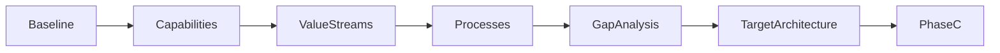
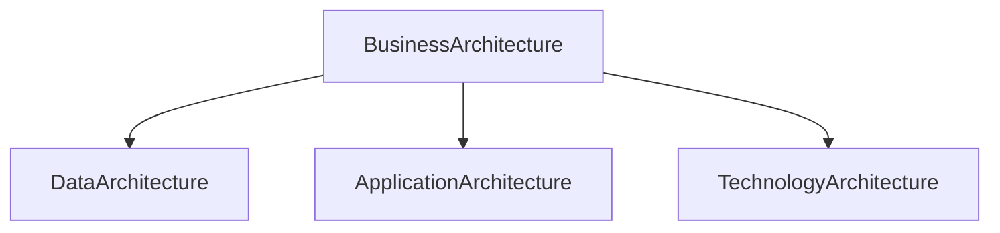

# Chapter 17

# Phase B – Business Architecture
## Designing the Business of Tomorrow

---

## Learning Objectives

By the end of this chapter, you will be able to:

- Explain the purpose of Phase B – Business Architecture.
- Differentiate between Baseline and Target Business Architecture.
- Develop business capabilities, value streams, and business processes.
- Perform business gap analysis.
- Understand the major inputs, activities, deliverables, and outputs of Phase B.

---

# Wednesday Morning – Redesigning the Business

With the Architecture Vision approved, SwiftShip's executive team gathers to answer the next question.

Emma Chen asks:

> "We know where we want to go. But how should our business actually operate in the future?"

You reply:

> "Before choosing applications or technology, we must redesign the business itself."

This is the focus of **Phase B – Business Architecture**.

---

# Purpose of Phase B

Phase B develops the Business Architecture required to achieve the Architecture Vision.

It describes how the enterprise should operate by defining:

- Business capabilities
- Value streams
- Business processes
- Organizational structure
- Business services
- Stakeholder interactions

Technology decisions come later.

---

# Inputs

Typical inputs include:

- Approved Architecture Vision
- Statement of Architecture Work
- Architecture Principles
- Business Strategy
- Stakeholder Requirements
- Architecture Repository

---

# Key Activities

## Understand the Baseline Business Architecture

Document the current operating model, including processes, organization, services, and pain points.

## Define the Target Business Architecture

Design the future business model aligned with strategic goals.

## Identify Business Capabilities

Capabilities describe **what** the business must be able to do.

Examples at SwiftShip include:

- Shipment Tracking
- Customer Service
- Warehouse Operations
- Fleet Management
- Analytics

## Map Value Streams

A value stream shows how value is delivered to customers from request to fulfillment.

## Model Business Processes

Document the sequence of activities required to deliver each capability efficiently.

## Perform Gap Analysis

Compare the baseline and target architectures to identify missing capabilities, redundant activities, and improvement opportunities.

---

# Baseline vs Target Business Architecture

| Baseline | Target |
|----------|--------|
| Current operating model | Future operating model |
| Existing processes | Optimized processes |
| Current organization | Future organization |
| Known pain points | Desired outcomes |

---

# Phase B Workflow

---

# Business Capability Example

SwiftShip defines a capability called **Shipment Visibility**.

Supporting processes include:

- Receive shipment event
- Update tracking status
- Notify customer
- Escalate delivery exception

Multiple applications may support these processes, but the capability remains stable over time.

---

# Business Deliverables

| Deliverable | Purpose |
|-------------|---------|
| Business Architecture Document | Defines the target business architecture |
| Capability Map | Shows enterprise capabilities |
| Value Stream Map | Describes customer value creation |
| Business Process Models | Documents future processes |
| Gap Analysis | Identifies required changes |

---

# Relationship to Later ADM Phases

Business Architecture drives every later design decision.

---

# SwiftShip Example

The Architecture Board discovers duplicate customer service processes across regions.

The Target Business Architecture standardizes them into one global operating model, reducing delays and improving customer experience.

---

# Foundation Exam Focus

Remember:

- Phase B develops the Business Architecture.
- Business Architecture comes before Data, Application, and Technology Architecture.
- Capabilities describe what the business does.
- Value streams describe how value is delivered.
- Gap analysis compares baseline and target architectures.

---

# Practitioner Scenario

**Scenario**

Regional business units each use different order fulfillment processes, creating inconsistent customer experiences.

**Question**

How should the Enterprise Architect respond?

**Answer**

Model the Baseline Business Architecture, define a Target Business Architecture aligned with enterprise strategy, perform a gap analysis, and propose standardized business capabilities and processes.

---

# Common Mistakes

- Jumping directly to technology solutions.
- Ignoring the baseline architecture.
- Confusing business capabilities with applications.
- Failing to engage business stakeholders.
- Skipping gap analysis.

---

# Key Takeaways

- Phase B focuses on business transformation.
- Business capabilities remain stable even when technology changes.
- Value streams and business processes explain how value is delivered.
- Gap analysis identifies the work needed to reach the target state.
- Business Architecture provides the foundation for all subsequent architecture phases.

---

# Chapter Summary

Emma reviews the future operating model.

> "Now I understand. We're redesigning the business first—not the software."

You nod.

> "Exactly. Technology should enable the business, never define it."

SwiftShip is now ready for **Phase C – Data Architecture**, where enterprise information will be modeled to support the new business.

---

# Next Chapter

**Chapter 18 – Phase C: Data Architecture**
