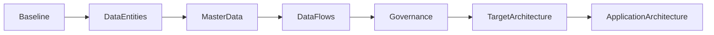
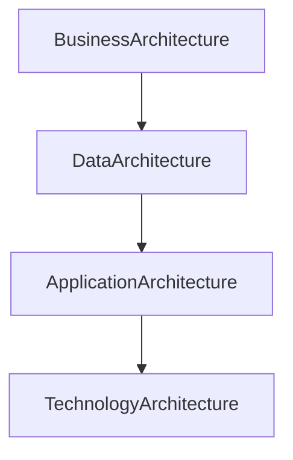

# Chapter 18

# Phase C – Data Architecture
## Information as an Enterprise Asset

---

## Learning Objectives

By the end of this chapter, you will be able to:

- Explain the purpose of Phase C – Data Architecture.
- Distinguish between Baseline and Target Data Architecture.
- Understand data entities, data lifecycle, and master data.
- Describe data governance and data security.
- Produce the primary deliverables of the Data Architecture phase.

---

# Thursday Morning – Data Becomes the Focus

SwiftShip has redesigned its business processes.

Emma Chen asks the next question.

> "Our future business depends on information. Do we know where our data comes from, who owns it, and how it flows?"

You reply:

> "Business processes create value, but data enables those processes."

This is the purpose of **Phase C – Data Architecture**.

---

# Purpose of Phase C

The Data Architecture defines how enterprise data is structured, managed, shared, protected, and governed to support the Business Architecture.

It answers questions such as:

- What information does the business need?
- Where is it stored?
- Who owns it?
- How does it move across the enterprise?
- How is it protected?

---

# Inputs

Typical inputs include:

- Business Architecture
- Architecture Vision
- Architecture Principles
- Requirements Repository
- Existing data models
- Architecture Repository

---

# Key Activities

## Assess the Baseline Data Architecture

Document existing databases, data sources, ownership, integrations, quality issues, and duplication.

## Define the Target Data Architecture

Design the future-state information landscape aligned with business capabilities.

## Identify Data Entities

Examples include:

- Customer
- Shipment
- Order
- Warehouse
- Vehicle
- Employee

These represent the core business information managed across the enterprise.

## Define Master Data

Master Data provides a single trusted source for critical entities such as Customers, Products, and Locations.

## Model Data Flows

Describe how information moves between business functions and applications while maintaining integrity and traceability.

## Define Data Governance

Assign ownership, stewardship, quality standards, retention policies, and access controls.

## Address Data Security

Protect sensitive information using classification, encryption, authentication, authorization, auditing, and privacy controls.

---

# Baseline vs Target Data Architecture

| Baseline | Target |
|----------|--------|
| Disconnected data sources | Integrated enterprise data |
| Duplicate records | Single source of truth |
| Manual reconciliation | Automated synchronization |
| Inconsistent quality | Governed, trusted data |

---

# Phase C Workflow

---

# Data Lifecycle

Enterprise data passes through several stages:

1. Create
2. Store
3. Use
4. Share
5. Archive
6. Dispose

Managing the complete lifecycle improves compliance and reduces risk.

---

# SwiftShip Example

The architecture team discovers that regional warehouses maintain separate customer records.

The Target Data Architecture introduces a centralized customer master, eliminating duplicate records and ensuring consistent shipment information worldwide.

---

# Phase Deliverables

| Deliverable | Purpose |
|-------------|---------|
| Data Architecture Document | Defines target data architecture |
| Data Entity Catalog | Lists enterprise data entities |
| Data Lifecycle Model | Describes how data is managed |
| Data Flow Diagram | Shows movement of information |
| Data Governance Model | Defines ownership and controls |
| Gap Analysis | Identifies changes required |

---

# Relationship to Application Architecture

Applications consume and create data, but the business defines what data is required.

---

# Foundation Exam Focus

Remember:

- Data Architecture supports Business Architecture.
- Data entities describe business information.
- Master Data creates a single source of truth.
- Data Governance defines ownership, quality, and accountability.
- Data Security protects enterprise information.

---

# Practitioner Scenario

**Scenario**

SwiftShip has three customer databases with inconsistent records, causing shipment delays and reporting errors.

**Question**

How should the Enterprise Architect respond?

**Answer**

Assess the Baseline Data Architecture, define a Target Data Architecture with centralized master data, establish governance and ownership, perform gap analysis, and plan the migration to a trusted enterprise information model.

---

# Common Mistakes

- Treating databases as the Data Architecture.
- Ignoring data ownership.
- Overlooking data quality.
- Designing applications before defining enterprise data.
- Failing to integrate governance and security.

---

# Key Takeaways

- Data is a strategic enterprise asset.
- Phase C defines how information is organized and governed.
- Master Data improves consistency and decision-making.
- Data Governance and security are essential.
- A strong Data Architecture enables effective Application and Technology Architectures.

---

# Chapter Summary

Emma reviews the new enterprise data model.

> "Now every region will work with the same trusted information."

You smile.

> "Exactly. Reliable data is the foundation of reliable decisions."

SwiftShip is now ready for the next part of Phase C, where the enterprise applications supporting this information will be designed.

---

# Next Chapter

**Chapter 19 – Phase C: Application Architecture**

---

## 📖 Continue Reading

⬅️ **Previous:** [Chapter 17 – Phase B Business Architecture](17-Phase-B-Business-Architecture.md)

🏠 **Home:** [📚 Table of Contents](../../../README.md)

➡️ **Next:** [Chapter 19 – Phase C Application Architecture](19-Phase-C-Application-Architecture.md)

---

© 2026 **Baskar Periasamy** • Licensed under the MIT License.
