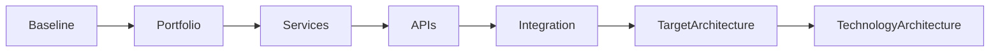
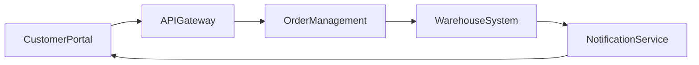
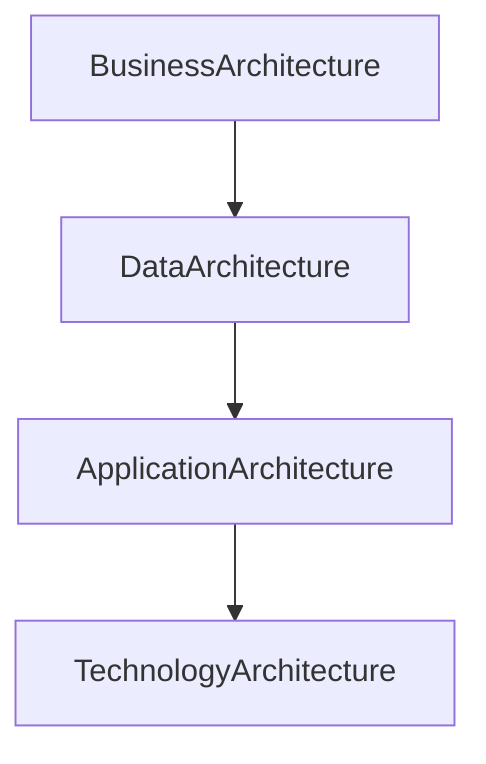

# Chapter 19

# Phase C – Application Architecture
## Designing Enterprise Applications

---

## Learning Objectives

By the end of this chapter, you will be able to:

- Explain the purpose of Phase C – Application Architecture.
- Differentiate between Baseline and Target Application Architecture.
- Understand application portfolios, services, APIs, and integrations.
- Model application interactions that support business capabilities.
- Produce the primary deliverables of the Application Architecture phase.

---

# Friday Morning – Choosing the Right Applications

SwiftShip has redesigned its business and information landscape.

Emma Chen asks the next question.

> "We know what our business does and what data it needs. Which applications will support those capabilities?"

You reply:

> "Applications are the digital workforce of the enterprise. They must support the business—not define it."

This is the purpose of **Phase C – Application Architecture**.

---

# Purpose of Phase C

Application Architecture defines the individual applications, their interactions, and the services they provide to support the Business and Data Architectures.

It answers questions such as:

- Which applications are needed?
- Which applications should be retired?
- How do applications exchange information?
- Which services and APIs are required?
- Where are duplicate capabilities?

---

# Inputs

Typical inputs include:

- Business Architecture
- Data Architecture
- Architecture Vision
- Architecture Principles
- Requirements Repository
- Existing Application Portfolio

---

# Key Activities

## Assess the Baseline Application Architecture

Document existing applications, integrations, interfaces, ownership, and technical issues.

## Define the Target Application Architecture

Design a future application landscape aligned with business capabilities.

## Develop the Application Portfolio

Classify applications as:

- Retain
- Replace
- Modernize
- Consolidate
- Retire

## Identify Application Services

Applications expose reusable services such as:

- Customer Profile Service
- Shipment Tracking Service
- Notification Service
- Payment Service

## Design Application Integration

Define how applications communicate through APIs, messaging, events, or integration platforms.

## Model Application Communication

Describe interactions between applications while avoiding unnecessary point-to-point integrations.

---

# Baseline vs Target Application Architecture

| Baseline | Target |
|----------|--------|
| Siloed applications | Integrated application ecosystem |
| Duplicate functionality | Shared enterprise services |
| Point-to-point interfaces | API-driven integration |
| Legacy platforms | Modern, scalable applications |

---

# Phase C Workflow

---

# Application Interaction Example

The architecture emphasizes loosely coupled services and standardized interfaces.

---

# SwiftShip Example

The Architecture Board discovers three separate customer portals across different regions.

The Target Application Architecture introduces:

- One global customer portal
- Shared authentication
- Enterprise API Gateway
- Central notification service

This reduces maintenance effort while providing a consistent customer experience.

---

# Phase Deliverables

| Deliverable | Purpose |
|-------------|---------|
| Application Architecture Document | Defines the future application landscape |
| Application Portfolio Catalog | Lists enterprise applications |
| Interface Catalog | Documents integrations and APIs |
| Application Communication Diagram | Shows application interactions |
| Gap Analysis | Identifies changes required |

---

# Relationship to Technology Architecture

Applications implement business capabilities, while the Technology Architecture provides the infrastructure that hosts and connects them.

---

# Foundation Exam Focus

Remember:

- Application Architecture supports the Business and Data Architectures.
- Applications provide services to the enterprise.
- APIs and integration enable communication.
- The Application Portfolio identifies modernization opportunities.
- Application Architecture precedes Technology Architecture.

---

# Practitioner Scenario

**Scenario**

SwiftShip operates multiple warehouse management systems that perform similar functions but cannot exchange information efficiently.

**Question**

How should the Enterprise Architect respond?

**Answer**

Assess the Baseline Application Architecture, identify duplicate capabilities, define a Target Application Architecture with standardized services and APIs, perform gap analysis, and plan application consolidation.

---

# Common Mistakes

- Selecting products before defining application services.
- Designing applications without considering business capabilities.
- Creating excessive point-to-point integrations.
- Ignoring application lifecycle planning.
- Failing to rationalize duplicate applications.

---

# Key Takeaways

- Application Architecture defines how enterprise applications support the business.
- Services and APIs improve reuse and interoperability.
- Portfolio rationalization reduces complexity and cost.
- Standardized integration enables scalable enterprise solutions.
- Application Architecture prepares the foundation for Technology Architecture.

---

# Chapter Summary

Emma reviews the future application landscape.

> "Instead of dozens of disconnected systems, we'll have a connected application ecosystem."

You reply:

> "Exactly. Applications become more valuable when they work together."

SwiftShip is now ready to design the infrastructure that will host these applications in **Phase D – Technology Architecture**.

---

# Next Chapter

**Chapter 20 – Phase D: Technology Architecture**

---

## 📖 Continue Reading

⬅️ **Previous:** [Chapter 18 – Phase C Data Architecture](18-Phase-C-Data-Architecture.md)

🏠 **Home:** [📚 Table of Contents](../../../README.md)

➡️ **Next:** [Chapter 20 – Phase D Technology Architecture](20-Phase-D-Technology-Architecture.md)

---

© 2026 **Baskar Periasamy** • Licensed under the MIT License.
