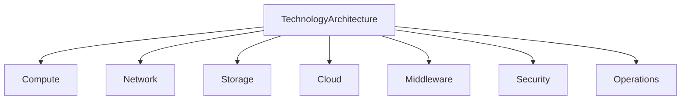
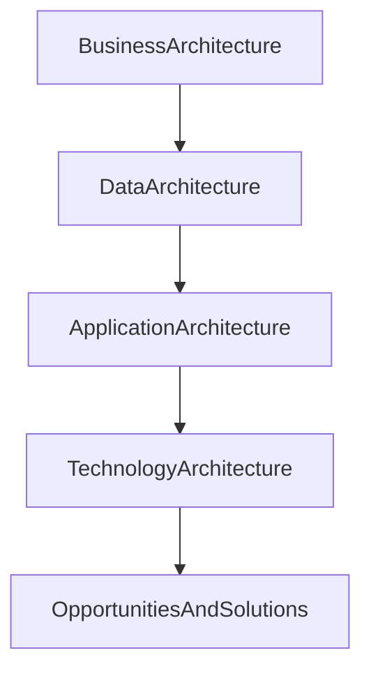

# Chapter 20

# Phase D – Technology Architecture
## Building the Enterprise Technology Platform

---

## Learning Objectives

By the end of this chapter, you will be able to:

- Explain the purpose of Phase D – Technology Architecture.
- Differentiate between Baseline and Target Technology Architecture.
- Understand infrastructure domains including compute, network, storage, cloud, middleware, and security.
- Define technology standards and platform services.
- Produce the primary deliverables of the Technology Architecture phase.

---

# Monday Morning – Building the Foundation

SwiftShip has completed its Business, Data, and Application Architectures.

The executive team now turns its attention to the technology that will power the transformation.

Emma Chen asks:

> "We've redesigned our business, our data, and our applications. What technology platform will make all of this possible?"

You answer:

> "Technology Architecture provides the enterprise foundation that enables every business capability and application."

This is the focus of **Phase D – Technology Architecture**.

---

# Purpose of Phase D

Technology Architecture defines the infrastructure, platforms, and technical services required to support the Business, Data, and Application Architectures.

It describes:

- Compute platforms
- Network infrastructure
- Storage platforms
- Cloud services
- Middleware
- Identity and security services
- Monitoring and operations

The objective is to create a scalable, secure, resilient, and standardized technology environment.

---

# Inputs

Typical inputs include:

- Business Architecture
- Data Architecture
- Application Architecture
- Architecture Vision
- Architecture Principles
- Technology standards
- Requirements Repository

---

# Key Activities

## Assess the Baseline Technology Architecture

Document the existing infrastructure, including:

- Servers
- Networks
- Storage
- Operating systems
- Virtualization
- Cloud environments
- Security controls

Identify constraints, risks, and technical debt.

---

## Define the Target Technology Architecture

Design a technology platform capable of supporting future business growth and digital transformation.

The design should prioritize:

- Scalability
- Availability
- Performance
- Security
- Resilience
- Operational simplicity

---

## Select Technology Standards

Establish enterprise standards for:

- Operating systems
- Databases
- Virtualization
- Cloud platforms
- Network protocols
- Identity providers
- Monitoring tools

Technology standards improve consistency and simplify operations.

---

## Design Infrastructure Services

Technology services commonly include:

- Compute
- Storage
- Networking
- Identity Management
- Backup and Recovery
- Disaster Recovery
- Monitoring
- Logging
- Container Platforms

These shared services support multiple business applications.

---

## Define Security Architecture

Security is integrated throughout the technology platform.

Key areas include:

- Identity and Access Management (IAM)
- Network segmentation
- Encryption
- Endpoint protection
- Vulnerability management
- Security monitoring
- Zero Trust principles

---

# Baseline vs Target Technology Architecture

| Baseline | Target |
|----------|--------|
| Legacy infrastructure | Modern hybrid cloud platform |
| Manual provisioning | Automated infrastructure |
| Inconsistent standards | Enterprise technology standards |
| Siloed monitoring | Centralized observability |
| Limited scalability | Elastic infrastructure |

---

# Technology Domains

Each domain contributes to a resilient enterprise platform.

---

# Technology Architecture Workflow

---

# SwiftShip Example

SwiftShip's assessment reveals:

- Multiple regional data centers
- Different virtualization platforms
- Duplicate monitoring tools
- Aging network infrastructure

The Target Technology Architecture introduces:

- Hybrid cloud deployment
- Standardized virtualization
- Enterprise monitoring platform
- Software-defined networking
- Centralized identity management
- Automated infrastructure provisioning

This creates a consistent global technology platform.

---

# Phase Deliverables

| Deliverable | Purpose |
|-------------|---------|
| Technology Architecture Document | Defines the future technology platform |
| Technology Standards Catalog | Lists approved technologies and standards |
| Infrastructure Landscape Diagram | Shows infrastructure components |
| Platform Services Catalog | Documents shared technology services |
| Gap Analysis | Identifies required technology changes |

---

# Relationship to Opportunities & Solutions

Technology Architecture completes the target-state design and prepares the transition into implementation planning.

---

# Foundation Exam Focus

Remember:

- Technology Architecture follows Application Architecture.
- It defines the infrastructure supporting enterprise applications.
- Technology standards improve consistency and governance.
- Security is embedded throughout the architecture.
- The outputs of Phase D provide the foundation for identifying implementation opportunities.

---

# Practitioner Scenario

**Scenario**

SwiftShip operates multiple regional infrastructure platforms with inconsistent security controls, monitoring tools, and virtualization technologies.

**Question**

How should the Enterprise Architect respond?

**Answer**

Assess the Baseline Technology Architecture, define a standardized Target Technology Architecture, establish enterprise technology standards, identify shared infrastructure services, perform a gap analysis, and prepare the technology roadmap for implementation.

---

# Common Mistakes

- Designing infrastructure before understanding business needs.
- Selecting technologies without enterprise standards.
- Treating security as a separate activity.
- Ignoring operational monitoring and resilience.
- Allowing unnecessary technology diversity across regions.

---

# Key Takeaways

- Technology Architecture provides the enterprise platform for applications and data.
- Standardization reduces complexity and operational cost.
- Shared technology services improve reuse and scalability.
- Security, resilience, and observability are integral to the architecture.
- Phase D completes the target architecture needed for solution planning.

---

# Chapter Summary

Emma reviews the proposed technology platform.

> "We've moved beyond individual systems."

You smile.

> "Exactly. We've designed a unified enterprise platform that can support SwiftShip's growth for years to come."

With the target architecture complete, SwiftShip is ready to identify implementation initiatives in **Phase E – Opportunities & Solutions**.

---

# Next Chapter

**Chapter 21 – Phase E: Opportunities & Solutions**
