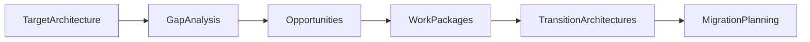
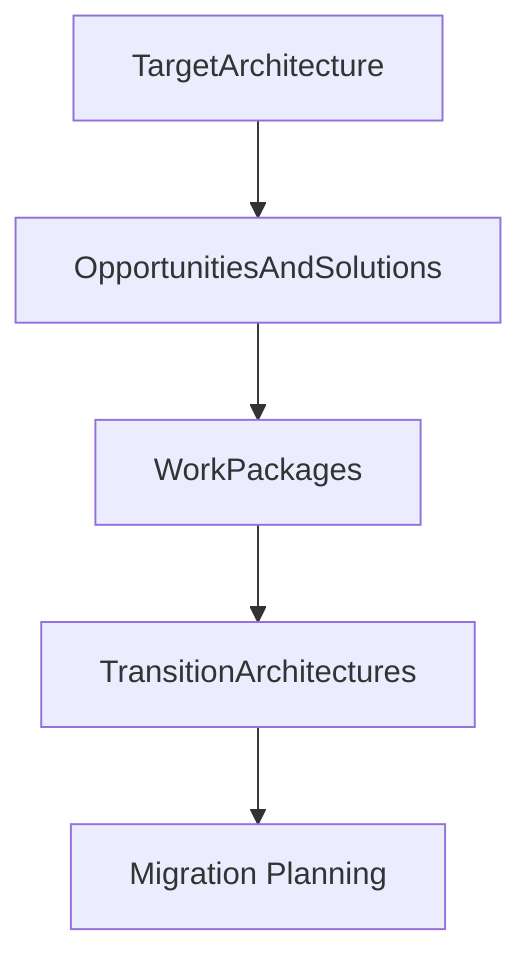

# Chapter 21

# Phase E – Opportunities & Solutions
## Turning Architecture into Executable Initiatives

---

## Learning Objectives

By the end of this chapter, you will be able to:

- Explain the purpose of Phase E – Opportunities & Solutions.
- Identify implementation opportunities from the Target Architecture.
- Understand Solution Building Blocks (SBBs) and Work Packages.
- Define Transition Architectures.
- Produce implementation-focused deliverables that prepare the enterprise for migration planning.

---

# Tuesday Morning – From Design to Delivery

SwiftShip has completed its Business, Data, Application, and Technology Architectures.

Emma Chen studies the architecture documents.

> "These designs look excellent—but how do we turn them into real projects?"

You answer:

> "Now we move from architecture design to implementation planning."

This is the purpose of **Phase E – Opportunities & Solutions**.

---

# Purpose of Phase E

Phase E identifies practical implementation opportunities and groups architecture changes into manageable initiatives.

It answers questions such as:

- Which projects should be launched?
- Which capabilities should be delivered together?
- Which Solution Building Blocks are required?
- What intermediate states are needed before reaching the Target Architecture?

---

# Inputs

Typical inputs include:

- Business Architecture
- Data Architecture
- Application Architecture
- Technology Architecture
- Gap Analysis
- Architecture Requirements Repository
- Architecture Vision

---

# Key Activities

## Consolidate Gap Analysis

Review gaps identified across all architecture domains and prioritize those that deliver the greatest business value.

## Identify Solution Building Blocks (SBBs)

Select implementation technologies and products that realize the approved Architecture Building Blocks.

Examples:

- Enterprise API Gateway
- Identity Platform
- Customer Master Data Platform
- Cloud Infrastructure
- Enterprise Monitoring Platform

## Define Work Packages

Group related changes into manageable initiatives.

SwiftShip identifies work packages such as:

- Customer Experience Modernization
- Warehouse Digitalization
- Enterprise Integration Platform
- Cloud Infrastructure Migration

## Develop Transition Architectures

Instead of moving directly from the current state to the final target, define intermediate architectures that reduce risk and support phased delivery.

## Assess Dependencies

Identify relationships between projects, technology upgrades, business changes, and organizational readiness.

---

# Opportunities to Solutions Workflow

---

# Transition Architecture

A Transition Architecture represents an intermediate state between the Baseline and Target Architectures.

Benefits include:

- Reduced implementation risk
- Faster business value
- Easier organizational adoption
- Better resource planning

Example:

1. Baseline: Regional customer portals
2. Transition: Shared authentication and API gateway
3. Target: Unified global customer platform

---

# Work Package Example

| Work Package | Primary Outcome |
|--------------|-----------------|
| Customer Portal Modernization | Unified customer experience |
| Warehouse Automation | Improved operational efficiency |
| Enterprise API Platform | Standardized integration |
| Identity Modernization | Secure enterprise access |
| Cloud Foundation | Scalable infrastructure |

---

# SwiftShip Example

The Architecture Board decides not to replace every legacy system at once.

Instead, implementation is divided into three waves:

- **Wave 1:** Identity, integration, and cloud foundation
- **Wave 2:** Customer portal and shipment tracking
- **Wave 3:** Warehouse modernization and advanced analytics

This phased approach minimizes disruption while delivering value early.

---

# Phase Deliverables

| Deliverable | Purpose |
|-------------|---------|
| Opportunities & Solutions Report | Summarizes implementation options |
| Work Package Portfolio | Groups related implementation activities |
| Transition Architecture | Defines intermediate target states |
| Initial Implementation Roadmap | Sequences major initiatives |
| Updated Architecture Repository | Records implementation decisions |

---

# Relationship to Migration Planning

Phase E determines **what** should be implemented.

Phase F determines **when and how** implementation will occur.

---

# Foundation Exam Focus

Remember:

- Phase E bridges architecture design and implementation.
- Solution Building Blocks realize Architecture Building Blocks.
- Work Packages organize implementation activities.
- Transition Architectures reduce delivery risk.
- Dependencies influence implementation sequencing.

---

# Practitioner Scenario

**Scenario**

SwiftShip cannot modernize every business capability within a single budget cycle.

**Question**

What should the Enterprise Architect recommend?

**Answer**

Identify implementation opportunities, group related initiatives into Work Packages, define Transition Architectures, assess dependencies, and prioritize delivery based on business value and risk before producing an initial implementation roadmap.

---

# Common Mistakes

- Attempting a single large-scale implementation.
- Ignoring project dependencies.
- Confusing Architecture Building Blocks with Solution Building Blocks.
- Creating Work Packages without clear business outcomes.
- Failing to define Transition Architectures.

---

# Key Takeaways

- Phase E converts architecture into executable initiatives.
- Work Packages organize related implementation work.
- Solution Building Blocks provide technology realization.
- Transition Architectures support phased transformation.
- Phase E prepares the enterprise for detailed Migration Planning.

---

# Chapter Summary

Emma reviews the proposed implementation waves.

> "Instead of one massive transformation, we'll deliver value step by step."

You nod.

> "Exactly. Successful enterprise transformation is planned as a journey, not a single event."

SwiftShip is now ready for **Phase F – Migration Planning**, where timelines, priorities, risks, and investment plans are finalized.

---

# Next Chapter

**Chapter 22 – Phase F: Migration Planning**
