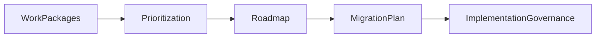
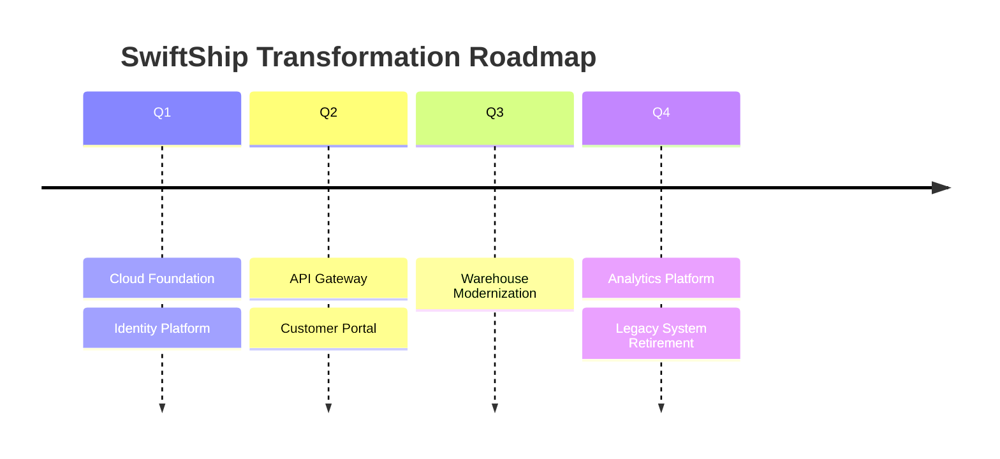
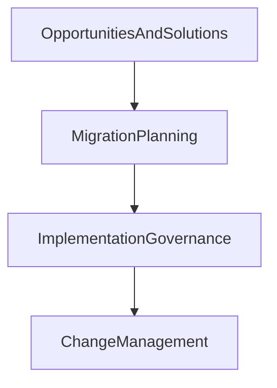

# Chapter 22

# Phase F – Migration Planning
## Building the Enterprise Transformation Roadmap

---

## Learning Objectives

By the end of this chapter, you will be able to:

- Explain the purpose of Phase F – Migration Planning.
- Develop an Architecture Roadmap and Implementation & Migration Plan.
- Prioritize work packages based on business value, cost, risk, and dependencies.
- Understand the role of transition architectures in migration planning.
- Produce the primary deliverables of Phase F.

---

# Wednesday Morning – Planning the Journey

SwiftShip has identified the work packages and transition architectures required for its digital transformation.

Emma Chen studies the list of initiatives.

> "We can't do everything at once."

She continues,

> "How do we decide what comes first?"

You reply:

> "That's exactly what Phase F is designed to answer."

---

# Purpose of Phase F

Phase F transforms implementation opportunities into a realistic migration roadmap.

It determines:

- Which initiatives should be delivered first.
- How work packages will be sequenced.
- What dependencies exist.
- How risks and costs will be managed.
- When the enterprise will reach each transition architecture.

The objective is to create a practical, business-driven implementation plan.

---

# Inputs

Typical inputs include:

- Opportunities & Solutions Report
- Work Package Portfolio
- Transition Architectures
- Gap Analysis
- Architecture Requirements Repository
- Business priorities
- Resource constraints

---

# Key Activities

## Prioritize Work Packages

Evaluate initiatives using criteria such as:

- Business value
- Strategic alignment
- Cost
- Risk
- Technical complexity
- Regulatory requirements

High-value initiatives are generally delivered earlier.

---

## Sequence the Implementation

Identify dependencies between initiatives.

Examples include:

- Identity platform before customer portal.
- API platform before application integration.
- Cloud foundation before workload migration.

Proper sequencing reduces implementation risk.

---

## Develop the Architecture Roadmap

The roadmap shows how the enterprise moves from the Baseline Architecture through Transition Architectures to the Target Architecture.

It provides executives with a long-term transformation view.

---

## Create the Implementation & Migration Plan

This plan includes:

- Timeline
- Milestones
- Resource allocation
- Budget estimates
- Risk mitigation
- Success measures

The plan becomes the primary guide for implementation teams.

---

## Assess Risks

Evaluate risks such as:

- Budget overruns
- Skills shortages
- Technology readiness
- Organizational change
- Vendor dependencies

Mitigation strategies should accompany each major risk.

---

# Migration Planning Workflow

---

# Example Architecture Roadmap

The roadmap provides a phased view of transformation aligned with business priorities.

---

# SwiftShip Example

The Architecture Board approves the following sequence:

### Phase 1
- Hybrid Cloud Platform
- Identity Modernization
- Enterprise Monitoring

### Phase 2
- Enterprise API Platform
- Customer Portal
- Shipment Tracking

### Phase 3
- Warehouse Automation
- Advanced Analytics
- Legacy System Decommissioning

This phased delivery balances risk, budget, and business value.

---

# Phase Deliverables

| Deliverable | Purpose |
|-------------|---------|
| Architecture Roadmap | Shows phased enterprise transformation |
| Implementation & Migration Plan | Defines timelines, resources, and milestones |
| Updated Work Package Portfolio | Reflects implementation priorities |
| Risk Assessment | Identifies migration risks |
| Updated Architecture Repository | Records migration decisions |

---

# Relationship to Phase G

Phase F determines **when** implementation will occur.

Phase G ensures implementation follows the approved architecture.

---

# Foundation Exam Focus

Remember:

- Phase F develops the Architecture Roadmap.
- Work Packages are prioritized based on business value and dependencies.
- The Implementation & Migration Plan guides project execution.
- Transition Architectures enable phased transformation.
- Risk assessment is an essential migration planning activity.

---

# Practitioner Scenario

**Scenario**

SwiftShip has approved ten work packages, but funding allows only four to begin this year.

**Question**

How should the Enterprise Architect respond?

**Answer**

Prioritize work packages using business value, strategic alignment, risk, dependencies, and resource availability. Produce an Architecture Roadmap and Implementation & Migration Plan that sequences initiatives into achievable phases.

---

# Common Mistakes

- Trying to implement every initiative simultaneously.
- Ignoring dependencies between work packages.
- Building roadmaps without business priorities.
- Underestimating organizational change.
- Failing to identify migration risks early.

---

# Key Takeaways

- Phase F creates a realistic transformation roadmap.
- Prioritization balances value, cost, and risk.
- Transition Architectures support phased delivery.
- The Implementation & Migration Plan guides execution.
- Effective migration planning improves delivery success.

---

# Chapter Summary

Emma reviews the migration roadmap.

> "Now we know not only where we're going—but how we'll get there."

You smile.

> "Exactly. A great architecture becomes valuable only when it can be implemented successfully."

SwiftShip is now ready to enter **Phase G – Implementation Governance**, where architecture moves from planning into controlled execution.

---

# Next Chapter

**Chapter 23 – Phase G: Implementation Governance**
