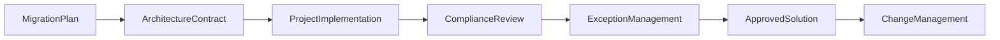
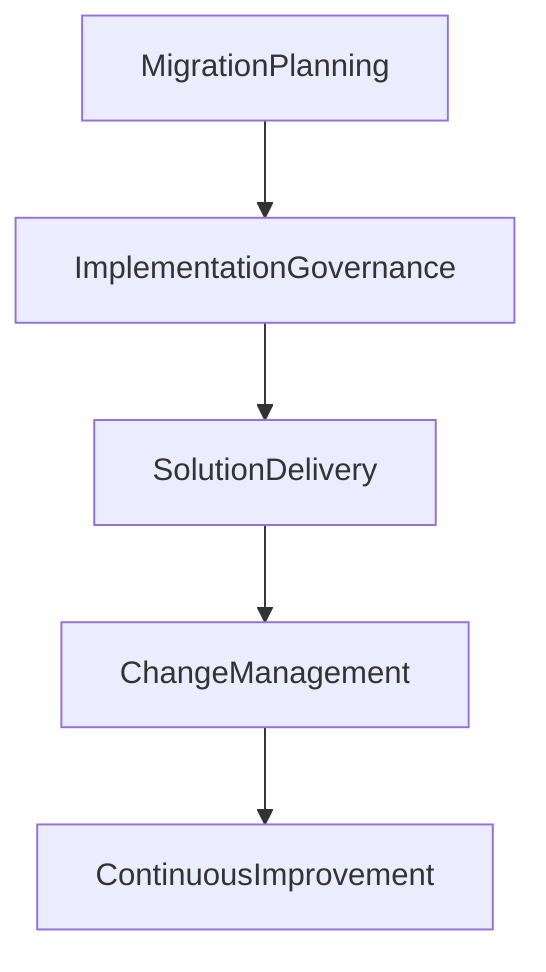

# Chapter 23

# Phase G – Implementation Governance
## Ensuring Solutions Follow the Architecture

---

## Learning Objectives

By the end of this chapter, you will be able to:

- Explain the purpose of Phase G – Implementation Governance.
- Understand the role of Architecture Contracts.
- Describe Architecture Compliance Reviews.
- Manage implementation risks, issues, and architecture exceptions.
- Explain how governance ensures that delivered solutions remain aligned with the approved Enterprise Architecture.

---

# Thursday Morning – From Plans to Reality

SwiftShip's implementation teams begin delivering the projects defined in the Migration Plan.

Emma Chen visits the Enterprise Architecture Office.

> "The projects have started. How do we make sure they don't drift away from the architecture we approved?"

You reply:

> "Designing the architecture was only half the journey. Now we must govern its implementation."

This is the purpose of **Phase G – Implementation Governance**.

---

# Purpose of Phase G

Phase G ensures that implementation projects conform to the approved Enterprise Architecture.

Its objectives are to:

- Guide implementation teams.
- Verify compliance with architecture principles and standards.
- Manage architecture risks and exceptions.
- Resolve implementation issues.
- Ensure delivered solutions realize the intended business outcomes.

---

# Inputs

Typical inputs include:

- Architecture Roadmap
- Implementation & Migration Plan
- Architecture Requirements Repository
- Architecture Definition Documents
- Opportunities & Solutions Report
- Architecture Contracts

---

# Key Activities

## Establish Architecture Contracts

Architecture Contracts define the responsibilities and expectations between the Enterprise Architecture function and implementation teams.

Typical contents include:

- Scope
- Deliverables
- Architecture principles
- Compliance expectations
- Roles and responsibilities
- Escalation process

---

## Conduct Architecture Compliance Reviews

Throughout implementation, the Architecture Board reviews projects to verify that they:

- Follow approved principles
- Use approved standards
- Reuse enterprise building blocks
- Address identified risks
- Support the target architecture

Early reviews prevent expensive redesign later.

---

## Monitor Project Alignment

Architects work closely with project teams to ensure that implementation decisions remain aligned with the target architecture.

Any proposed deviation is evaluated before approval.

---

## Manage Architecture Exceptions

Sometimes implementation teams request exceptions because of:

- Regulatory requirements
- Legacy system constraints
- Budget limitations
- Delivery deadlines

Each request is evaluated based on:

- Business justification
- Risk
- Alternatives
- Long-term impact

Approved exceptions are documented and monitored.

---

## Support Delivery Teams

Enterprise Architects continue supporting projects by:

- Clarifying architecture decisions
- Resolving design issues
- Reviewing solution designs
- Updating architecture documentation when necessary

Architecture is an ongoing partnership—not a one-time approval.

---

# Phase G Workflow

---

# SwiftShip Example

During implementation, one regional office proposes using an unsupported integration platform to meet an aggressive deadline.

The Architecture Board conducts a Compliance Review and determines that the short-term benefit does not outweigh the long-term operational risk.

Instead, the team accelerates deployment of the approved enterprise API platform.

The project stays aligned with the target architecture while meeting the business deadline.

---

# Phase Deliverables

| Deliverable | Purpose |
|-------------|---------|
| Architecture Contract | Defines implementation responsibilities |
| Compliance Assessment Report | Documents review findings |
| Architecture Review Decisions | Records approvals and actions |
| Governance Log | Tracks compliance issues and exceptions |
| Updated Architecture Repository | Captures implementation outcomes |

---

# Relationship to Change Management

Implementation Governance ensures that the delivered solution becomes the approved enterprise architecture.

---

# Foundation Exam Focus

Remember:

- Phase G governs implementation.
- Architecture Contracts define responsibilities.
- Compliance Reviews verify adherence to architecture.
- Exceptions must be formally assessed and documented.
- Enterprise Architects remain engaged throughout delivery.

---

# Practitioner Scenario

**Scenario**

A project team wants to replace the approved enterprise identity platform with a local solution because it appears faster to deploy.

**Question**

How should the Enterprise Architect respond?

**Answer**

Review the proposal through an Architecture Compliance Review, evaluate the business justification, risks, and alternatives, and either approve a documented exception or require alignment with the approved architecture before implementation proceeds.

---

# Common Mistakes

- Treating architecture approval as the end of governance.
- Allowing undocumented exceptions.
- Performing compliance reviews too late.
- Failing to communicate with delivery teams.
- Ignoring implementation feedback.

---

# Key Takeaways

- Phase G ensures projects implement the approved architecture.
- Governance continues throughout solution delivery.
- Architecture Contracts clarify expectations.
- Compliance Reviews detect deviations early.
- Controlled exception management balances agility with enterprise consistency.

---

# Chapter Summary

Emma reviews the first completed implementation.

> "The project delivered exactly what the architecture promised."

You smile.

> "That's the goal of Implementation Governance—turning architectural intent into business reality."

With implementation underway, SwiftShip is prepared for the final ADM phase: **Phase H – Architecture Change Management**, where the architecture evolves with changing business needs.

---

# Next Chapter

**Chapter 24 – Phase H: Architecture Change Management**

---

## 📖 Continue Reading

⬅️ **Previous:** [Chapter 22 – Phase F Migration Planning](22-Phase-F-Migration-Planning.md)

🏠 **Home:** [📚 Table of Contents](../../../README.md)

➡️ **Next:** [Chapter 24 – Phase H Architecture Change Management](24-Phase-H-Architecture-Change-Management.md)

---

© 2026 **Baskar Periasamy** • Licensed under the MIT License.
