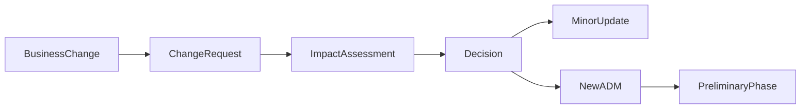
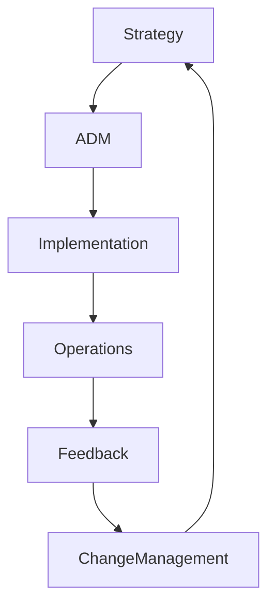
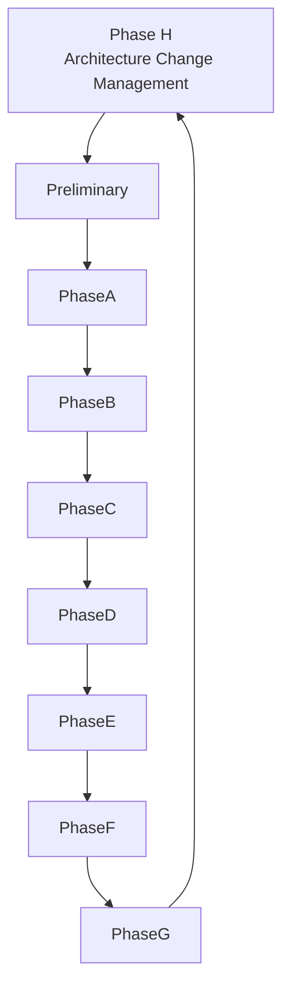

# Chapter 24

# Phase H – Architecture Change Management
## Keeping Enterprise Architecture Alive

---

## Learning Objectives

By the end of this chapter, you will be able to:

- Explain the purpose of Phase H – Architecture Change Management.
- Understand why Enterprise Architecture is a continuous capability.
- Identify drivers for architecture change.
- Describe the Architecture Change Management process.
- Produce the primary deliverables of Phase H.

---

# Friday Morning – The Journey Never Ends

SwiftShip has successfully implemented its transformation roadmap.

Customer satisfaction has improved.

Operations are more efficient.

The executive team celebrates.

Emma Chen smiles and asks one final question.

> "Our transformation is complete. Are we finished?"

You reply:

> "Enterprise Architecture is never finished. It evolves as the business evolves."

This is the purpose of **Phase H – Architecture Change Management**.

---

# Purpose of Phase H

Phase H ensures that the Enterprise Architecture remains aligned with changing business strategies, technologies, regulations, and operational needs.

Rather than treating architecture as a one-time project, Phase H establishes continuous improvement.

It answers questions such as:

- What has changed?
- Does the current architecture still meet business needs?
- Should we begin another ADM cycle?
- What new opportunities should be explored?

---

# Inputs

Typical inputs include:

- Implemented Architecture
- Architecture Repository
- Architecture Contracts
- Compliance Review Results
- Business Strategy Updates
- Technology Trends
- Change Requests
- Requirements Repository

---

# Drivers for Architecture Change

Common triggers include:

- New business strategies
- Mergers and acquisitions
- Regulatory changes
- Emerging technologies
- Security threats
- Customer expectations
- Operational performance issues

Each trigger may require architecture assessment.

---

# Key Activities

## Monitor the Business Environment

Continuously review strategic, operational, and external changes.

## Assess Change Requests

Determine whether requested changes:

- Fit within the existing architecture
- Require minor updates
- Require a new ADM cycle

## Evaluate Business Impact

Analyze:

- Business value
- Cost
- Risk
- Dependencies
- Stakeholder impact

## Update the Architecture Repository

Capture approved changes, new standards, lessons learned, and revised architecture artifacts.

## Launch New Architecture Work

When major changes are required, issue a new Request for Architecture Work and begin another ADM iteration.

---

# Architecture Change Process

The ADM is iterative. Phase H often becomes the starting point for the next architecture cycle.

---

# Continuous Improvement

Enterprise Architecture supports continuous organizational learning.

---

# SwiftShip Example

Two years after implementation, SwiftShip expands into autonomous delivery services.

The existing architecture does not fully support AI-enabled route optimization.

The Architecture Board evaluates the change request and determines that a new architecture initiative is required.

A new Request for Architecture Work is approved, beginning another ADM cycle.

---

# Phase Deliverables

| Deliverable | Purpose |
|-------------|---------|
| Architecture Change Request | Records proposed changes |
| Impact Assessment | Evaluates business and technical effects |
| Updated Architecture Repository | Captures approved changes |
| Updated Architecture Roadmap | Reflects future initiatives |
| Request for Architecture Work | Starts a new ADM cycle when required |

---

# Relationship to the ADM

The ADM is a continuous lifecycle rather than a linear project.

---

# Foundation Exam Focus

Remember:

- Phase H manages architecture evolution.
- Change requests are evaluated through impact assessment.
- Minor changes may update the current architecture.
- Major changes can trigger a new ADM cycle.
- Continuous improvement is a core TOGAF principle.

---

# Practitioner Scenario

**Scenario**

SwiftShip acquires a logistics company with different applications, business processes, and infrastructure.

**Question**

How should the Enterprise Architect respond?

**Answer**

Evaluate the acquisition through Architecture Change Management, perform an impact assessment, determine whether the current architecture can accommodate the changes, and, if necessary, initiate a new ADM cycle with a Request for Architecture Work.

---

# Common Mistakes

- Treating Enterprise Architecture as a one-time project.
- Ignoring changes in business strategy.
- Delaying architecture updates until problems occur.
- Failing to capture lessons learned.
- Starting new initiatives without reassessing the architecture.

---

# Key Takeaways

- Enterprise Architecture evolves continuously.
- Phase H ensures long-term alignment with business strategy.
- Change requests are evaluated before implementation.
- The Architecture Repository is updated throughout the lifecycle.
- Major change can initiate a new ADM cycle.

---

# Chapter Summary

Emma reflects on SwiftShip's transformation.

> "We've transformed our business, but the world will keep changing."

You reply:

> "Exactly. Enterprise Architecture isn't a destination—it's a continuous capability that helps the organization adapt with confidence."

SwiftShip now has a sustainable architecture practice capable of supporting future innovation and growth.

---

# Next Chapter

**Chapter 25 – Requirements Management Across the ADM**
