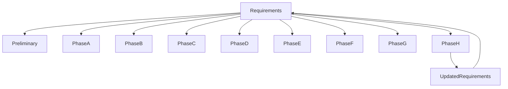
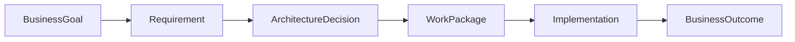

# Chapter 25

# Requirements Management Across the ADM
## The Thread That Connects Every Architecture Phase

---

## Learning Objectives

By the end of this chapter, you will be able to:

- Explain the purpose of Requirements Management in TOGAF.
- Understand how requirements support every ADM phase.
- Describe the Requirements Management process.
- Understand requirements traceability, prioritization, and change control.
- Produce the key deliverables used to manage architecture requirements.

---

# Monday Morning – One Requirement Changes Everything

SwiftShip's digital transformation is well underway.

A major customer requests real-time shipment visibility across all regions.

Emma Chen asks:

> "We've already completed most of our architecture work. Can we still accommodate this new requirement?"

You reply:

> "Absolutely—but we must evaluate its impact across every architecture domain."

This is why **Requirements Management** sits at the center of the TOGAF ADM.

---

# What Is Requirements Management?

Requirements Management is the continuous process of identifying, documenting, validating, prioritizing, tracing, and managing business and architecture requirements throughout the ADM lifecycle.

Unlike the ADM phases, Requirements Management is **continuous** rather than sequential.

Every phase both consumes and produces requirements.

---

# Why Requirements Matter

Requirements ensure that:

- Architecture supports business objectives.
- Stakeholder expectations are captured.
- Design decisions remain aligned with strategy.
- Changes are assessed consistently.
- Architecture evolves in a controlled manner.

Without effective requirements management, architecture quickly loses alignment with business needs.

---

# Sources of Requirements

Requirements may originate from:

- Business strategy
- Executive sponsors
- Customers
- Regulators
- Operations teams
- Security teams
- Technology teams
- Lessons learned from previous ADM cycles

Each requirement should be documented and validated before influencing the architecture.

---

# Requirements Across the ADM

Requirements flow into every ADM phase and are refined as the architecture evolves.

---

# Key Activities

## Capture Requirements

Identify new business, technical, regulatory, and operational needs.

## Validate Requirements

Confirm that each requirement is clear, feasible, measurable, and aligned with business goals.

## Prioritize Requirements

Classify requirements according to business value, urgency, risk, and strategic importance.

## Trace Requirements

Maintain traceability from business objectives to architecture decisions, deliverables, and implemented solutions.

## Manage Changes

Evaluate new or changed requirements through impact analysis before approving modifications.

---

# Requirements Traceability

Traceability links every requirement to architecture outcomes.

This enables architects to understand the impact of change throughout the enterprise.

---

# Requirements Repository

The Requirements Repository stores:

- Business requirements
- Functional requirements
- Non-functional requirements
- Constraints
- Assumptions
- Priorities
- Approval status
- Traceability links
- Change history

A centralized repository provides a single source of truth for architecture requirements.

---

# SwiftShip Example

A new sustainability regulation requires carbon emissions reporting for every shipment.

The Enterprise Architect:

1. Captures the new requirement.
2. Assesses its business impact.
3. Updates the Business, Data, Application, and Technology Architectures.
4. Revises implementation work packages.
5. Updates the Architecture Roadmap.

The change is incorporated without losing architectural consistency.

---

# Phase Deliverables

| Deliverable | Purpose |
|-------------|---------|
| Requirements Repository | Stores all architecture requirements |
| Requirements Traceability Matrix | Links requirements to architecture decisions |
| Impact Assessment | Evaluates proposed changes |
| Updated Architecture Roadmap | Reflects approved requirement changes |
| Change Log | Records requirement history |

---

# Foundation Exam Focus

Remember:

- Requirements Management is continuous across the ADM.
- Requirements are captured, validated, prioritized, traced, and managed.
- Requirements influence every architecture phase.
- Traceability supports change impact analysis.
- New requirements may trigger updates to any ADM phase.

---

# Practitioner Scenario

**Scenario**

During implementation, a regulatory change introduces new data retention requirements that affect multiple business processes and systems.

**Question**

How should the Enterprise Architect respond?

**Answer**

Capture and validate the new requirement, perform an impact assessment, update the Requirements Repository and Traceability Matrix, revise affected architecture deliverables, and determine whether changes can be incorporated into the current ADM cycle or require a new iteration.

---

# Common Mistakes

- Treating requirements as a one-time activity.
- Failing to maintain traceability.
- Ignoring changing business priorities.
- Allowing undocumented requirement changes.
- Managing technical requirements without business context.

---

# Key Takeaways

- Requirements Management is the central discipline that connects every ADM phase.
- Requirements evolve throughout the architecture lifecycle.
- Traceability enables informed decision-making and change control.
- A managed Requirements Repository improves governance and consistency.
- Effective requirements management keeps architecture aligned with business strategy.

---

# Chapter Summary

Emma reviews the updated roadmap after the regulatory change.

> "The requirement changed, but our architecture adapted without losing direction."

You smile.

> "That's the strength of TOGAF. Requirements guide every phase, ensuring the architecture remains aligned with the business from beginning to end."

Congratulations! You have completed **Part III – Architecture Development Method (ADM)**. You now understand how TOGAF guides an enterprise from strategic vision through implementation, governance, continuous improvement, and ongoing requirements management.

---

# Next Part

**Part IV – Governing Enterprise Change**

---

## 📖 Continue Reading

⬅️ **Previous:** [Chapter 24 – Phase H Architecture Change Management](24-Phase-H-Architecture-Change-Management.md)

🏠 **Home:** [📚 Table of Contents](../../../README.md)

➡️ **Next:** [Chapter 26 – Architecture Capability Framework](26-Architecture-Capability-Framework.md)

---

© 2026 **Baskar Periasamy** • Licensed under the MIT License.
