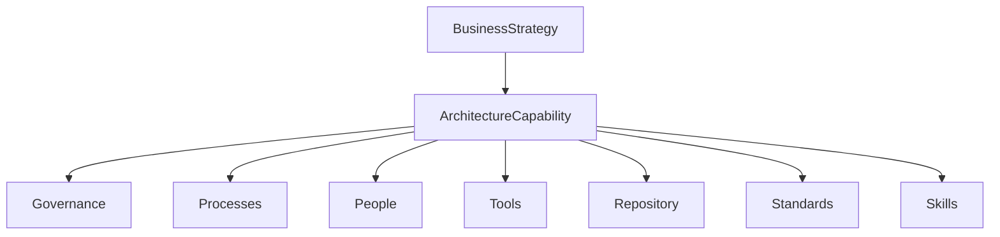

# Chapter 26

# Architecture Capability Framework
## Building an Enterprise Architecture Function That Delivers Business Value

---

## Learning Objectives

- Explain the purpose of an Architecture Capability.
- Understand the TOGAF Architecture Capability Framework.
- Identify the components required to establish an effective Enterprise Architecture practice.
- Understand the relationship between Architecture Capability and Architecture Governance.
- Design an Enterprise Architecture function that supports long-term business transformation.

---

# Monday Morning – Preparing for the Next Stage

SwiftShip Global has successfully completed several architecture initiatives.

The Executive Leadership Team asks:

> "How do we ensure Enterprise Architecture becomes a permanent capability rather than a one-time project?"

You reply:

> "Enterprise Architecture succeeds when the organization builds an Architecture Capability—not just an architecture."

---

# What Is an Architecture Capability?

An **Architecture Capability** is the organizational ability to develop, govern, maintain, and continuously improve Enterprise Architecture.

It includes people, processes, governance, skills, tools, standards, repositories, and continuous improvement.

---

# Architecture Capability Framework

---

# Components of an Architecture Capability

| Component | Purpose |
|------------|---------|
| Governance | Decision-making and oversight |
| Architecture Processes | Standardized architecture activities |
| Architecture Repository | Stores reusable architecture assets |
| Architecture Principles | Guides decision-making |
| Architecture Team | Delivers architecture services |
| Tools | Supports modeling and governance |
| Skills & Competencies | Builds professional capability |
| Metrics | Measures architecture effectiveness |

---

# Architecture Capability Maturity

| Level | Description |
|--------|-------------|
| 1 | Initial |
| 2 | Repeatable |
| 3 | Defined |
| 4 | Managed |
| 5 | Optimized |

---

# SwiftShip Example

SwiftShip establishes a permanent Enterprise Architecture Office with governance, principles, repositories, review boards, skills development, and reference architectures.

---

# Key Deliverables

- Architecture Capability Assessment
- Enterprise Architecture Charter
- Architecture Operating Model
- Skills Development Plan
- Capability Improvement Roadmap

---

# Foundation Exam Focus

- Architecture Capability enables continuous Enterprise Architecture.
- Governance, people, processes, and tools work together.
- Continuous improvement is essential.

---

# Practitioner Scenario

Establish governance, roles, repositories, standards, skills development, and continuous improvement to embed Enterprise Architecture into the organization.

---

# Common Mistakes

- Treating Enterprise Architecture as a project.
- Ignoring governance.
- Measuring documentation instead of outcomes.

---

# Key Takeaways

- Enterprise Architecture is a long-term organizational capability.
- Maturity drives continuous improvement.

---

# Next Chapter

**Chapter 27 – Establishing the Enterprise Architecture Office**
