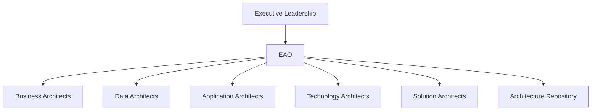
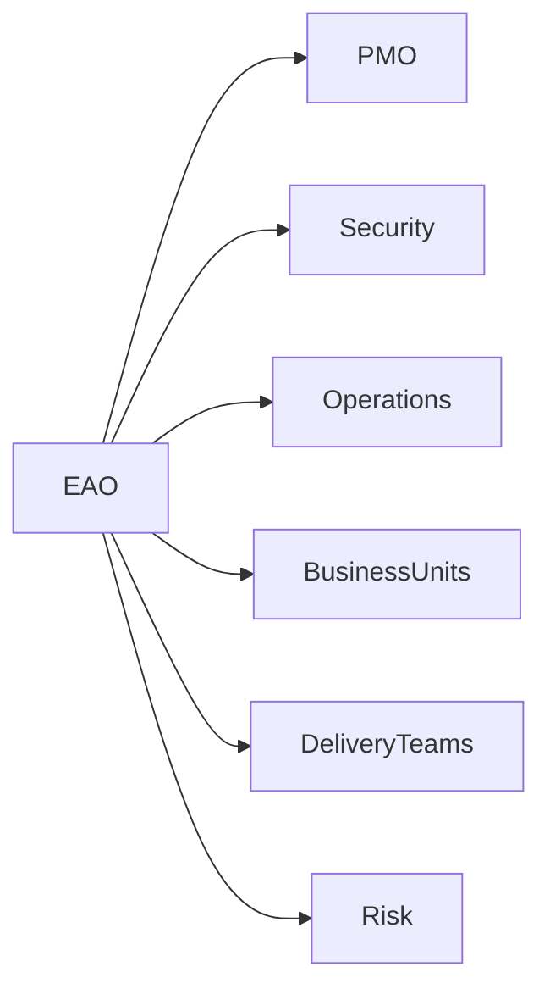

# Chapter 27

# Establishing the Enterprise Architecture Office (EAO)
## Turning Enterprise Architecture into an Organizational Function

---

## Learning Objectives

By the end of this chapter, you will be able to:

- Explain the purpose of an Enterprise Architecture Office (EAO).
- Identify the key roles within an EAO.
- Design an Enterprise Architecture operating model.
- Understand how the EAO collaborates with business and IT functions.
- Define governance responsibilities and success measures for an EAO.

---

# Tuesday Morning – Scaling Enterprise Architecture

SwiftShip has built a mature Architecture Capability.

New transformation initiatives are launching across logistics, AI, customer experience, cybersecurity, and sustainability.

Emma Chen asks:

> "Our architects are working independently. How do we coordinate architecture across the entire enterprise?"

You reply:

> "It's time to establish a dedicated Enterprise Architecture Office."

---

# What Is an Enterprise Architecture Office?

The **Enterprise Architecture Office (EAO)** is the organizational function responsible for governing, coordinating, and advancing Enterprise Architecture across the organization.

Rather than owning projects, the EAO provides direction, standards, governance, and architectural leadership.

---

# Objectives of the EAO

The EAO exists to:

- Align business strategy with technology investments
- Govern architecture across initiatives
- Promote reuse and standardization
- Support strategic decision-making
- Maintain enterprise-wide architecture artifacts
- Build long-term architecture capability

---

# Enterprise Architecture Operating Model

The EAO coordinates architecture decisions across business and technology domains.

---

# Key Roles

## Chief Enterprise Architect

Provides strategic leadership, chairs the Architecture Board, and advises executives.

## Domain Architects

Lead architecture within a specific domain:

- Business
- Data
- Application
- Technology
- Security

## Solution Architects

Translate enterprise standards into solution designs for individual projects.

## Repository Administrator

Maintains architecture artifacts, standards, and reusable assets.

---

# How the EAO Works with Other Functions

The EAO collaborates with:

- Executive leadership
- PMO
- Information Security
- Operations
- Delivery teams
- Risk and Compliance
- Business units

It influences decisions without replacing operational ownership.

---

# Governance Responsibilities

The EAO is responsible for:

- Architecture principles
- Standards management
- Architecture reviews
- Compliance assessments
- Exception approvals
- Repository governance
- Reference architectures
- Capability development

---

# RACI Example

| Activity | EAO | PMO | Project Team | Business |
|----------|:---:|:---:|:------------:|:--------:|
| Define Standards | R | C | I | C |
| Architecture Review | A | C | R | I |
| Project Delivery | I | A | R | C |
| Business Strategy | C | I | I | A |

**R** = Responsible • **A** = Accountable • **C** = Consulted • **I** = Informed

---

# Measuring EAO Success

Typical KPIs include:

- Architecture compliance rate
- Reuse of enterprise standards
- Number of approved exceptions
- Project alignment with target architecture
- Time to complete architecture reviews
- Stakeholder satisfaction
- Capability maturity improvement

---

# SwiftShip Example

SwiftShip establishes an Enterprise Architecture Office consisting of:

- One Chief Enterprise Architect
- Four Domain Architects
- Six Solution Architects
- An Architecture Repository Administrator

The EAO introduces quarterly governance meetings, enterprise standards, and a centralized review process. Within a year, duplicate technology purchases decrease and project consistency improves significantly.

---

# Key Deliverables

| Deliverable | Purpose |
|-------------|---------|
| Enterprise Architecture Charter | Defines mission and scope |
| Organization Structure | Documents roles and reporting |
| Operating Model | Describes governance and collaboration |
| RACI Matrix | Clarifies responsibilities |
| Architecture Review Calendar | Plans governance activities |

---

# Foundation Exam Focus

Remember:

- The EAO institutionalizes Enterprise Architecture.
- It governs rather than delivers projects.
- Roles, governance, and collaboration are essential.
- The EAO maintains the Architecture Repository and enterprise standards.

---

# Practitioner Scenario

**Scenario**

Different business units are selecting incompatible cloud platforms without consulting Enterprise Architecture.

**Question**

What should the Chief Enterprise Architect recommend?

**Answer**

Establish or strengthen the Enterprise Architecture Office with defined governance processes, mandatory architecture reviews, enterprise standards, and clear collaboration with the PMO and business units to ensure technology decisions remain aligned with enterprise strategy.

---

# Common Mistakes

- Viewing the EAO as an approval bottleneck.
- Giving unclear ownership of architecture decisions.
- Isolating architects from business stakeholders.
- Failing to define measurable KPIs.
- Neglecting communication and education.

---

# Key Takeaways

- The EAO is the permanent home of Enterprise Architecture.
- It aligns strategy, governance, and delivery.
- Clear roles and collaboration improve consistency.
- Success depends on enabling the business, not slowing it down.

---

# Chapter Summary

Emma looks at SwiftShip's new Enterprise Architecture Office.

> "Enterprise Architecture is no longer a collection of projects."

You reply:

> "It's now an organizational capability supported by dedicated people, governance, and leadership."

SwiftShip is ready to strengthen architecture governance across a growing portfolio of strategic initiatives.

---

# Next Chapter

**Chapter 28 – Architecture Governance in Practice**

---

## 📖 Continue Reading

⬅️ **Previous:** [Chapter 26 – Architecture Capability Framework](../Part-3-ADM/26-Architecture-Capability-Framework.md)

🏠 **Home:** [📚 Table of Contents](../../../README.md)

➡️ **Next:** [Chapter 28 – Architecture Governance in Practice](28-Architecture-Governance-in-Practice.md)

---

© 2026 **Baskar Periasamy** • Licensed under the MIT License.
