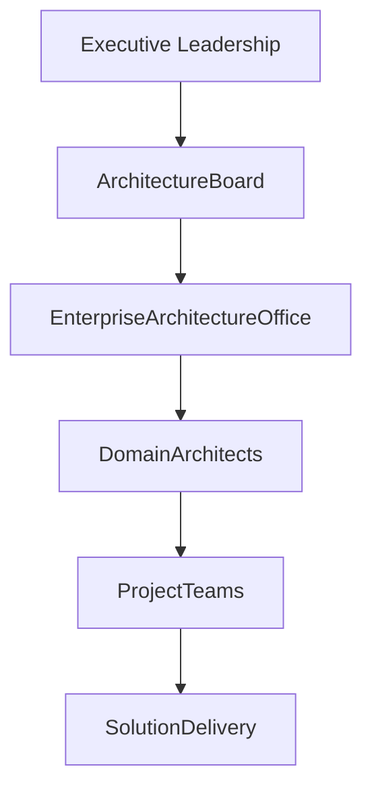
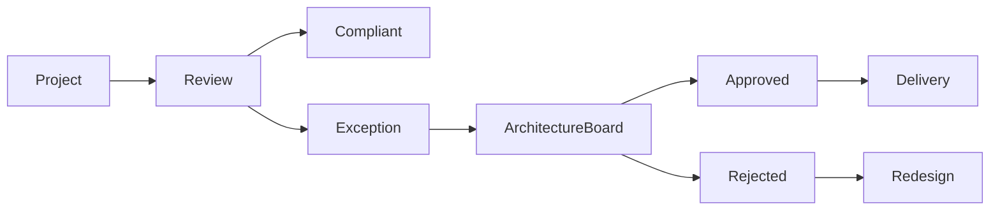

# Chapter 28

# Architecture Governance in Practice
## Ensuring Consistent Decision-Making Across the Enterprise

---

## Learning Objectives

By the end of this chapter, you will be able to:

- Explain the purpose of Architecture Governance.
- Understand the responsibilities of the Architecture Board.
- Conduct Architecture Compliance Reviews.
- Manage architecture exceptions and risks.
- Measure the effectiveness of architecture governance using KPIs.

---

# Wednesday Morning – Governance at Scale

SwiftShip's Enterprise Architecture Office has been operating successfully for a year.

More than 120 transformation projects are now running simultaneously across different regions.

Emma Chen asks:

> "How can we govern hundreds of projects without becoming a bottleneck?"

You reply:

> "By establishing practical governance processes that guide decisions rather than slow them down."

This is the purpose of **Architecture Governance in Practice**.

---

# What Is Architecture Governance?

Architecture Governance is the framework of leadership, decision-making, policies, processes, and controls that ensures architecture remains aligned with business strategy throughout the organization.

Good governance balances:

- Business agility
- Technology consistency
- Risk management
- Regulatory compliance
- Long-term strategic goals

---

# Objectives of Architecture Governance

Architecture Governance aims to:

- Ensure adherence to enterprise architecture principles
- Promote reuse of enterprise capabilities
- Reduce technology duplication
- Improve investment decisions
- Manage architecture risks
- Maintain alignment between business and IT

---

# Governance Structure

Governance provides clear accountability from executive strategy to project implementation.

---

# The Architecture Board

The Architecture Board is responsible for enterprise-wide architecture oversight.

Its responsibilities include:

- Approving architecture standards
- Reviewing major initiatives
- Resolving architecture conflicts
- Approving exceptions
- Monitoring compliance
- Providing strategic guidance

Typical members include:

- Chief Enterprise Architect
- CIO
- Business executives
- Security representatives
- Infrastructure leaders
- Data leaders

---

# Architecture Compliance Reviews

Compliance Reviews verify that projects follow approved architecture.

Typical review questions include:

- Are enterprise standards being followed?
- Are approved technologies being used?
- Are security requirements satisfied?
- Can existing building blocks be reused?
- Are architecture principles respected?

Conducting reviews early minimizes rework and project risk.

---

# Managing Architecture Exceptions

Occasionally, projects require exceptions.

Common reasons include:

- Regulatory requirements
- Vendor constraints
- Business urgency
- Legacy integration
- Budget limitations

Each exception should include:

- Business justification
- Risk assessment
- Alternative options
- Approval decision
- Expiration or review date

Exceptions should be controlled—not ignored.

---

# Governance Decision Process

Governance enables informed decisions while maintaining enterprise consistency.

---

# Governance KPIs

Effective governance is measurable.

Typical KPIs include:

| KPI | Example Measure |
|-----|-----------------|
| Architecture Compliance | % of compliant projects |
| Exception Rate | Number of approved exceptions |
| Review Cycle Time | Average review duration |
| Standards Reuse | Reuse of enterprise building blocks |
| Architecture Debt | Outstanding governance issues |
| Stakeholder Satisfaction | Survey results |

These metrics help demonstrate the value of Enterprise Architecture.

---

# SwiftShip Example

A regional business unit proposes purchasing a separate Customer Relationship Management (CRM) platform.

During the Architecture Compliance Review, the Architecture Board identifies that the enterprise CRM can satisfy the same requirements.

Instead of introducing another platform, the team extends the existing enterprise solution.

Results:

- Lower cost
- Reduced complexity
- Better data integration
- Consistent customer experience

Governance protects both business value and technical sustainability.

---

# Governance Deliverables

| Deliverable | Purpose |
|-------------|---------|
| Governance Framework | Defines governance structure |
| Architecture Review Report | Documents review outcomes |
| Compliance Checklist | Standardizes project assessments |
| Exception Register | Tracks approved deviations |
| Governance KPI Dashboard | Measures governance performance |

---

# Foundation Exam Focus

Remember:

- Governance ensures architecture decisions align with enterprise strategy.
- The Architecture Board provides oversight.
- Compliance Reviews identify deviations early.
- Exceptions require formal assessment and approval.
- Governance effectiveness should be measured using KPIs.

---

# Practitioner Scenario

**Scenario**

Several projects are independently selecting different API management platforms, increasing operational complexity.

**Question**

How should the Enterprise Architect respond?

**Answer**

Initiate Architecture Compliance Reviews, evaluate alignment with enterprise standards, present findings to the Architecture Board, and recommend a standardized enterprise API platform while documenting any approved exceptions.

---

# Common Mistakes

- Treating governance as bureaucracy.
- Conducting reviews too late.
- Allowing undocumented exceptions.
- Measuring activity instead of business outcomes.
- Failing to engage business stakeholders.

---

# Key Takeaways

- Governance enables consistent enterprise-wide decision-making.
- The Architecture Board provides strategic oversight.
- Compliance Reviews prevent costly architectural drift.
- Controlled exceptions balance agility with standardization.
- KPIs demonstrate the business value of governance.

---

# Chapter Summary

Emma reviews the latest governance dashboard.

> "We've reviewed more projects than ever before, yet delivery has become faster and more consistent."

You reply:

> "That's the goal of effective governance—not to slow change, but to guide it."

SwiftShip has established a governance model that enables innovation while maintaining enterprise consistency.

---

# Next Chapter

**Chapter 29 – Enterprise Portfolio Management**

---

## 📖 Continue Reading

⬅️ **Previous:** [Chapter 27 – Establishing the Enterprise Architecture Office](27-Establishing-the-Enterprise-Architecture-Office.md)

🏠 **Home:** [📚 Table of Contents](../../../README.md)

➡️ **Next:** [Chapter 29 – Enterprise Portfolio Management](29-Enterprise-Portfolio-Management.md)

---

© 2026 **Baskar Periasamy** • Licensed under the MIT License.
