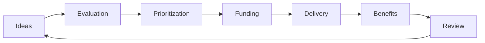
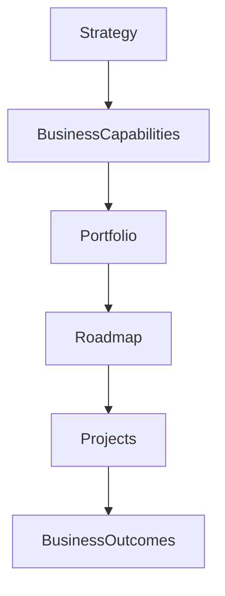

# Chapter 29

# Enterprise Portfolio Management
## Aligning Investments with Enterprise Strategy

---

## Learning Objectives

By the end of this chapter, you will be able to:

- Explain Enterprise Portfolio Management (EPM).
- Understand how Enterprise Architecture supports portfolio decisions.
- Prioritize initiatives using business capabilities and architecture roadmaps.
- Balance strategic value, cost, risk, and resource constraints.
- Measure portfolio performance and business value realization.

---

# Thursday Morning – Too Many Good Ideas

SwiftShip has matured its Enterprise Architecture capability.

The executive committee receives more than 200 proposals for digital transformation—from AI-powered logistics to warehouse automation and sustainability programs.

Emma Chen asks:

> "We can't fund everything. How do we decide which initiatives create the greatest strategic value?"

You reply:

> "By managing the enterprise portfolio through architecture."

---

# What Is Enterprise Portfolio Management?

Enterprise Portfolio Management (EPM) is the disciplined process of selecting, prioritizing, funding, monitoring, and governing initiatives so that investments support the organization's strategic objectives.

Enterprise Architecture provides the enterprise-wide view needed to make consistent investment decisions.

---

# Why Enterprise Architecture Matters

Enterprise Architecture helps portfolio decisions by:

- Aligning investments with business strategy
- Eliminating duplicate capabilities
- Identifying reusable building blocks
- Reducing technology risk
- Sequencing transformation initiatives
- Maximizing return on investment

Without Enterprise Architecture, portfolios often become collections of disconnected projects.

---

# Portfolio Management Lifecycle

Portfolio management is a continuous cycle of investment and learning.

---

# Portfolio Categories

SwiftShip groups initiatives into four portfolios:

| Portfolio | Purpose |
|-----------|---------|
| Strategic | Business transformation and growth |
| Operational | Improve efficiency and reliability |
| Regulatory | Meet compliance obligations |
| Innovation | Explore emerging technologies |

Balancing these portfolios reduces risk while supporting long-term growth.

---

# Prioritization Criteria

Projects are evaluated using common criteria:

- Strategic alignment
- Business value
- Customer impact
- Risk
- Cost
- Resource availability
- Regulatory urgency
- Architecture alignment

A common framework enables objective decision-making.

---

# Business Capability Planning

Business capabilities connect strategic objectives with investment decisions.

---

# Enterprise Roadmaps

Architecture roadmaps help executives answer:

- What should we do first?
- Which projects depend on others?
- Which capabilities create the highest value?
- Where should investment be delayed?

Roadmaps reduce duplication and improve sequencing.

---

# Portfolio Governance

The Enterprise Architecture Office collaborates with:

- Executive Leadership
- Finance
- PMO
- Business Units
- Architecture Board

Together they:

- Review proposals
- Prioritize investments
- Approve funding
- Monitor delivery
- Measure realized benefits

---

# Measuring Portfolio Success

Typical KPIs include:

| KPI | Example |
|-----|---------|
| Strategic Alignment | % of initiatives supporting strategic objectives |
| Portfolio Value | Estimated business benefits |
| Budget Performance | Planned vs. actual spend |
| Benefits Realization | Value delivered after implementation |
| Architecture Compliance | % of initiatives aligned with standards |
| Portfolio Risk | High-risk initiatives requiring mitigation |

---

# SwiftShip Example

The executive committee must choose between three initiatives:

1. AI-powered route optimization
2. Legacy ERP replacement
3. Customer self-service portal

Using capability maps, architecture roadmaps, cost-benefit analysis, and dependency analysis, the Enterprise Architecture Office recommends:

1. ERP modernization (foundation capability)
2. Customer portal (business value)
3. AI optimization (after core data improvements)

The sequencing maximizes long-term value while minimizing implementation risk.

---

# Key Deliverables

| Deliverable | Purpose |
|-------------|---------|
| Portfolio Dashboard | Provides executive visibility |
| Investment Prioritization Matrix | Ranks initiatives |
| Business Capability Heat Map | Highlights investment gaps |
| Enterprise Roadmap | Sequences transformation |
| Benefits Realization Report | Measures delivered value |

---

# Foundation Exam Focus

Remember:

- Enterprise Architecture supports portfolio decision-making.
- Investments should align with business capabilities and strategy.
- Roadmaps guide sequencing and dependencies.
- Portfolio governance balances value, cost, risk, and resources.
- Benefits realization confirms investment success.

---

# Practitioner Scenario

**Scenario**

Business units independently request funding for three different analytics platforms with overlapping functionality.

**Question**

How should the Enterprise Architect respond?

**Answer**

Assess the requests against enterprise strategy, capability maps, existing architecture, and technology standards. Recommend a consolidated enterprise analytics platform, update the portfolio roadmap, and prioritize investment based on business value and strategic alignment.

---

# Common Mistakes

- Funding projects without strategic alignment.
- Ignoring architectural dependencies.
- Measuring project delivery instead of business outcomes.
- Allowing duplicate capabilities across business units.
- Reviewing investments only once rather than continuously.

---

# Key Takeaways

- Enterprise Portfolio Management connects strategy with investment.
- Enterprise Architecture provides the enterprise-wide perspective needed for prioritization.
- Capability maps and roadmaps improve investment decisions.
- Governance and benefits realization ensure investments deliver measurable value.

---

# Chapter Summary

Emma reviews SwiftShip's annual investment portfolio.

> "We're no longer choosing projects—we're investing in enterprise capabilities."

You reply:

> "Exactly. Enterprise Architecture helps ensure every investment moves the organization closer to its strategic vision."

SwiftShip is now ready to focus on the people side of transformation: engaging stakeholders and leading organizational change.

---

# Next Chapter

**Chapter 30 – Managing Stakeholders & Organizational Change**
