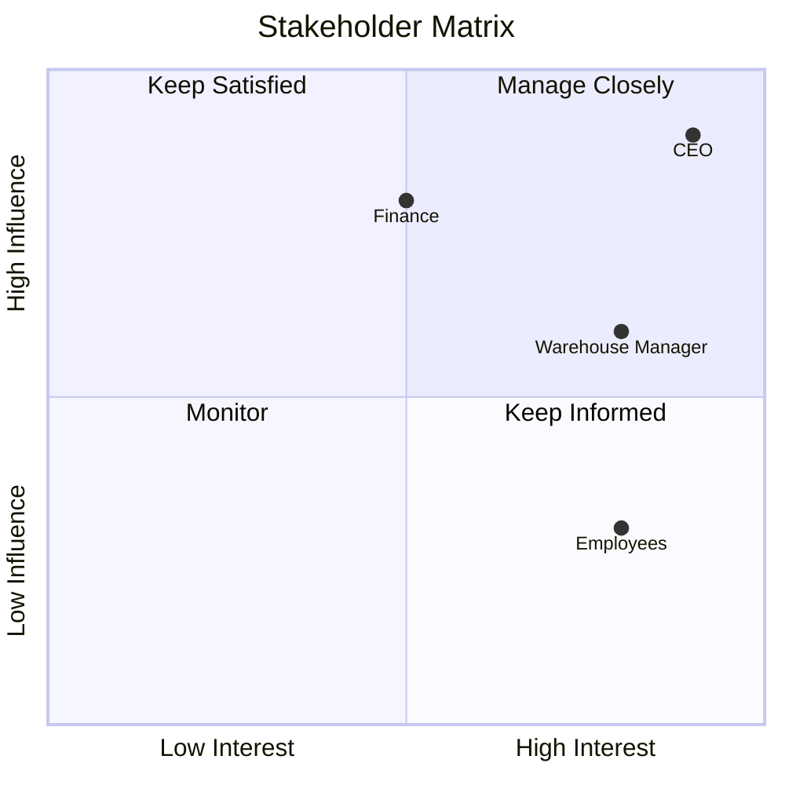
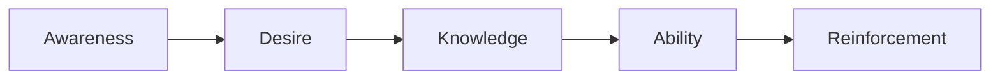

# Chapter 30

# Managing Stakeholders & Organizational Change
## Leading People Through Enterprise Transformation

---

## Learning Objectives

By the end of this chapter, you will be able to:

- Explain why stakeholder management is critical to Enterprise Architecture.
- Identify and analyze key stakeholders.
- Develop stakeholder engagement and communication strategies.
- Understand the principles of Organizational Change Management (OCM).
- Measure stakeholder adoption and business readiness.

---

# Friday Morning – Technology Isn't the Hard Part

SwiftShip has a strong Enterprise Architecture practice.

The technology platforms have been modernized, governance is working, and investment decisions are aligned with strategy.

Yet one major problem remains.

Warehouse employees continue using old spreadsheets instead of the new logistics platform.

Regional managers resist standardized business processes.

Emma Chen sighs.

> "We've built the right solution. Why aren't people using it?"

You reply:

> "Because successful transformation isn't just about technology—it's about people."

This is where **Stakeholder Management** and **Organizational Change Management (OCM)** become essential.

---

# Why Stakeholders Matter

Enterprise Architecture affects nearly every part of an organization.

Different stakeholders have different priorities:

- Executives seek strategic value.
- Business managers focus on operational performance.
- IT teams prioritize technical excellence.
- Employees want simple and reliable ways of working.
- Customers expect better services.

Success depends on balancing these perspectives.

---

# Identifying Stakeholders

Typical stakeholder groups include:

| Stakeholder | Primary Interest |
|-------------|------------------|
| Executive Leadership | Business strategy and ROI |
| Business Units | Operational improvement |
| PMO | Project delivery |
| IT Operations | Reliability and support |
| Information Security | Risk and compliance |
| Finance | Investment value |
| Customers | Better products and services |
| Partners | Collaboration and integration |

Stakeholders should be identified early in every architecture initiative.

---

# Stakeholder Analysis

A common approach is to assess stakeholders based on:

- Influence
- Interest
- Support level
- Communication needs

The communication strategy should differ for each stakeholder group.

---

# Stakeholder Engagement

Effective engagement includes:

- Listening to concerns
- Involving stakeholders in decisions
- Demonstrating business value
- Providing regular updates
- Celebrating early successes

Engagement builds trust and reduces resistance.

---

# Organizational Change Management (OCM)

OCM helps people transition from current ways of working to future operating models.

It focuses on:

- Awareness
- Understanding
- Acceptance
- Adoption
- Reinforcement

Technology succeeds only when people adopt it.

---

# Change Management Lifecycle

Successful transformation progresses through each stage.

---

# Communication Strategy

Different audiences require different messages.

| Audience | Preferred Communication |
|----------|--------------------------|
| Executives | Business outcomes and KPIs |
| Managers | Roadmaps and operational impact |
| Employees | Training and practical guidance |
| IT Teams | Technical standards and implementation |
| Customers | Benefits and service improvements |

Consistent communication reduces uncertainty.

---

# Managing Resistance

Resistance is natural.

Common causes include:

- Fear of change
- Lack of understanding
- Increased workload
- Loss of control
- Previous failed transformations

Enterprise Architects should address concerns with transparency, training, and continuous engagement rather than forcing compliance.

---

# Measuring Adoption

Typical change KPIs include:

| KPI | Example Measure |
|-----|-----------------|
| User Adoption | % of active users |
| Training Completion | Employees trained |
| Stakeholder Satisfaction | Survey scores |
| Business Readiness | Readiness assessment |
| Process Compliance | Standard process adoption |
| Change Requests | Number and type of feedback items |

These indicators reveal whether transformation has been embraced by the organization.

---

# SwiftShip Example

SwiftShip introduces a new AI-powered warehouse management system.

Instead of immediately replacing existing processes, the Enterprise Architecture Office:

- Conducts stakeholder workshops
- Identifies change champions in each warehouse
- Provides role-based training
- Publishes regular progress updates
- Collects user feedback after deployment

Within six months, adoption exceeds 90%, and operational efficiency improves significantly.

---

# Key Deliverables

| Deliverable | Purpose |
|-------------|---------|
| Stakeholder Register | Identifies key stakeholders |
| Stakeholder Engagement Plan | Defines engagement activities |
| Communication Plan | Coordinates messaging |
| Change Readiness Assessment | Evaluates organizational preparedness |
| Adoption Dashboard | Tracks change success |

---

# Foundation Exam Focus

Remember:

- Stakeholder engagement is essential throughout the ADM.
- Communication should be tailored to stakeholder needs.
- Organizational Change Management supports successful adoption.
- Resistance should be managed through engagement and education.
- Adoption metrics demonstrate transformation success.

---

# Practitioner Scenario

**Scenario**

A new enterprise platform has been technically deployed, but regional offices continue using legacy tools because employees were not involved during the transformation.

**Question**

How should the Enterprise Architect respond?

**Answer**

Develop a stakeholder engagement strategy, perform a change readiness assessment, communicate business benefits, provide targeted training, identify local change champions, and monitor adoption through measurable KPIs before retiring the legacy solution.

---

# Common Mistakes

- Treating architecture as purely a technology initiative.
- Engaging stakeholders too late.
- Using identical communication for every audience.
- Ignoring employee concerns.
- Measuring implementation instead of adoption.

---

# Key Takeaways

- Enterprise Architecture succeeds through people as much as technology.
- Stakeholder engagement should begin early and continue throughout the lifecycle.
- Organizational Change Management enables sustainable adoption.
- Communication, training, and measurement reduce resistance and improve outcomes.

---

# Chapter Summary

Emma walks through SwiftShip's newest distribution center.

Employees confidently use the new digital platform, managers rely on real-time dashboards, and executives monitor business outcomes through enterprise analytics.

Emma smiles.

> "The technology worked because our people embraced the change."

You reply:

> "Exactly. Enterprise Architecture creates the blueprint, but people bring it to life."

SwiftShip is now ready to focus on developing the next generation of Enterprise Architects.

---

# Next Chapter

**Chapter 31 – Architecture Skills, Competencies & Career Paths**
