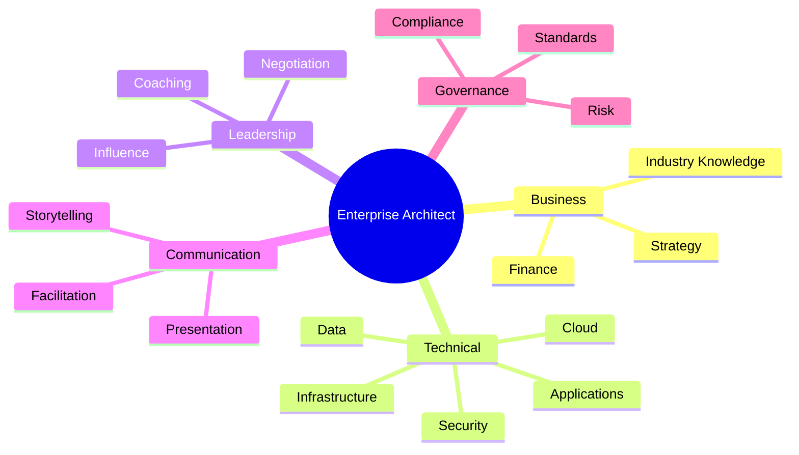

# Chapter 31

# Architecture Skills, Competencies & Career Paths
## Developing High-Performing Enterprise Architects

---

## Learning Objectives

By the end of this chapter, you will be able to:

- Explain the skills required of an Enterprise Architect.
- Distinguish between architecture roles and responsibilities.
- Understand the competency model for Enterprise Architects.
- Create a learning and career development roadmap.
- Build and sustain high-performing architecture teams.

---

# Monday Morning – Building the Next Generation

SwiftShip's Enterprise Architecture Office has become a trusted strategic partner.

As new transformation initiatives begin, Emma Chen asks:

> "We've built an excellent architecture practice. How do we develop the next generation of Enterprise Architects?"

You reply:

> "Great architecture is built by great architects. Developing people is as important as developing technology."

---

# Why Skills Matter

Enterprise Architecture sits at the intersection of:

- Business strategy
- Technology
- Leadership
- Governance
- Communication

An Enterprise Architect must connect these disciplines to help the organization make better decisions.

---

# The Enterprise Architect Skill Framework

---

# Core Competencies

## Business Acumen

- Understand strategy
- Analyze business capabilities
- Align investments with outcomes

## Technical Knowledge

- Enterprise platforms
- Cloud architecture
- Integration
- Data architecture
- Security
- Emerging technologies

## Architecture Thinking

- Systems thinking
- Trade-off analysis
- Long-term planning
- Capability mapping
- Roadmap development

## Leadership

Architects often lead through influence rather than authority.

Key capabilities include:

- Negotiation
- Decision facilitation
- Conflict resolution
- Executive advisory

## Communication

Successful architects communicate effectively with:

- Executives
- Business users
- Delivery teams
- Vendors
- Regulators

Complex technical ideas must be translated into business language.

---

# Architecture Roles

| Role | Primary Responsibility |
|------|-------------------------|
| Chief Enterprise Architect | Enterprise strategy and governance |
| Business Architect | Business capabilities and operating model |
| Data Architect | Enterprise information and data |
| Application Architect | Application portfolio and integration |
| Technology Architect | Infrastructure and platforms |
| Security Architect | Cybersecurity and compliance |
| Solution Architect | Solution design for projects |

---

# Competency Levels

| Level | Typical Focus |
|-------|---------------|
| Foundation | Learn architecture concepts |
| Practitioner | Apply architecture methods |
| Senior | Lead architecture initiatives |
| Principal | Guide enterprise transformation |
| Chief | Shape enterprise strategy |

---

# Building Architecture Teams

A successful Enterprise Architecture team should include:

- Diverse technical expertise
- Strong business knowledge
- Collaborative culture
- Continuous learning
- Knowledge sharing
- Mentoring

Architecture is a team capability rather than an individual achievement.

---

# Continuous Learning

SwiftShip encourages architects to develop through:

- TOGAF certification
- Cloud certifications
- Security certifications
- Business education
- Industry conferences
- Communities of practice
- Mentoring
- Cross-functional projects

Learning should be continuous throughout an architect's career.

---

# Skills Assessment

The Enterprise Architecture Office evaluates competencies annually.

Typical assessment areas include:

| Competency | Assessment Method |
|------------|-------------------|
| Business Knowledge | Manager review |
| Technical Expertise | Peer assessment |
| Communication | Stakeholder feedback |
| Leadership | 360-degree review |
| Governance | Architecture review outcomes |

Assessment identifies strengths and future development opportunities.

---

# SwiftShip Example

SwiftShip launches an Architecture Academy.

The program includes:

- TOGAF certification
- Mentoring by senior architects
- Rotation across business domains
- Executive presentation workshops
- Real-world architecture projects

Within two years, several Solution Architects are promoted into Enterprise Architect roles, ensuring a strong leadership pipeline.

---

# Key Deliverables

| Deliverable | Purpose |
|-------------|---------|
| Skills Matrix | Maps current competencies |
| Individual Development Plan | Defines learning objectives |
| Training Roadmap | Plans capability development |
| Competency Assessment | Evaluates architecture skills |
| Career Framework | Defines progression pathways |

---

# Foundation Exam Focus

Remember:

- Enterprise Architects require both business and technical skills.
- Leadership and communication are as important as technical expertise.
- Competency development is continuous.
- Enterprise Architecture is enabled by skilled people and collaborative teams.

---

# Practitioner Scenario

**Scenario**

SwiftShip plans to expand into new markets, but the Enterprise Architecture Office lacks experienced Business Architects and senior leaders.

**Question**

What should the Chief Enterprise Architect recommend?

**Answer**

Develop a structured capability-building program that includes competency assessments, mentoring, certification, cross-functional experience, and clear career pathways to strengthen the architecture team over time.

---

# Common Mistakes

- Hiring only technical specialists.
- Ignoring business and communication skills.
- Providing no mentoring or career development.
- Measuring only certifications instead of practical capability.
- Treating learning as a one-time activity.

---

# Key Takeaways

- Enterprise Architecture depends on skilled, well-rounded professionals.
- Technical expertise must be balanced with business, leadership, and communication skills.
- Career pathways encourage long-term capability growth.
- Continuous learning keeps architecture relevant in a changing business environment.

---

# Chapter Summary

Emma congratulates the newest graduates of SwiftShip's Architecture Academy.

> "Today's architects will become tomorrow's enterprise leaders."

You reply:

> "Technology evolves quickly, but investing in people creates lasting competitive advantage."

SwiftShip now has both the architecture capability and the talent needed to sustain enterprise transformation.

---

# Next Chapter

**Chapter 32 – Measuring Architecture Success**

---

## 📖 Continue Reading

⬅️ **Previous:** [Chapter 30 – Managing Stakeholders and Organizational Change](30-Managing-Stakeholders-and-Organizational-Change.md)

🏠 **Home:** [📚 Table of Contents](../../../README.md)

➡️ **Next:** [Chapter 32 – Measuring Architecture Success](32-Measuring-Architecture-Success.md)

---

© 2026 **Baskar Periasamy** • Licensed under the MIT License.
