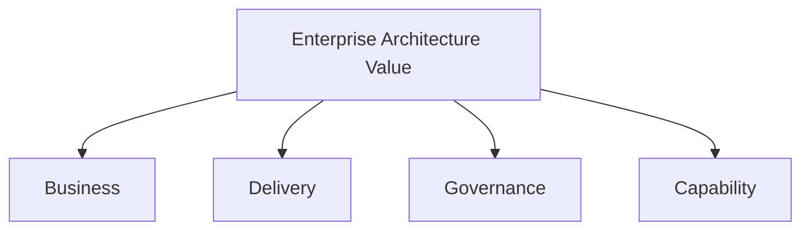
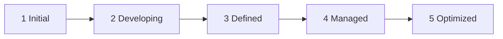
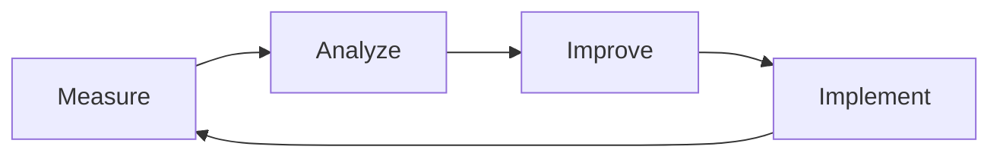

# Chapter 32

# Measuring Architecture Success
## Demonstrating the Business Value of Enterprise Architecture

---

## Learning Objectives

By the end of this chapter, you will be able to:

- Explain why Enterprise Architecture success must be measured.
- Identify meaningful Enterprise Architecture KPIs.
- Assess Enterprise Architecture maturity.
- Build executive dashboards that communicate architectural value.
- Drive continuous improvement through evidence-based decision-making.

---

# Friday Afternoon – Proving the Value

Five years have passed since SwiftShip began its Enterprise Architecture journey.

The company has modernized its platforms, improved customer experience, reduced operating costs, and expanded into new markets.

At the annual board meeting, Emma Chen is asked one final question.

> "How do we know Enterprise Architecture has actually created value?"

You reply:

> "By measuring outcomes—not just architecture activities."

This is the purpose of measuring Enterprise Architecture success.

---

# Why Measure Enterprise Architecture?

Enterprise Architecture exists to enable better business outcomes.

Without meaningful measurement:

- Architecture is viewed as overhead.
- Investment decisions become difficult.
- Success cannot be demonstrated.
- Continuous improvement becomes reactive.

Measurement transforms Enterprise Architecture into a strategic business capability.

---

# What Should Be Measured?

Enterprise Architecture should be evaluated across four dimensions:

---

# Business Outcomes

Examples include:

- Revenue growth enabled by digital initiatives
- Customer satisfaction improvements
- Faster time-to-market
- Operational efficiency
- Cost optimization
- Risk reduction

Architecture succeeds when the business succeeds.

---

# Delivery Performance

Typical KPIs include:

| KPI | Example Measure |
|-----|-----------------|
| Project Alignment | % aligned with target architecture |
| Architecture Review Cycle | Average review time |
| Standards Reuse | Reused enterprise building blocks |
| Delivery Predictability | Projects delivered as planned |
| Technical Debt Reduction | Legacy systems retired |

---

# Governance Metrics

Governance effectiveness may be measured through:

- Architecture compliance rate
- Number of approved exceptions
- Architecture review completion
- Policy adherence
- Audit findings
- Risk mitigation

Good governance reduces enterprise complexity while enabling innovation.

---

# Capability Metrics

Measure how the architecture function evolves:

- Capability maturity
- Skills development
- Certification levels
- Repository quality
- Stakeholder satisfaction
- Knowledge reuse

These indicators show whether Enterprise Architecture itself is improving.

---

# Enterprise Architecture Maturity

| Level | Characteristics |
|------|------------------|
| 1 | Informal architecture practices |
| 2 | Basic governance established |
| 3 | Standardized enterprise processes |
| 4 | Metrics actively managed |
| 5 | Continuous optimization and strategic influence |

Maturity should improve gradually through continuous learning.

---

# Executive Dashboard

Executives need concise, business-focused reporting.

A typical dashboard includes:

| Area | Sample KPI |
|------|------------|
| Strategy | Strategic initiative alignment |
| Finance | Cost savings realized |
| Delivery | Architecture compliance |
| Technology | Technical debt reduction |
| Risk | Security and compliance posture |
| Capability | Architecture maturity score |

Dashboards should emphasize trends and outcomes rather than technical detail.

---

# Continuous Improvement

Measurement creates a feedback loop that strengthens Enterprise Architecture over time.

---

# SwiftShip Example

The Enterprise Architecture Office prepares its annual report.

Highlights include:

- 96% architecture compliance across projects
- 35% reduction in duplicate technology platforms
- 28% faster project delivery
- 18% reduction in operating costs
- Architecture maturity increased from Level 2 to Level 4
- Stakeholder satisfaction exceeded executive targets

The board approves additional investment because the value of Enterprise Architecture is now measurable.

---

# Key Deliverables

| Deliverable | Purpose |
|-------------|---------|
| EA Scorecard | Measures enterprise performance |
| Executive Dashboard | Reports key indicators |
| Architecture Maturity Assessment | Evaluates organizational capability |
| Benefits Realization Report | Demonstrates business value |
| Continuous Improvement Plan | Defines future actions |

---

# Foundation Exam Focus

Remember:

- Enterprise Architecture should be measured using business outcomes as well as governance and capability metrics.
- KPIs demonstrate value to executives.
- Maturity assessments identify improvement opportunities.
- Continuous measurement supports continuous improvement.

---

# Practitioner Scenario

**Scenario**

Senior executives believe the Enterprise Architecture Office is adding unnecessary governance but cannot see measurable business value.

**Question**

How should the Chief Enterprise Architect respond?

**Answer**

Develop an executive scorecard that links architecture activities to strategic outcomes, including compliance, cost optimization, delivery performance, technical debt reduction, stakeholder satisfaction, and maturity improvements. Review these metrics regularly with leadership to demonstrate measurable value.

---

# Common Mistakes

- Measuring documents produced instead of outcomes achieved.
- Reporting technical metrics without business context.
- Ignoring stakeholder feedback.
- Measuring once instead of continuously.
- Failing to act on measurement results.

---

# Key Takeaways

- Enterprise Architecture creates value only when it improves business outcomes.
- Balanced KPIs should measure business, delivery, governance, and capability.
- Executive dashboards translate architecture into business language.
- Continuous measurement enables continuous improvement.
- Demonstrated value strengthens executive support for Enterprise Architecture.

---

# Chapter Summary

Emma presents SwiftShip's Enterprise Architecture scorecard to the Board.

> "Enterprise Architecture is no longer judged by the number of documents we produce."

You conclude:

> "It is judged by the business value we enable."

The Board unanimously approves the next generation of strategic transformation initiatives.

Congratulations! You have completed **Part IV – Governing Enterprise Change**.

---

# Looking Ahead

**Part V – Enterprise Architecture in the Modern Digital Enterprise** (Cloud, AI, Data, Agile, DevSecOps, Sustainability, and the Future of Enterprise Architecture)
