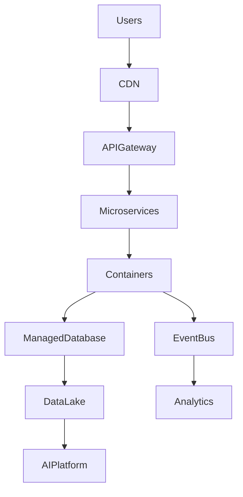
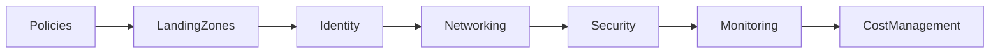

# Chapter 33

# Enterprise Architecture in the Cloud Era
## Applying TOGAF to Cloud-First Organizations

---

## Learning Objectives

By the end of this chapter, you will be able to:

- Explain how Enterprise Architecture supports cloud transformation.
- Compare cloud service and deployment models.
- Apply cloud architecture principles within TOGAF.
- Evaluate common cloud migration strategies.
- Establish cloud governance and FinOps practices.

---

# Monday Morning – The Next Transformation

Five years after its first transformation, SwiftShip has become a global digital logistics company.

The Executive Committee announces a new objective:

> "Become cloud-first within three years."

Emma Chen asks:

> "Moving to the cloud is easy. Governing the cloud is difficult. How can Enterprise Architecture help?"

You reply:

> "Cloud transformation is not an infrastructure project—it's an enterprise transformation."

---

# Why Cloud Changes Enterprise Architecture

Cloud computing changes how organizations:

- Build applications
- Consume infrastructure
- Deliver software
- Secure information
- Manage costs
- Scale globally

Enterprise Architecture ensures these changes remain aligned with business strategy rather than becoming isolated technology decisions.

---

# Cloud Service Models

| Model | Organization Manages | Provider Manages | Typical Examples |
|--------|----------------------|------------------|------------------|
| SaaS | Users, configuration | Complete application | CRM, ERP, Collaboration |
| PaaS | Applications & data | Runtime and platform | Application platforms |
| IaaS | OS, applications, data | Compute, storage, networking | Virtual infrastructure |
| FaaS | Functions only | Entire execution platform | Event-driven functions |

Choose the model that best balances business flexibility, operational responsibility, and speed.

---

# Cloud Deployment Models

| Model | Best Used For |
|--------|---------------|
| Public Cloud | Elastic workloads and rapid innovation |
| Private Cloud | Sensitive or highly regulated systems |
| Hybrid Cloud | Gradual modernization and mixed workloads |
| Multi-Cloud | Resilience, vendor diversification, specialized services |

Enterprise Architects evaluate deployment models using business, regulatory, and operational requirements.

---

# Cloud-First Architecture Principles

SwiftShip adopts the following principles:

- API First
- Security by Design
- Everything as Code
- Automation First
- Resilience by Design
- Elastic Scalability
- Reuse Before Build
- Cost Transparency

These principles guide every cloud initiative.

---

# Cloud Reference Architecture

This reference architecture becomes the enterprise standard for cloud-native solutions.

---

# Cloud Migration Strategies (The 7 Rs)

| Strategy | Description | Typical Scenario |
|----------|-------------|------------------|
| Rehost | Lift and shift | Fast migration |
| Replatform | Minor optimization | Quick cloud benefits |
| Refactor | Redesign application | Cloud-native architecture |
| Repurchase | Replace with SaaS | Commercial applications |
| Relocate | Move virtualization platform | Large-scale migrations |
| Retain | Keep on-premises | Technical or regulatory constraints |
| Retire | Decommission | Obsolete systems |

Enterprise Architects assess each application individually rather than applying one strategy to every workload.

---

# Cloud Governance

Governance includes:

- Landing zones
- Identity and access management
- Network architecture
- Security controls
- Compliance
- Monitoring
- Cost governance

---

# FinOps

Cloud success requires financial governance.

Key practices include:

- Budget monitoring
- Rightsizing resources
- Reserved capacity planning
- Chargeback and showback
- Continuous cost optimization

Enterprise Architecture and FinOps work together to maximize business value.

---

# Cloud Security

Security principles include:

- Zero Trust
- Least privilege access
- Encryption by default
- Secrets management
- Continuous compliance
- Security automation

Security must be designed into the architecture—not added afterward.

---

# SwiftShip Example

SwiftShip migrates 400 applications from regional data centers to a hybrid Azure–AWS environment.

The Enterprise Architecture Office develops:

- Enterprise cloud principles
- Standard landing zones
- Cloud reference architectures
- Migration roadmap
- FinOps dashboard
- Security guardrails

Within three years:

- 80% of applications operate in the cloud.
- Infrastructure provisioning drops from weeks to minutes.
- Operating costs become transparent through FinOps.
- Architecture governance remains consistent across providers.

---

# Key Deliverables

| Deliverable | Purpose |
|-------------|---------|
| Cloud Reference Architecture | Enterprise cloud standard |
| Cloud Migration Roadmap | Guides transformation |
| Landing Zone Blueprint | Standard cloud foundation |
| Cloud Governance Framework | Policies and controls |
| FinOps Dashboard | Cost visibility and optimization |

---

# Foundation Exam Focus

Remember:

- TOGAF provides governance for cloud transformation.
- Architecture principles apply regardless of deployment model.
- Cloud governance covers security, identity, networking, and cost.
- Cloud migration should follow structured assessment and roadmap planning.

---

# Practitioner Scenario

**Scenario**

SwiftShip wants to migrate 120 applications to the cloud. Some are legacy ERP systems, while others are modern web applications.

**Question**

How should the Enterprise Architect approach the migration?

**Answer**

Assess each application individually using business value, technical complexity, regulatory requirements, dependencies, and the 7 Rs migration strategies. Develop a phased roadmap, establish cloud governance, and use reference architectures to ensure consistency across the migration.

---

# Common Mistakes

- Treating cloud as only an infrastructure migration.
- Applying one migration strategy to every application.
- Ignoring cloud cost governance.
- Allowing different teams to create inconsistent architectures.
- Delaying security until after migration.

---

# Key Takeaways

- Cloud transformation is a business transformation enabled by Enterprise Architecture.
- Reference architectures and governance improve consistency.
- The 7 Rs provide structured migration options.
- FinOps and security are essential architectural capabilities.
- TOGAF provides the governance needed for successful cloud adoption.

---

# Chapter Summary

Emma watches the final on-premises server room power down.

> "We've completed our move to the cloud."

You reply:

> "The real achievement isn't moving workloads. It's building a cloud operating model that supports innovation, governance, and business growth."

SwiftShip is now ready for the next frontier—Artificial Intelligence.

---

# Next Chapter

**Chapter 34 – Enterprise Architecture for AI & Intelligent Enterprises**

---

## 📖 Continue Reading

⬅️ **Previous:** [Chapter 32 – Measuring Architecture Success](../Part-4-Governing-Enterprise-Change/32-Measuring-Architecture-Success.md)

🏠 **Home:** [📚 Table of Contents](../../../README.md)

➡️ **Next:** [Chapter 34 – Enterprise Architecture for AI and Intelligent Enterprises](34-Enterprise-Architecture-for-AI-and-Intelligent-Enterprises.md)

---

© 2026 **Baskar Periasamy** • Licensed under the MIT License.
