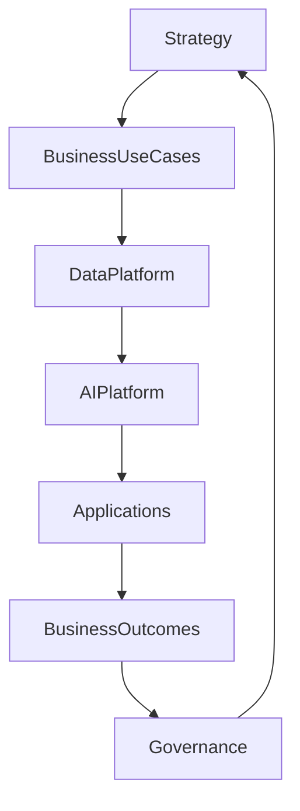
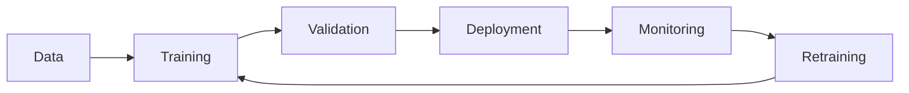

# Chapter 34

# Enterprise Architecture for AI & Intelligent Enterprises
## Applying TOGAF in the Age of Artificial Intelligence

---

## Learning Objectives

By the end of this chapter, you will be able to:

- Explain the role of Enterprise Architecture in AI transformation.
- Differentiate Generative AI, Predictive AI, and Traditional Machine Learning.
- Establish AI governance aligned with enterprise strategy.
- Design an enterprise AI operating model.
- Apply responsible AI principles and MLOps practices.

---

# Tuesday Morning – The AI Imperative

SwiftShip's cloud transformation is complete.

Now every business unit wants Artificial Intelligence.

Marketing wants AI-generated campaigns.

Customer Service wants AI assistants.

Operations wants predictive maintenance.

Finance wants intelligent forecasting.

Emma Chen asks:

> "Everyone wants AI. How do we ensure it creates business value rather than isolated experiments?"

You reply:

> "Enterprise Architecture provides the governance, standards, and operating model for an intelligent enterprise."

---

# Why AI Needs Enterprise Architecture

AI initiatives often fail because they lack:

- Business alignment
- Quality data
- Governance
- Security
- Responsible AI controls
- Scalable platforms

Enterprise Architecture connects AI investments to enterprise strategy.

---

# Types of Artificial Intelligence

| Type | Primary Purpose | Example |
|------|-----------------|---------|
| Traditional AI | Rule-based decision making | Expert systems |
| Machine Learning | Learn patterns from data | Demand forecasting |
| Predictive AI | Forecast future outcomes | Delivery delay prediction |
| Generative AI | Create new content | AI copilots and document generation |

Each type serves different business capabilities.

---

# AI Operating Model

Enterprise Architecture ensures every AI initiative follows a common operating model.

---

# AI Architecture Principles

SwiftShip establishes the following principles:

- Business Value First
- Human Oversight
- Responsible AI
- Secure by Design
- Privacy by Default
- Reusable AI Services
- Data Quality Before Models
- Continuous Monitoring

These principles guide AI solution design and governance.

---

# AI Governance

Effective AI governance addresses:

- Model approval
- Data governance
- Ethical use
- Regulatory compliance
- Security
- Risk management
- Performance monitoring
- Lifecycle management

Architecture Boards expand their responsibilities to include AI governance.

---

# MLOps Lifecycle

MLOps applies engineering discipline to AI model development and operations.

---

# Responsible AI

Enterprise Architects should ensure AI systems are:

- Fair
- Transparent
- Explainable
- Secure
- Reliable
- Accountable
- Privacy-preserving

Responsible AI builds trust among customers, employees, and regulators.

---

# Enterprise AI Platform

A reusable enterprise AI platform typically includes:

| Component | Purpose |
|----------|---------|
| Data Lake | Enterprise data |
| Feature Store | Shared machine learning features |
| Model Registry | Version-controlled AI models |
| API Gateway | Model access |
| Monitoring Platform | Performance and drift detection |
| Governance Portal | Approval and compliance |

Shared platforms reduce duplication and accelerate innovation.

---

# AI Use Cases at SwiftShip

SwiftShip introduces AI across multiple domains:

- Intelligent route optimization
- Predictive fleet maintenance
- AI customer service assistants
- Automated invoice processing
- Demand forecasting
- Executive copilots

The Enterprise Architecture Office ensures every solution uses shared data, common AI services, and enterprise governance.

---

# Key Deliverables

| Deliverable | Purpose |
|-------------|---------|
| AI Strategy | Aligns AI with business goals |
| AI Reference Architecture | Standard enterprise blueprint |
| AI Governance Framework | Policies and controls |
| Responsible AI Guidelines | Ethical AI principles |
| AI Roadmap | Prioritized implementation plan |

---

# Foundation Exam Focus

Remember:

- TOGAF governs AI transformation through architecture principles and governance.
- AI initiatives should align with enterprise strategy and business capabilities.
- Data quality and governance are foundational to AI success.
- Responsible AI is an architectural responsibility, not only a technical concern.

---

# Practitioner Scenario

**Scenario**

Multiple business units purchase different Generative AI tools without enterprise standards, creating security, compliance, and data privacy risks.

**Question**

How should the Enterprise Architect respond?

**Answer**

Define an enterprise AI strategy, establish governance policies, introduce a shared AI platform, standardize approved AI services, and require architecture reviews for AI initiatives. Balance innovation with security, compliance, and responsible AI practices.

---

# Common Mistakes

- Treating AI as a standalone technology project.
- Ignoring data quality.
- Deploying models without monitoring.
- Overlooking ethical and regulatory requirements.
- Allowing duplicate AI platforms across business units.

---

# Key Takeaways

- Enterprise Architecture transforms AI from isolated pilots into enterprise capabilities.
- Governance, data, and reusable platforms enable scalable AI adoption.
- Responsible AI builds trust and reduces risk.
- MLOps ensures AI solutions remain accurate and reliable.
- AI investments should always be linked to measurable business outcomes.

---

# Chapter Summary

Emma reviews SwiftShip's first Enterprise AI Dashboard.

AI copilots help employees, predictive models optimize logistics, and executives make faster, data-driven decisions.

Emma smiles.

> "Artificial Intelligence has become part of how we operate—not just another technology."

You reply:

> "That's the goal of Enterprise Architecture: turning innovation into sustainable enterprise capability."

---

# Next Chapter

**Chapter 35 – Data-Driven Enterprise Architecture**

---

## 📖 Continue Reading

⬅️ **Previous:** [Chapter 33 – Enterprise Architecture in the Cloud Era](33-Enterprise-Architecture-in-the-Cloud-Era.md)

🏠 **Home:** [📚 Table of Contents](../../../README.md)

➡️ **Next:** [Chapter 35 – Data Driven Enterprise Architecture](35-Data-Driven-Enterprise-Architecture.md)

---

© 2026 **Baskar Periasamy** • Licensed under the MIT License.
