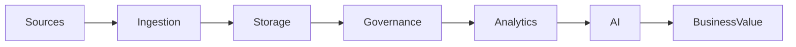
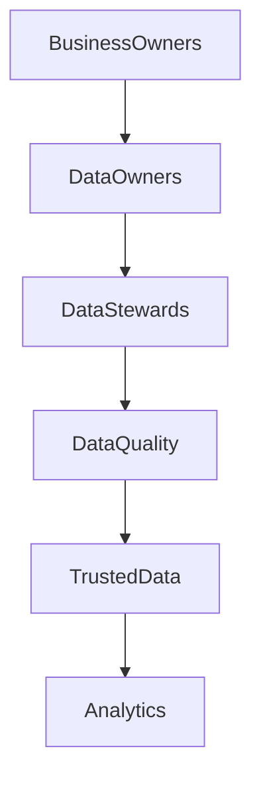

# Chapter 35

# Data-Driven Enterprise Architecture
## Building an Enterprise Where Data Becomes a Strategic Asset

---

## Learning Objectives

By the end of this chapter, you will be able to:

- Explain why data is a core enterprise capability.
- Understand the relationship between Enterprise Architecture and data strategy.
- Compare Data Warehouse, Data Lake, Data Lakehouse, Data Fabric, and Data Mesh.
- Establish enterprise data governance.
- Design a modern data architecture that supports analytics and AI.

---

# Wednesday Morning – The Data Challenge

SwiftShip has successfully adopted cloud and AI.

However, every department reports different numbers for the same KPI.

Emma Chen asks:

> "How can AI make good decisions if our data tells different stories?"

You reply:

> "Artificial Intelligence is only as good as the data that powers it. Enterprise Architecture ensures there is one trusted foundation."

---

# Why Data Matters

Modern enterprises depend on data for:

- Strategic decisions
- Customer insights
- Automation
- AI models
- Regulatory reporting
- Operational excellence

Enterprise Architecture aligns data with business capabilities and enterprise goals.

---

# The Modern Data Journey

Enterprise Architecture provides standards and governance across the entire lifecycle.

---

# Modern Data Platforms

| Platform | Best Use |
|----------|----------|
| Data Warehouse | Structured reporting and BI |
| Data Lake | Raw structured and unstructured data |
| Data Lakehouse | Combines warehouse and lake capabilities |
| Data Fabric | Unified data access across environments |
| Data Mesh | Domain-oriented decentralized data ownership |

Enterprise Architects select the approach that best supports business strategy.

---

# Enterprise Data Principles

SwiftShip defines the following principles:

- Data is an enterprise asset
- Capture data once, reuse many times
- Data quality by design
- Security and privacy by default
- Metadata is mandatory
- Standard business definitions
- Self-service analytics with governance

---

# Data Governance

Data governance includes:

- Ownership
- Stewardship
- Data quality
- Metadata
- Master data
- Privacy
- Lifecycle management

---

# Master Data Management (MDM)

Master Data Management provides a single trusted view of critical business entities such as:

- Customers
- Suppliers
- Employees
- Products
- Locations

MDM reduces duplication and improves consistency across applications.

---

# Data Architecture Layers

| Layer | Purpose |
|-------|---------|
| Data Sources | Operational systems and external feeds |
| Integration | ETL/ELT, APIs, streaming |
| Storage | Warehouse, lake, lakehouse |
| Processing | Data engineering and transformation |
| Analytics | BI, dashboards, reporting |
| AI | Machine learning and Generative AI |

---

# Data Quality

Key dimensions include:

- Accuracy
- Completeness
- Consistency
- Timeliness
- Validity
- Uniqueness

Poor-quality data results in poor business decisions.

---

# Data Security & Privacy

Enterprise Architects should incorporate:

- Data classification
- Encryption
- Access control
- Data masking
- Regulatory compliance
- Audit logging

Security and governance should be built into the architecture from the beginning.

---

# SwiftShip Example

SwiftShip establishes a global enterprise data platform.

The Enterprise Architecture Office creates:

- Enterprise data model
- Master Data Management program
- Common business glossary
- Data governance council
- Data quality scorecards
- Shared analytics platform

Business users now access consistent dashboards, while AI models use trusted enterprise data.

---

# Key Deliverables

| Deliverable | Purpose |
|-------------|---------|
| Enterprise Data Strategy | Aligns data with business objectives |
| Data Reference Architecture | Standard enterprise blueprint |
| Data Governance Framework | Roles, policies, and ownership |
| Enterprise Data Model | Common business definitions |
| Data Quality Dashboard | Monitors trusted data |

---

# Foundation Exam Focus

Remember:

- Data Architecture supports business strategy and applications.
- Data governance defines ownership, quality, and standards.
- Enterprise Architecture enables trusted enterprise data.
- Data is a strategic enterprise asset.

---

# Practitioner Scenario

**Scenario**

Different business units maintain separate customer databases, resulting in inconsistent reports and duplicate AI training data.

**Question**

How should the Enterprise Architect respond?

**Answer**

Establish Master Data Management, define enterprise data standards, implement governance roles, create a shared enterprise data platform, and measure data quality to ensure consistent information across the organization.

---

# Common Mistakes

- Treating data as an IT asset rather than a business asset.
- Ignoring data ownership.
- Building isolated data silos.
- Focusing only on storage instead of governance.
- Deploying AI without trusted enterprise data.

---

# Key Takeaways

- Enterprise data is the foundation for analytics and AI.
- Governance is as important as technology.
- Modern platforms support scalable, reusable data capabilities.
- Trusted data enables trusted decisions.
- Enterprise Architecture connects data strategy to business value.

---

# Chapter Summary

Emma reviews a single executive dashboard.

Every department now reports the same trusted metrics.

AI systems learn from governed, high-quality enterprise data.

Emma smiles.

> "We've finally created one version of the truth."

You reply:

> "That's the power of Data-Driven Enterprise Architecture."

---

# Next Chapter

**Chapter 36 – Enterprise Architecture & Agile Delivery**
