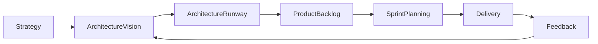
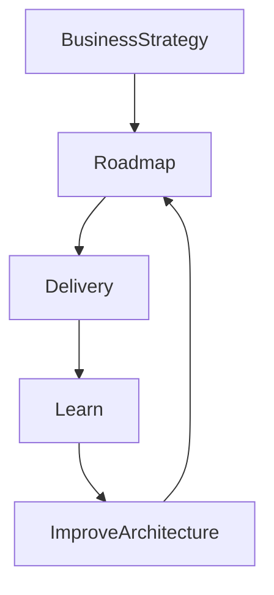

# Chapter 36

# Enterprise Architecture & Agile Delivery
## Aligning TOGAF with Agile, Scrum, and Product-Centric Delivery

---

## Learning Objectives

By the end of this chapter, you will be able to:

- Explain how Enterprise Architecture complements Agile delivery.
- Understand the relationship between TOGAF, Scrum, Kanban, and SAFe.
- Balance architectural governance with delivery speed.
- Apply architecture runway, intentional architecture, and continuous planning.
- Enable product teams through reusable enterprise capabilities.

---

# Thursday Morning – Speed Without Chaos

SwiftShip's cloud, AI, and data platforms are thriving.

Product teams now release software every two weeks.

Emma Chen asks:

> "Agile teams move fast. Enterprise Architecture focuses on long-term direction. Can they work together?"

You reply:

> "Enterprise Architecture provides the destination. Agile determines the fastest route."

---

# The Myth: Architecture vs Agile

A common misconception is that architecture slows Agile.

In reality:

- Enterprise Architecture provides strategic direction.
- Agile delivers value incrementally.
- Architecture evolves continuously.
- Both focus on delivering business value.

Architecture should enable agility—not prevent it.

---

# Enterprise Architecture and Agile

| Enterprise Architecture | Agile Delivery |
|--------------------------|----------------|
| Enterprise vision | Incremental delivery |
| Long-term roadmap | Short iterations |
| Standards and governance | Continuous feedback |
| Cross-enterprise optimization | Product optimization |
| Capability planning | Feature implementation |

Together they create both stability and speed.

---

# Agile Delivery Frameworks

| Framework | Primary Focus |
|-----------|---------------|
| Scrum | Iterative product development |
| Kanban | Continuous workflow |
| SAFe | Enterprise-scale Agile |
| Lean | Eliminate waste and maximize value |

Enterprise Architects adapt governance to support each framework.

---

# Architecture in an Agile Enterprise

Architecture continuously evolves through feedback and learning.

---

# Architecture Runway

Architecture Runway provides the technical foundation needed for future features.

Examples include:

- API platforms
- Identity services
- Shared data models
- Cloud landing zones
- Messaging platforms

Building the runway early reduces future delivery risk.

---

# Intentional vs Emergent Architecture

| Intentional Architecture | Emergent Architecture |
|--------------------------|-----------------------|
| Planned enterprise direction | Design evolves during delivery |
| Shared standards | Local optimization |
| Strategic decisions | Team-level improvements |
| Long-term capabilities | Short-term implementation |

Successful organizations balance both approaches.

---

# Continuous Architecture

Architecture becomes a continuous practice rather than a one-time phase.

---

# Governance in Agile

Modern governance emphasizes:

- Lightweight reviews
- Automated compliance
- Architecture decision records (ADRs)
- Reusable reference architectures
- Continuous risk assessment

Governance should accelerate delivery by reducing uncertainty.

---

# Product-Centric Operating Model

Enterprise Architects collaborate with:

- Product Managers
- Product Owners
- Scrum Masters
- Engineering Managers
- Platform Teams
- Security Teams

The objective is to enable product teams with shared capabilities rather than dictate technical decisions.

---

# Agile Metrics

Useful architecture metrics include:

| KPI | Example Measure |
|------|-----------------|
| Lead Time | Time from idea to production |
| Deployment Frequency | Releases per week/month |
| Architecture Compliance | % aligned with reference architecture |
| Platform Reuse | Shared capability adoption |
| Technical Debt | Outstanding architecture issues |
| Business Value | Features delivering measurable outcomes |

Measure outcomes rather than documentation.

---

# SwiftShip Example

SwiftShip reorganizes around digital products.

The Enterprise Architecture Office:

- Defines enterprise architecture principles.
- Creates reusable API and cloud platforms.
- Publishes reference architectures.
- Introduces lightweight architecture reviews.
- Embeds architects within Agile Release Trains.

Product delivery accelerates while enterprise consistency improves.

---

# Key Deliverables

| Deliverable | Purpose |
|-------------|---------|
| Architecture Runway | Enables future delivery |
| Product Architecture Roadmap | Aligns products with strategy |
| Architecture Decision Records (ADRs) | Documents key decisions |
| Reference Architectures | Standard reusable patterns |
| Agile Governance Model | Balances speed and control |

---

# Foundation Exam Focus

Remember:

- TOGAF and Agile are complementary.
- Enterprise Architecture provides strategic direction.
- Agile delivers incremental business value.
- Governance should be lightweight and enable delivery.
- Architecture evolves continuously through feedback.

---

# Practitioner Scenario

**Scenario**

Several Agile teams independently develop similar authentication services, creating duplication and inconsistent security.

**Question**

How should the Enterprise Architect respond?

**Answer**

Define a reusable enterprise identity platform, publish a reference architecture, establish lightweight governance, and encourage product teams to consume shared capabilities instead of building duplicate solutions.

---

# Common Mistakes

- Treating architecture as a one-time design phase.
- Excessive governance that delays delivery.
- Ignoring enterprise standards.
- Building duplicate platforms across teams.
- Measuring documentation instead of outcomes.

---

# Key Takeaways

- Enterprise Architecture and Agile reinforce one another.
- Architecture provides direction while Agile provides execution.
- Continuous Architecture supports continuous delivery.
- Shared platforms and reusable capabilities increase delivery speed.
- Lightweight governance enables innovation without sacrificing consistency.

---

# Chapter Summary

Emma watches a new customer feature move from idea to production in less than two weeks.

The enterprise remains secure, governed, and strategically aligned.

She smiles.

> "We've proven that speed and governance can coexist."

You reply:

> "That is the essence of modern Enterprise Architecture."

---

# Next Chapter

**Chapter 37 – DevSecOps & Platform Engineering**
