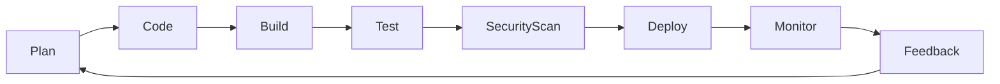
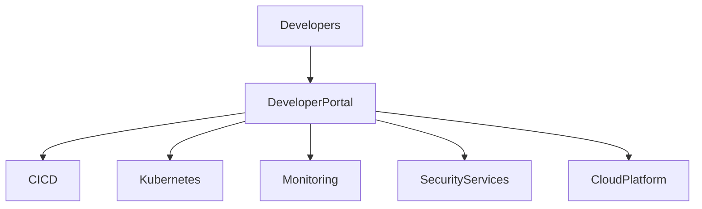

# Chapter 37

# DevSecOps & Platform Engineering
## Building Secure, Automated, and Self-Service Digital Platforms

---

## Learning Objectives

By the end of this chapter, you will be able to:

- Explain how DevSecOps supports Enterprise Architecture.
- Understand Platform Engineering and Internal Developer Platforms (IDPs).
- Apply "security by design" throughout the software lifecycle.
- Integrate DevSecOps into TOGAF governance.
- Design reusable engineering platforms that accelerate delivery.

---

# Friday Morning – From Fast Delivery to Trusted Delivery

SwiftShip now releases software several times a day.

While delivery has accelerated, new concerns emerge.

Security teams struggle to review every release.

Developers spend too much time configuring infrastructure.

Emma Chen asks:

> "How can we move even faster without increasing risk?"

You reply:

> "By embedding security, automation, and reusable platforms into the architecture itself."

---

# Why DevSecOps Matters

Traditional delivery treated development, operations, and security as separate activities.

Modern enterprises integrate them into one continuous value stream.

Benefits include:

- Faster releases
- Improved quality
- Reduced operational risk
- Automated compliance
- Better collaboration

Enterprise Architecture provides the enterprise-wide standards that make this possible.

---

# From DevOps to DevSecOps

| DevOps | DevSecOps |
|--------|-----------|
| Development + Operations | Development + Security + Operations |
| Automation | Automation with security controls |
| Faster delivery | Faster and safer delivery |
| Continuous deployment | Continuous deployment with continuous security |

Security becomes everyone's responsibility.

---

# Continuous Delivery Pipeline

Quality, security, and governance are integrated into every stage.

---

# Shift Left Security

Instead of detecting vulnerabilities after deployment, DevSecOps moves security earlier.

Examples include:

- Secure coding standards
- Dependency scanning
- Static application security testing (SAST)
- Secrets detection
- Infrastructure as Code validation

Finding issues earlier reduces cost and risk.

---

# Platform Engineering

Platform Engineering creates reusable capabilities for product teams.

Typical platform services include:

- CI/CD pipelines
- Kubernetes platforms
- Identity services
- API gateways
- Observability
- Infrastructure as Code
- Developer portals

Teams consume platforms rather than rebuilding common services.

---

# Internal Developer Platform (IDP)

An Internal Developer Platform provides self-service access to approved enterprise capabilities.

---

# Enterprise Architecture and Platform Engineering

Enterprise Architects define:

- Platform principles
- Reference architectures
- Technology standards
- Reusable building blocks
- Governance guardrails

Platform teams implement these standards as reusable services.

---

# DevSecOps Governance

Modern governance emphasizes automation.

Examples include:

- Automated policy validation
- Infrastructure compliance checks
- Container image scanning
- Software Bill of Materials (SBOM)
- Continuous compliance reporting

Governance becomes part of the delivery pipeline.

---

# Observability

Reliable digital platforms require visibility.

Core capabilities include:

- Metrics
- Logs
- Traces
- Alerts
- Dashboards

Observability enables rapid incident detection and continuous improvement.

---

# SwiftShip Example

SwiftShip launches an Enterprise Developer Platform.

The platform provides:

- One-click application templates
- Standard CI/CD pipelines
- Built-in security scanning
- Kubernetes deployment
- Central logging and monitoring
- Automated compliance checks

Development teams now deploy securely within minutes while adhering to enterprise standards.

---

# Key Deliverables

| Deliverable | Purpose |
|-------------|---------|
| DevSecOps Reference Architecture | Standard delivery blueprint |
| Platform Engineering Roadmap | Capability evolution plan |
| Internal Developer Platform Blueprint | Self-service platform design |
| Security Automation Standards | Embedded security controls |
| DevSecOps KPI Dashboard | Measures engineering performance |

---

# Foundation Exam Focus

Remember:

- Enterprise Architecture provides governance for DevSecOps.
- Security should be integrated throughout the delivery lifecycle.
- Platform Engineering enables reusable enterprise capabilities.
- Automation improves both speed and compliance.

---

# Practitioner Scenario

**Scenario**

Multiple product teams have created different CI/CD pipelines, security tools, and deployment standards, resulting in inconsistent quality and compliance.

**Question**

How should the Enterprise Architect respond?

**Answer**

Define a standard DevSecOps reference architecture, establish a shared Internal Developer Platform, automate governance controls, and encourage teams to adopt common engineering services while allowing flexibility where appropriate.

---

# Common Mistakes

- Treating security as a final approval gate.
- Building separate platforms for every team.
- Manual governance processes.
- Ignoring developer experience.
- Measuring deployment speed without measuring reliability.

---

# Key Takeaways

- DevSecOps integrates development, security, and operations.
- Platform Engineering increases consistency and developer productivity.
- Enterprise Architecture defines reusable standards and guardrails.
- Automated governance enables secure, rapid delivery.
- Self-service platforms accelerate enterprise innovation.

---

# Chapter Summary

Emma watches a new logistics service move from code commit to production in under an hour.

Every deployment is automatically tested, scanned, governed, and monitored.

She smiles.

> "We've made secure delivery the easiest way to deliver."

You reply:

> "That is the power of combining Enterprise Architecture with DevSecOps and Platform Engineering."

---

# Next Chapter

**Chapter 38 – Digital Transformation Patterns**

---

## 📖 Continue Reading

⬅️ **Previous:** [Chapter 36 – Enterprise Architecture and Agile Delivery](36-Enterprise-Architecture-and-Agile-Delivery.md)

🏠 **Home:** [📚 Table of Contents](../../../README.md)

➡️ **Next:** [Chapter 38 – Digital Transformation Patterns](38-Digital-Transformation-Patterns.md)

---

© 2026 **Baskar Periasamy** • Licensed under the MIT License.
