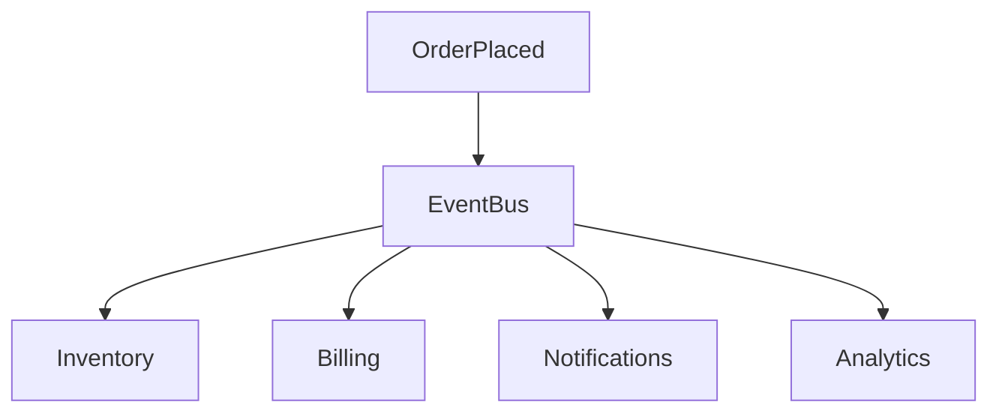

# Chapter 38

# Digital Transformation Patterns
## Designing Modern Digital Enterprises with Enterprise Architecture

---

## Learning Objectives

- Explain common digital transformation architecture patterns.
- Understand APIs, microservices, event-driven architecture, and composable enterprises.
- Select appropriate integration patterns for business capabilities.
- Apply TOGAF principles to modern digital platforms.
- Balance innovation, governance, and scalability.

---

# Monday Morning – Beyond Digital Projects

SwiftShip has modernized its cloud platform, adopted AI, established trusted data, and embraced DevSecOps.

Now the business wants to launch new digital services in weeks rather than months.

Emma Chen asks:

> "We've modernized our technology. How do we design an enterprise that can continuously adapt?"

You reply:

> "Digital transformation isn't a destination. It's an architectural capability built on reusable patterns."

---

# What Are Digital Transformation Patterns?

Digital transformation patterns are proven architectural approaches that solve recurring business and technology challenges.

Benefits include:

- Faster delivery
- Reuse of proven designs
- Lower risk
- Better interoperability
- Greater scalability

---

# Modern Digital Architecture

---

# API-First Architecture

APIs expose reusable business capabilities.

Examples:

- Customer Profile API
- Shipment Tracking API
- Pricing API
- Payment API

Benefits:

- Loose coupling
- Faster integration
- Partner enablement
- Reuse

---

# Microservices

| Monolith | Microservices |
|-----------|---------------|
| Single deployment | Independent services |
| Shared database | Service-owned data |
| Large releases | Frequent releases |
| Tight coupling | Loose coupling |

---

# Event-Driven Architecture

---

# Composable Enterprise

Core principles:

- Modular business capabilities
- Reusable APIs
- Configurable workflows
- Independent deployment
- Low-code integration

---

# Integration Patterns

| Pattern | Best Use |
|----------|----------|
| REST APIs | Synchronous services |
| Event Streaming | Real-time integration |
| Message Queues | Asynchronous communication |
| ETL/ELT | Batch integration |
| API Gateway | API management |

---

# Digital Governance

Enterprise Architects define:

- API standards
- Event standards
- Security policies
- Versioning
- Reference architectures

---

# Measuring Success

| KPI | Example |
|------|---------|
| API Reuse | Shared APIs consumed |
| Release Frequency | Deployments/month |
| Integration Time | New system onboarding |
| Platform Adoption | Teams using shared platforms |
| Customer Satisfaction | Digital experience |

---

# SwiftShip Example

SwiftShip launches a Digital Commerce Platform using:

- Enterprise API catalog
- Event platform
- Microservice reference architecture
- API gateway
- Shared customer and logistics services

New products are assembled from reusable capabilities.

---

# Key Deliverables

| Deliverable | Purpose |
|-------------|---------|
| Digital Reference Architecture | Standard modernization blueprint |
| API Standards | API guidance |
| Integration Architecture | Connectivity patterns |
| Event Catalog | Standard enterprise events |
| Digital Transformation Roadmap | Modernization sequencing |

---

# Foundation Exam Focus

- TOGAF governs digital transformation.
- APIs and reusable services improve agility.
- Event-driven architecture supports scalability.
- Architecture patterns improve consistency.

---

# Practitioner Scenario

**Scenario**

Business units independently build APIs and integration platforms.

**Answer**

Define enterprise API standards, establish reusable capabilities, implement an API gateway and event platform, publish reference architectures, and govern initiatives through architecture reviews.

---

# Common Mistakes

- Duplicate APIs
- Tight coupling
- Poor event governance
- Technology-first thinking
- Ignoring business capabilities

---

# Key Takeaways

- Reusable patterns accelerate transformation.
- APIs, events, and microservices require governance.
- Enterprise Architecture enables innovation with consistency.
- Business capabilities drive architecture decisions.

---

# Chapter Summary

Emma watches SwiftShip launch new digital services in days rather than months.

> "We've become a composable digital enterprise."

---

# Next Chapter

**Chapter 39 – Sustainability & Green Enterprise Architecture**
