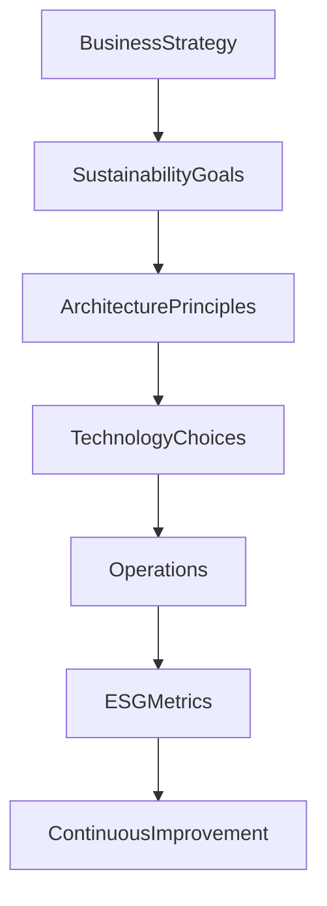

# Chapter 39

# Sustainability & Green Enterprise Architecture
## Designing Digital Enterprises for a Sustainable Future

---

## Learning Objectives

By the end of this chapter, you will be able to:

- Explain the role of Enterprise Architecture in sustainability.
- Understand Green IT, ESG, and sustainable architecture principles.
- Apply sustainability considerations throughout the architecture lifecycle.
- Balance business value, environmental impact, and technology decisions.
- Measure sustainability outcomes using enterprise metrics.

---

# Tuesday Morning – Architecture Beyond Technology

SwiftShip has become a modern digital enterprise.

The Board now sets a new strategic objective:

> "Become carbon-neutral by 2040 while continuing to grow globally."

Emma Chen asks:

> "Can Enterprise Architecture help us achieve our sustainability goals?"

You reply:

> "Absolutely. Sustainable enterprises are built through sustainable architecture."

---

# Why Sustainability Matters

Enterprise Architecture no longer focuses only on cost, speed, and innovation.

Modern architects must also consider:

- Environmental impact
- Social responsibility
- Governance (ESG)
- Energy efficiency
- Responsible technology choices

Architecture decisions influence long-term sustainability.

---

# Sustainability in Enterprise Architecture

Enterprise Architecture connects sustainability strategy with execution.

---

# Green Enterprise Architecture Principles

SwiftShip adopts these principles:

- Sustainability by Design
- Cloud Before Data Center
- Optimize Before Expand
- Measure Before Improve
- Reuse Before Build
- Energy-Efficient Solutions
- Responsible Procurement
- Circular Technology Lifecycle

---

# ESG and Enterprise Architecture

| ESG Dimension | Architecture Contribution |
|--------------|---------------------------|
| Environmental | Energy-efficient platforms, cloud optimization |
| Social | Accessibility, digital inclusion, employee experience |
| Governance | Compliance, transparency, risk management |

Enterprise Architects help translate ESG goals into technology decisions.

---

# Green IT Practices

Examples include:

- Cloud resource optimization
- Server consolidation
- Virtualization
- Auto-scaling workloads
- Efficient storage management
- Responsible hardware disposal
- Renewable-energy-aware hosting

Small improvements across thousands of workloads create significant impact.

---

# Sustainable Cloud Architecture

Cloud platforms enable organizations to consume only the resources they need.

---

# FinOps + GreenOps

FinOps optimizes financial efficiency.

GreenOps extends this by optimizing environmental efficiency.

Together they focus on:

- Resource utilization
- Cost optimization
- Carbon reduction
- Capacity planning
- Continuous measurement

Enterprise Architecture aligns both disciplines with business objectives.

---

# Measuring Sustainability

Typical sustainability KPIs include:

| KPI | Example Measure |
|------|-----------------|
| Carbon Emissions | CO₂ per workload |
| Infrastructure Utilization | Average compute utilization |
| Renewable Energy Usage | % renewable-powered workloads |
| Server Consolidation | Legacy servers retired |
| Cloud Optimization | Cost and energy savings |
| ESG Compliance | Regulatory compliance score |

What gets measured gets improved.

---

# Sustainable Technology Lifecycle

Enterprise Architects should consider the complete lifecycle:

- Design
- Procurement
- Deployment
- Operation
- Optimization
- Retirement
- Recycling

Sustainability extends beyond implementation.

---

# SwiftShip Example

SwiftShip modernizes its global logistics platform using sustainability principles.

The Enterprise Architecture Office:

- Migrates workloads to energy-efficient cloud regions.
- Implements auto-scaling and rightsizing.
- Introduces GreenOps dashboards.
- Extends hardware life through virtualization.
- Publishes sustainable architecture standards.

Within three years:

- Infrastructure energy consumption falls by 32%.
- Cloud utilization improves significantly.
- Technology costs decrease while ESG reporting improves.

---

# Key Deliverables

| Deliverable | Purpose |
|-------------|---------|
| Sustainability Architecture Principles | Guides enterprise decisions |
| Green IT Strategy | Defines sustainability initiatives |
| ESG Technology Roadmap | Aligns technology with ESG goals |
| GreenOps Dashboard | Tracks energy and carbon metrics |
| Sustainable Reference Architecture | Standard environmentally responsible patterns |

---

# Foundation Exam Focus

Remember:

- Enterprise Architecture supports enterprise sustainability objectives.
- Architecture principles should include environmental considerations.
- Governance extends to ESG and responsible technology use.
- Continuous measurement enables sustainable improvement.

---

# Practitioner Scenario

**Scenario**

SwiftShip plans to build a new analytics platform. Two options exist: one provides maximum performance but consumes significantly more infrastructure resources; the other offers slightly lower performance with substantially lower cost and carbon impact.

**Question**

How should the Enterprise Architect respond?

**Answer**

Evaluate both options against business requirements, enterprise architecture principles, ESG objectives, lifecycle costs, performance needs, and sustainability goals. Recommend the solution that provides the best long-term enterprise value rather than focusing on a single metric.

---

# Common Mistakes

- Considering sustainability only after implementation.
- Measuring cost but not environmental impact.
- Ignoring workload optimization.
- Treating ESG as solely a reporting exercise.
- Replacing hardware unnecessarily.

---

# Key Takeaways

- Sustainability is an enterprise architecture concern.
- Green IT and GreenOps complement FinOps.
- Enterprise Architecture balances innovation, cost, performance, and environmental responsibility.
- ESG objectives should influence architecture decisions.
- Continuous measurement drives sustainable improvement.

---

# Chapter Summary

Emma presents SwiftShip's annual sustainability dashboard.

Technology is now measured not only by performance and cost, but also by environmental impact.

She smiles.

> "We've proven that innovation and sustainability can grow together."

You reply:

> "The best architectures don't just transform businesses—they help create a better future."

---

# Next Chapter

**Chapter 40 – The Future Enterprise Architect**

---

## 📖 Continue Reading

⬅️ **Previous:** [Chapter 38 – Digital Transformation Patterns](38-Digital-Transformation-Patterns.md)

🏠 **Home:** [📚 Table of Contents](../../../README.md)

➡️ **Next:** [Chapter 40 – The Future Enterprise Architect](40-The-Future-Enterprise-Architect.md)

---

© 2026 **Baskar Periasamy** • Licensed under the MIT License.
