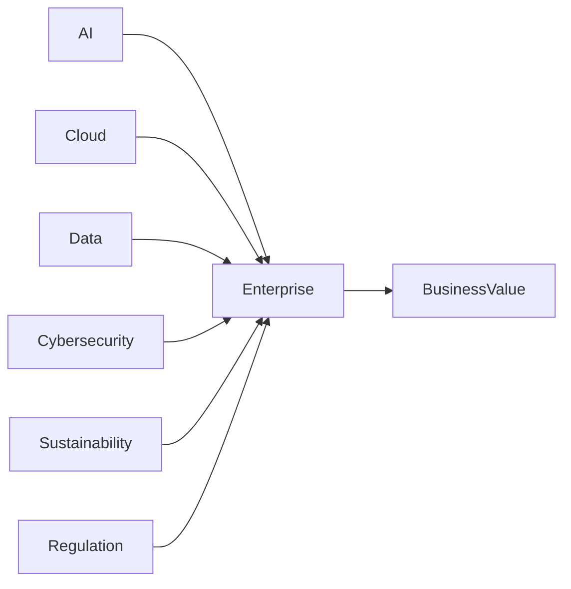
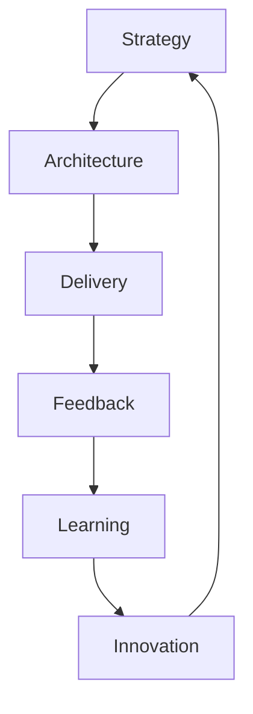

# Chapter 40

# The Future Enterprise Architect
## Leading Intelligent, Adaptive, and Resilient Enterprises

---

## Learning Objectives

By the end of this chapter, you will be able to:

- Understand how the Enterprise Architect role is evolving.
- Identify emerging technology and business trends shaping architecture.
- Explain the future skills required of Enterprise Architects.
- Build adaptive architecture capabilities for continuous change.
- Prepare for lifelong learning in Enterprise Architecture.

---

# Wednesday Morning – Looking Beyond Today

SwiftShip has completed its transformation.

It has embraced cloud, AI, trusted data, Agile, DevSecOps, and sustainability.

At the annual strategy meeting, Emma Chen asks:

> "We've transformed our enterprise. What's next for Enterprise Architecture?"

You reply:

> "The future Enterprise Architect won't simply design systems—they'll help shape the future of the business."

---

# The Evolution of Enterprise Architecture

Enterprise Architecture has progressed from:

| Yesterday | Today | Tomorrow |
|-----------|-------|----------|
| IT alignment | Business transformation | Intelligent enterprise leadership |
| Static roadmaps | Continuous planning | Adaptive ecosystems |
| Technology focus | Business capabilities | Business ecosystems and AI |
| Governance | Enablement | Strategic innovation |

The role continues to expand beyond technology into enterprise strategy.

---

# Forces Shaping the Future

Key drivers include:

- Artificial Intelligence
- Automation
- Cloud-native platforms
- Data-driven decision making
- Cyber resilience
- Sustainability
- Digital ecosystems
- Increasing regulation

---

# The Future Enterprise Architect

Future architects combine multiple disciplines:

- Business strategist
- Technology leader
- Data champion
- AI advisor
- Change leader
- Risk manager
- Sustainability advocate
- Innovation catalyst

Enterprise Architecture becomes a leadership capability.

---

# Essential Skills

| Technical Skills | Leadership Skills |
|------------------|-------------------|
| Cloud Architecture | Strategic thinking |
| AI & Analytics | Communication |
| Cybersecurity | Stakeholder engagement |
| Data Governance | Negotiation |
| Platform Engineering | Influencing without authority |
| Automation | Change leadership |

Continuous learning is essential.

---

# Adaptive Enterprise Architecture

Modern architecture is iterative, evidence-based, and continuously refined.

---

# Principles for the Next Decade

- Business value before technology
- AI with human oversight
- Security by design
- Sustainability by design
- Data as a strategic asset
- Reuse before reinvent
- Automation wherever practical
- Continuous architecture

---

# Measuring Long-Term Success

Successful Enterprise Architecture creates:

- Faster innovation
- Better customer experiences
- Improved resilience
- Lower complexity
- Greater business agility
- Sustainable growth
- Trusted governance

Enterprise Architecture succeeds when the business succeeds.

---

# SwiftShip's Next Chapter

The Enterprise Architecture Office evolves into an Enterprise Strategy & Architecture function.

Architects work alongside executives, product leaders, data scientists, cybersecurity specialists, and sustainability teams.

Instead of approving projects, they enable enterprise-wide innovation through principles, reusable platforms, governance, and strategic guidance.

SwiftShip is prepared not only for today's challenges, but also for opportunities that have yet to emerge.

---

# Key Deliverables

| Deliverable | Purpose |
|-------------|---------|
| Enterprise Strategy Map | Aligns architecture with long-term vision |
| Emerging Technology Radar | Tracks future capabilities |
| Architecture Capability Roadmap | Develops organizational maturity |
| Skills Development Plan | Builds future-ready architects |
| Innovation Portfolio | Prioritizes strategic initiatives |

---

# Foundation Exam Focus

Remember:

- Enterprise Architecture aligns business and technology.
- Architecture is a continuous capability, not a one-time project.
- Governance should enable innovation while managing risk.
- Business outcomes remain the primary measure of success.

---

# Practitioner Scenario

**Scenario**

Your organization plans to adopt AI, modernize legacy systems, strengthen cybersecurity, and meet ambitious ESG targets over the next five years.

**Question**

How should the Enterprise Architect respond?

**Answer**

Develop a business-aligned target architecture, define guiding principles, establish governance, prioritize initiatives through a roadmap, identify reusable capabilities, and continuously review progress as business priorities evolve.

---

# Common Mistakes

- Treating architecture as documentation rather than leadership.
- Focusing only on technology trends.
- Ignoring business strategy.
- Resisting continuous change.
- Failing to invest in new skills.

---

# Key Takeaways

- Enterprise Architects are strategic leaders.
- Continuous learning is essential.
- Business, technology, data, AI, security, and sustainability are interconnected.
- Enterprise Architecture enables resilient, adaptive organizations.
- The future belongs to architects who combine strategic thinking with practical execution.

---

# Book Summary

Emma reflects on SwiftShip's journey.

From understanding Enterprise Architecture to mastering TOGAF, governance, cloud, AI, Agile, DevSecOps, digital transformation, and sustainability, the organization has built a resilient enterprise capable of continuous evolution.

She smiles.

> "Enterprise Architecture isn't about predicting the future."

You reply:

> "It's about designing an enterprise that is ready for whatever the future brings."

---

# Congratulations!

You have completed the journey from TOGAF fundamentals to modern Enterprise Architecture.

The principles in this book are intended not only to help you pass the TOGAF Foundation and Practitioner examinations, but also to equip you to lead real-world digital transformation initiatives with confidence.
